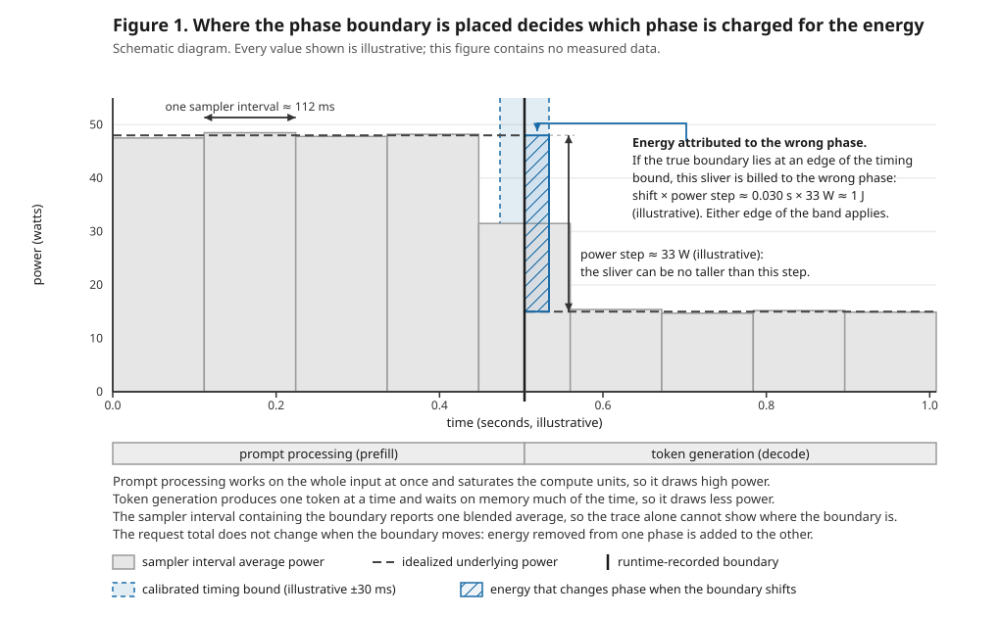
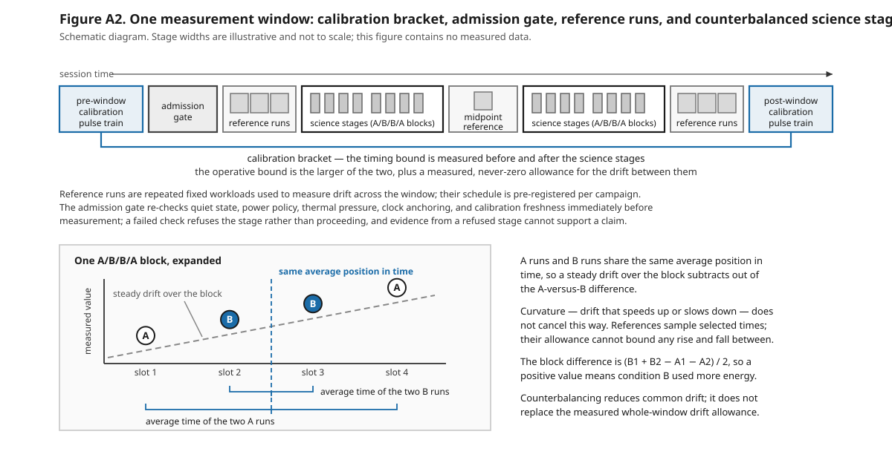
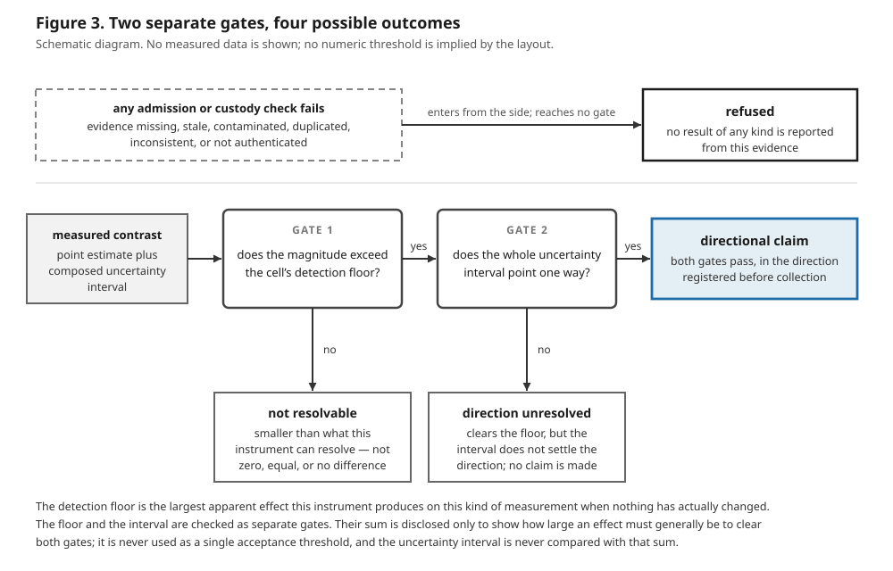

<!--
TITLE PAIR — HELD UNTIL `_v4` ISSUES; NEITHER TITLE IS TYPESET.
PRIMARY: When Phase Boundaries Set the Limit: Comparing Phase Energy in LLM Inference on Apple Silicon
NULL-OUTCOME: Correcting a Clock Error Before a Prospective Test of Phase-Energy Differences in LLM Inference on Apple Silicon
-->

# PLACEHOLDER pending `_v4`: JouleWise — Measuring Phase Energy in LLM Inference on Apple Silicon

## Abstract

Phase-energy measurements can repeat yet still charge energy to the wrong stage when the boundary between prompt processing and token generation is uncertain. JouleWise calibrates that boundary with a pulse train captured in the same session as the inference measurements. For each group of like-for-like runs, called a cell, the analysis will construct the cell's resolution bound — the artifact calls it the detection floor — “the largest false difference this measurement system can manufacture.” Diagnostic-era evidence identifies the scale: boundary uncertainty during a steep power change can move about 1 J into the wrong phase, and repetition cannot remove that systematic ambiguity. This scale comes from commanded calibration pulses and is assumed to apply to sustained mixed inference load; the prospective collection will not test the transfer. The results will test whether boundary assignment contributes more than run-to-run variation to the bound for prompt processing and token generation on the named configuration. A model-size comparison will exercise the decision rule: report a direction only when the observed difference clears the bound and its uncertainty interval supports the direction fixed before collection; otherwise print a refusal. Claims remain limited to the named machine, software stack, and processor power channels.

## 1. Introduction

Energy measurements for large language model (LLM) inference often look more precise than their timing supports. JouleWise measures two main stages of a request: prefill processes the prompt up to the first output token, and decode covers output-token emission. Energy is power accumulated over time, so the energy assigned to either stage depends on where their boundary falls on the power trace. If that boundary shifts across a steep change in power, some energy is charged to the wrong stage even though the request total stays the same. Repeating the workload can reduce ordinary variation among runs, but it cannot remove a boundary error applied to every run.

This physical distinction, rather than a tour of the measurement system, is the paper's center. The runtime records phase events, while Apple's *powermetrics* reports average processor power over sampling intervals. Those records use clocks that must be placed on a common timeline. The corrected clock model in §2 allows the clocks to advance at slightly different rates and retains the set of alignments consistent with the recorded clock pairs and sampler timestamps. The earlier calculation assumed equal clock rates; correcting that error changed which calibration captures could support the method.

For runs that share the same phase, workload, model, hardware, software, and power definition, JouleWise constructs the cell's resolution bound — the artifact calls it the detection floor — “the largest false difference this measurement system can manufacture.” It includes ordinary repeat-to-repeat variation and the energy that calibrated uncertainty in boundary placement could move across a phase edge. The timing component is measured with commanded graphics-processor pulses inside the same uninterrupted collection session in which it is used. Carrying that component to sustained mixed inference load is an assumption, not a tested result; §7 treats this as the primary limitation.

The primary research question is therefore plain: under the corrected clock model, does phase-boundary attribution rather than run-to-run scatter dominate the resolution bound for prefill and decode on the named M3 Max / MLX / *powermetrics* configuration? The two components will be produced independently for every phase cell that could support a claim. The finding is falsified for a phase if the timing-widened bound does not exceed the point-only repeatability bound. Failure in one phase narrows the finding to the other; failure in both rejects attribution dominance and leaves a calibration that corrected its own clock-model error followed by a prospective null.

The planned model-size comparison will demonstrate how this measurement result governs a claim; it is not the paper's destination. The decision has two separate gates. The point difference must exceed the applicable cell bound, and the uncertainty intervals must support the direction fixed before collection. A failed gate or missing required evidence produces a printed refusal that states why no directional claim is made. Separately, the resolvability rule marks a short prefill phase as not resolvable when fewer than three power samples fall inside it. These outcomes are useful behavior: they show what the named implementation can defend without turning a small or incomplete measurement into a claim.

The scope is deliberately narrow. The result will characterize one physical machine, one MLX software stack, one *powermetrics* sampling configuration, and the processor power channels included in that counter. It will not establish whole-system energy without an external meter, compare vendors, or transfer a numerical bound to another machine, workload family, sampler cadence, or software stack.

This paper makes three contributions:

1. The first contribution is an in-window pulse-train calibration with the corrected clock model; §2 specifies and reconstructs it.
2. The second contribution is a cell-specific resolution bound and the prospective attribution-dominance finding; §3 characterizes the instrument, §4 composes the bound, and §6 reports the test.
3. The third contribution is the decision behavior the prospective demonstration will exercise — two gates, printed refusals, and the resolvability rule; §5 defines when collection stops, and §6 will report the resulting decisions.

## 2. In-window calibration method

JouleWise assigns each *powermetrics* sampling interval to prompt processing (*prefill*) or token generation (*decode*) using phase boundaries emitted by the runtime, then integrates the CPU, GPU, and neural-engine interval-average power inside each phase. A phase boundary is therefore a separate measurement problem from repeatability. If a boundary is placed a few tens of milliseconds late while power falls by tens of watts, power multiplied by misplaced time assigns about a joule to the wrong phase. The request total does not change: energy removed from one phase is added to the other. Repetition can reduce random scatter, but it cannot remove this systematic reassignment.

Figure 1 names the mechanism. Its horizontal time axis, vertical power axis, pale grid, and gray step rectangles show interval-average samples; the dashed trace is idealized underlying power. The lower gray bars name prefill and decode. The black vertical line is the runtime-recorded boundary, the blue band is its calibrated timing bound, and the hatched sliver is the energy that changes phase if the true boundary lies at a band edge. Double-headed arrows name one sampler interval and the power step; the blue callout arrow identifies the sliver. The legend and four notes name the marks, the high-power prefill and lower-power decode regimes, the blended sample at the boundary, and the unchanged request total.



*Figure 1. Boundary-attribution schematic. Every value is illustrative, including both axes, the sampler interval, timing band, power step, and approximately one-joule product. The power-versus-time axes and pale grid frame gray interval-average rectangles and a dashed idealized-power trace; lower bars name prefill and decode. A black vertical line marks the runtime-recorded boundary, a blue band its calibrated timing bound, and a hatched sliver the energy reassigned by a boundary shift. Horizontal and vertical double-headed arrows name the sampler interval and power step; a blue callout arrow points to the sliver. The notes and legend explain the high- and low-power regimes, the blended boundary sample, the unchanged request total, and every mark.*

### Bracketed pulse-train algorithm

Immediately before and after each science window—one uninterrupted measurement session—JouleWise records a calibration under the same declared machine state. Its recorded SHA-256 values, which identify exact file bytes, must match the fixed record; its timestamps must place it before the first or after the last science run and no more than 24 hours from the window's far end. After three warm-up pulses, it commands 59 one-second GPU matrix-multiplication pulses on preallocated \(4096\times4096\) 16-bit floating-point matrices. A fixed base-two varied-gap schedule prevents the pulse edges from repeatedly lining up with the requested 100-ms sampler cadence. Five seconds of quiet trace are requested on both sides of the train, of which at least 4.5 s must be present.

For each commanded pulse, the detector estimates resting GPU power from samples outside every pulse margin and pulse height from samples wholly inside its plateau. It predicts each reported interval average from the fraction of that interval covered by a shifted rectangular pulse, then scores the difference between predicted and observed power with a rule that limits the influence of one large discrepancy while moving the onset and offset separately. After finding the best pair, it encloses every pair close enough to that fit: a rectangle is rejected only when a mathematical lower bound proves that none of it can pass, and every surviving rectangle is split to a fixed resolution. The four outer edge values are widened for uncertainty in the two command timestamps. A capture is refused unless all 59 pulses pass the signal, fit, range, trace-coverage, and completeness checks; no uncommanded plateau appears; and the shared search-work limits remain unexhausted. The accepted capture bound is the largest allowed edge displacement among all pulses plus the trace's clock-anchor bound.

The clock anchor uses five wall-clock readings, each bracketed by monotonic-clock readings, together with every whole-second label embedded in the native power records. It retains the complete set of straight-line clock mappings whose rate, offset, first-record endpoint, stamp brackets, native labels, and launch-to-first-parse ordering agree. The method permits the two clocks to run at slightly different fixed rates and charges the full allowed departure of a native label from that line. It refuses missing or malformed inputs, an empty or unbounded set, inadequate capture span, implausible clock rate, active automatic network-time correction, or a bound outside the accepted range. Otherwise it finds the earliest and latest allowed first-record endpoint and adds four separately named allowances. This corrected rate-aware model replaced the false equal-rate assumption, which could move every fitted edge in the same direction.

Finally, the pre-window and post-window capture bounds form a bracket. A difference greater than 10.164835 ms refuses the window. Otherwise the operative bound is the larger capture bound plus the larger of their absolute difference and the 9.724-ms screen; that complete, never-zero allowance is added once. If the post-window calibration widens a bound already used, the affected phase energies are recomputed with the wider bound or refused. Appendix A.3 defines the pulse accepted region, clock-anchor feasible set, objectives, ranges, and every refusal constraint formally.

This calibrates edge placement under commanded GPU pulses and then transports that bound to sustained mixed inference load. That load-regime transfer is an applicability assumption, not a result: the pre/post bracket tests change across a window, but it does not test whether the pulse-derived bound transfers to inference.

Figure 2 maps that bracket onto one complete measurement window. The gray horizontal arrow across the top points in the direction of session time. Blue-outlined boxes at the two ends are the pre-window and post-window calibration pulse trains; the blue bracket joining them says that the timing bound is measured on both sides of the science work and that the operative bound uses the larger capture plus a measured, never-zero allowance for change between them. The gray admission-gate box is the immediate pre-measurement check: its accompanying note names quiet state, power policy, thermal pressure, clock anchoring, and calibration freshness, and says that a failed check refuses the stage. The three small gray bars in the opening reference box, the single bar in the midpoint box, and the three bars in the closing reference box are fixed-workload reference runs used to measure drift. Between them, the two large white science-stage boxes contain small gray run bars grouped into A/B/B/A blocks—condition A, condition B, condition B, condition A. Box widths are illustrative rather than elapsed-time measurements, and the figure contains no measured data.

The pale lower inset expands one A/B/B/A block. Its black vertical axis is measured value and its horizontal slot sequence runs from slot 1 through slot 4. A dashed sloping gray line, identified by a short gray leader, represents steady drift. Four circles lie on that line: white A circles occupy slots 1 and 4, while blue B circles occupy slots 2 and 3. The dashed blue vertical line marks the common average position in time. The two blue brackets below the circles show that the mean time of the two B runs and the mean time of the two A runs both land on that line. The right-hand notes state the consequence: steady linear drift subtracts from \((B_1+B_2-A_1-A_2)/2\), whose positive sign means B used more energy; curvature does not cancel and remains covered by the reference-derived whole-window drift allowance. Counterbalancing therefore reduces common linear drift but never replaces the measured allowance.



*Figure 2. Schematic structure of one measurement window. The upper session-time arrow orders the pre-calibration, admission gate, three opening references, two groups of A/B/B/A science stages around one midpoint reference, three closing references, and post-calibration. The blue spanning bracket joins the two pulse trains; the lower inset's axes, dashed drift line, four A/B/B/A circles, common-time line, and averaging brackets show why steady drift cancels while curvature and whole-window drift still require a measured allowance. Stage widths are not to scale, and no measured value is shown.*

### One diagnostic reconstruction

The following table and arithmetic reconstruct one retained diagnostic capture from raw clock readings through its maximal pulse. Wall stamps use seconds since 1970; monotonic stamps use the machine's never-adjusted counter. The protocol offsets use the commanded pulse schedule's own origin at its first protocol pulse. Three warm-up pulses occur before that origin, and sampling began earlier still, so those offsets are neither times since sampling began nor observed edge times. Each onset or offset lag uses its matching commanded edge as zero and is observed edge minus commanded edge; bounds are elapsed durations rather than positions on either clock.

| Stamp \(s\) | \(W_s\) (s) | \(M_s^-\) (s) | \(M_s^+\) (s) | \(R_s\) (s) |
|---|---|---|---|---|
| `pre_spawn` | 1784757335.502742 | 458736.4081875 | 458736.408188666 | 0.0000010000000000000002 |
| `first_parse` | 1784757336.604396 | 458737.509839458 | 458737.509840291 | 0.0000010000000000000002 |
| `sampling_started` | 1784757337.0900722 | 458737.995513416 | 458737.995514666 | 0.0000010000000000000002 |
| `sampling_stopped` | 1784757533.877846 | 458934.782846541 | 458934.782848041 | 0.0000010000000000000002 |
| `post_parse` | 1784757533.8891652 | 458934.794166 | 458934.7941665 | 0.0000010000000000000002 |

*The rows above are the five paired clock readings of one retained diagnostic capture. Wall values are seconds since 1970; monotonic values are seconds on the machine's never-adjusted counter. \(R_s\) is the larger of the two resolutions recorded with the stamp — the wall clock's \(1.0000000000000002\times10^{-6}\) s against the monotonic clock's \(4.166666666666666\times10^{-8}\) s — so the wall figure governs every row here. The two monotonic readings bracket each wall reading, which is what makes the pair usable: the wall value is known to have been taken somewhere inside that bracket.*
<!-- evidence: runs_window_a_20260722/instrument_validation/20260722T145535-e941c821/instrument_evidence.json -> clock_anchor.clock_stamps; row order is joulewise/uncertainty_evidence.py STAMP_ORDER; R_s composition is max(wall_resolution_s, monotonic_resolution_s) per the same module -->
<!-- replay fence: scripts/check_paper_replay_fence.py is the mechanical re-derivation check for this table — it reads the five stamp rows back out of the retained evidence file in solver order and requires each printed value to be the same double, failing closed if a row is dropped or the caption is reworded. -->

**Worked current-capture arithmetic.** One retained current-estimator derivation reports all \(59\) pulses detected, \(122{,}859\) evaluated rectangles, a local clock-anchor bound of \(0.0011349971959968978\) s, and a final capture bound of \(0.030067931757111657\) s. Therefore the largest pulse residual before the anchor term is \(0.030067931757111657-0.0011349971959968978=0.0289329345611147592\) s. Re-running the detector over that capture's retained raw power trace and event log, under the current anchor method, reproduces both the capture bound and the evaluated-rectangle count exactly, and identifies the pulse attaining the maximum: the tenth commanded pulse of the capture, scheduled to switch on \(26.625\) s and off \(27.625\) s measured from the origin of the commanded pulse schedule, which is where the schedule places its first protocol pulse rather than an observed onset. Its two commands were stamped at \(1784757381.2856488\) s and \(1784757382.293089\) s of wall time, expressed as seconds since 1970. The fit leaves its onset lag anywhere in \([0.02544938965763524,\,0.02893293456111476]\) s and its offset lag anywhere in \([-0.008607394549133255,\,-0.005308621075866744]\) s, about a best-fit pair of \(+0.027\) s and \(-0.007\) s. The retained residual bound for the pulse is the largest absolute value those four endpoints allow — \(0.02893293456111476\) s, the upper end of the onset interval — and adding the local clock-anchor bound to it returns the capture bound quoted above. Every value in this worked example is diagnostic instrument evidence; none of it supports a claim.
<!-- evidence: runs_window_a_20260722/instrument_validation/20260722T145535-e941c821/{events.jsonl,instrument_evidence.json}; commanded edges from events.jsonl pulse_command_on/off #10 metadata.clock_stamp.epoch_s (planned offsets 26.625 s / 27.625 s). The v3-anchored fit rows are re-derived deterministically by joulewise.powermetrics_fiducial.rederive_detection_from_artifacts over the retained raw plist + events.jsonl, reproducing b_fiducial_s = 0.030067931757111657 and projection_evaluated_cell_count = 122859 exactly; the byte-retained pulses[] in this 2026-07-22 file are v2-anchor-era, while fresh _v4 captures byte-retain v3. -->
<!-- evidence: docs/process_traces/2026-08-19-refreeze-execution/r6-issuance/r4-derivation.json -->
<!-- replay fence: scripts/check_paper_replay_fence.py is the mechanical re-derivation check for this paragraph — it re-runs the anchor and the 59 pulse fits from the capture's primary bytes and requires every literal above to be the same double it re-derives (stored rows and the stored bound are never inputs). -->

## 3. Instrument characterization

These tests use workloads as known signals to characterize the measuring instrument; they are not findings about a model, machine, or workload. An *admitted bundle* is one run that passed every frozen entry check. A criterion names a statistic, its authenticated inputs, an independent sample unit and count, a threshold or a rule that derives one, and a predicate that can be replayed without judgment. A row is supported only if all its criteria pass. Missing evidence or a missing earlier limit yields the registered indeterminate outcome; a predicate that fails on complete evidence yields a published refusal. The report writer also refuses to issue unless the criteria predate every admitted member and every borrowed limit comes from an earlier frozen artifact.

The frozen P06 result specification contains the predicates below. D-152 supplies the ruled values: the phase-overcount tolerance is \(10^{-6}\) J, six held-out reference probes are registered, and an unavailable claim-anchored limit has no absolute substitute. In that last case the row is indeterminate under `characterization_operative_floor_unavailable`.

Table 1. Frozen instrument-characterization criteria. Each row states the question, the statistic computed, the frozen threshold or its supplier, the independent sample unit and count, and the replayable accept-or-refuse rule.

| What the row asks | Statistic computed | Frozen threshold or supplier | Sample unit and count | Accept/refuse rule |
|---|---|---|---|---|
| **Workload response:** do request and decode energy increase with realized output tokens, without detectable curvature? | Fit \(E=a+bT\) by ordinary least squares for request energy and decode energy, one admitted bundle per point. Evaluate each slope at every joint corner of the authenticated energy intervals. For each metric, \(R_{\max}\) is the largest interval-endpoint departure of a registered level mean from its fitted line. | Each all-corners slope lower bound must exceed \(0\). \(H\) is the largest energy-interval half-width among the admitted bundles. \(F_{\mathrm{op}}\) is the same-cell operative floor from a strictly earlier issued artifact. | Five registered levels, \(T\in\{128,256,512,1024,2048\}\), with eight admitted bundles per level: \(n=40\). | Accept iff all five levels have eight members, both slope lower bounds are \(>0\), and each metric has \(R_{\max}\le H\) **and** \(R_{\max}\le F_{\mathrm{op}}\). A missing \(F_{\mathrm{op}}\) is indeterminate; any evaluated inequality failure is contradicted and refuses the affected conversion. |
| **Identical-condition null:** does an A/B/B/A comparison manufacture a difference when A and B are identical? | Per block, \(\delta_i=(B_1+B_2-A_1-A_2)/2\), with composed interval \(I_{\delta_i}\). Per magnitude, compute the Holm-adjusted mean interval \(I_{\mathrm{mean}}\) and \(M=\max_i\sup\lvert I_{\delta_i}\rvert\). | The physical null is \(0\). The comparator \(m\) is a disjoint, earlier-issued same-cell \(F_{\mathrm{op}}\). If none exists when the plan freezes, the registered branch uses \(F_{\mathrm{train}}\), built from five training blocks that exclude the five tested blocks. | Three magnitudes, \(T\in\{128,512,2048\}\). Earlier-floor branch: five blocks each, \(n=15\). Held-out branch: five training plus five test blocks each, \(n=30\). One A/B/B/A block is one unit. | Accept iff every \(I_{\delta_i}\) contains \(0\), every \(I_{\mathrm{mean}}\subseteq[-m,+m]\), and every \(M\le m\). Failure to reject zero is insufficient. A completed failure withdraws that cell's floor from claim use; an unavailable comparator is indeterminate. This identical-condition containment test is the test of the floor itself. |
| **Phase accounting:** do the two phase energies close to request energy, stay invariant to later work, preserve timing-term provenance, meet the accepted calibration band and sampling rules, and show phase-edge dominance? | Per bundle, \(D_i=E_{\mathrm{prefill}}+E_{\mathrm{decode}}-E_{\mathrm{request}}\). Fit prefill energy against later output tokens and compose its slope interval. Separately report the shared `b_fiducial_s` and each member's local/edge term; compare both bracket bounds with the named acceptance edition's band; compute the quarter-window and cadence/sample-flag rates; evaluate `admissible_set_uncertainty_dominates_point_floor` for each floor cell. | Overcount: \(\max D_i\le10^{-6}\) J. Undercount: \(\lvert D_i\rvert\le t_{\mathrm{gap},i}P_{\mathrm{gap,max},i}\). Invariance: the entire slope interval lies within both \(L_H=\max_i(H_i)/(T_{\max}-T_{\min})\) and \(L_F=F_{\mathrm{op}}/(T_{\max}-T_{\min})\). Two timing terms must occupy separate fields; both bracket bounds must lie in the acceptance edition's band; both flag rates must equal \(0\); the dominance predicate must be true for every floor cell. | Three prompt/output shapes—\(2048/128\), \(512/512\), \(128/2048\)—with eight admitted bundles each: \(n=24\); two bracket captures; all 24 claim-bearing members for each flag rate; every floor cell (minimum one) for dominance. | Accept iff every listed predicate holds. Missing gap evidence or an earlier \(F_{\mathrm{op}}\) makes its criterion indeterminate. An evaluated closure, invariance, bracket, flag, or dominance failure contradicts the row; a false dominance predicate withholds the attribution-limited label. |
| **Drift and recovery:** does an allowance contain probes excluded from constructing it, and does workload-induced disturbance recover within the settling convention? | For gross and idle-subtracted request energy, \(D_{\mathrm{hold}}=\max_j\lvert H_j-R_{\mathrm{mean}}\rvert\) over held-out probes. For each sustained hold, \(t_j\) is elapsed time to the first cooldown evaluation with a complete 30 s window, at least 80% duration coverage, duration-weighted mean power \(\le1.10\) times the fixed clean reference, and nominal thermal pressure; report \(\max_jt_j\). | \(A_{\mathrm{drift}}=\max(X,R_c)\), built without held-out probes. Recovery threshold: \(180\) s; this is not the cooldown gate's \(300\) s refusal cap. | Six registered held-out reference probes, two per window third (criterion minimum \(n=3\)); three sustained holds and their following cooldowns (\(n=3\)). | Accept iff every reference role was frozen before collection, no held-out probe contributed to \(A_{\mathrm{drift}}\), both energy families have \(D_{\mathrm{hold}}\le A_{\mathrm{drift}}\), and \(\max_jt_j\le180\) s. An unfrozen role is indeterminate; an evaluated containment or recovery failure contradicts the row. The recovery claim is limited to the registered workload disturbance. |

The two inferential properties—the null-mean containment and prefill-invariance containment—use Holm \(\alpha=0.05\) with \(m=2\). Every other cell is a deterministic predicate.

### Most probative diagnostic-era observations

**Diagnostic-era evidence of the phenomenon, not a current instrument property.** In three retained cells, point floors from run-to-run scatter alone were \(0.2888\), \(0.4934\), and \(0.3113\) J; the corresponding corner-widened floors were \(3.153\), \(2.922\), and \(2.184\) J. The paired ratios were \(10.92\), \(5.92\), and \(7.02\). Forcing all timing-envelope widths to zero flipped the registered dominance predicate from true to false, showing that phase-edge placement, rather than the predicate itself, produced the widening.

In the same diagnostic era, composed timing bounds ranged from \(25.6\) to \(31.1\) ms across \(n=30\) phase members. Those are not 30 independent timing draws: every member in the session contains the same shared fiducial term plus a member-local term. The phase-accounting row therefore requires the two terms to be reported separately.

No retained fragment can be promoted to a current row outcome. Workload response still requires its 40 admitted bundles; the null row still requires its disjoint blocks; and drift/recovery still requires its held-out probes and three recorded cooldown exits.

## 4. The resolution bound and how it is composed

As §1 establishes, each cell's resolution bound covers both same-condition run-to-run variation and phase energy reassigned by calibrated boundary uncertainty; it is a worst-case bound, not an estimated population percentile.

The only window classes are `request` and `phase`. Gross and idle-subtracted energy are request-window metrics; idle-subtracted request energy is gross request energy minus mean idle power times request duration. Phase energy is gross-only because no phase-idle model is defined.

### A reproducible construction

The construction has two sources of false difference. The *absolute component* measures how far repeated same-condition energies wander around their mean. The *comparative component* measures the apparent A/B difference in identical-condition A/B/B/A (ABBA) blocks. A block with member energies \(A_1,B_1,B_2,A_2\) has

\[
\delta=(B_1+B_2-A_1-A_2)/2.
\]

For member intervals \([A_1^-,A_1^+]\) and so on, its complete signed interval is

\[
\delta^-=(B_1^-+B_2^- -A_1^+-A_2^+)/2,\qquad
\delta^+=(B_1^++B_2^+ -A_1^- -A_2^-)/2.
\]

The following procedure is applied after all entry checks have passed.

1. For \(n\) repeated energies \(E_i\), compute their mean, residuals \(r_i=E_i-\bar E\), and sample standard deviation \(s_r\). The absolute point guard is

   \[
   U_{\mathrm{abs,point}}=\max\!\left(\max_i|r_i|,
   t_{.975,n-1}s_r\sqrt{1+1/n}\right).
   \]

   The first term retains the largest false displacement already observed; the second is a Student-\(t\) prediction guard for one further unit.

2. For \(n\) identical-condition ABBA blocks, compute every \(\delta\), their mean \(\bar\delta\), and sample standard deviation \(s_\delta\). The comparative point guard is

   \[
   U_{\mathrm{cmp,point}}=\max\!\left(\max_i|\delta_i|,
   |\bar\delta|+t_{.975,n-1}s_\delta\sqrt{1+1/n}\right).
   \]

3. A point value hides timing uncertainty, so each independent energy or block difference enters as \([x_i-h_i,x_i+h_i]\). Enumerate all \(2^n\) joint *corners*, where a corner is one simultaneous lower-or-upper choice for every interval. At each corner, recompute the complete point formula, including its mean and standard deviation; retain the maxima \(U_{\mathrm{abs},*}\) and \(U_{\mathrm{cmp},*}\). Exact enumeration refuses above \(n=16\) rather than substituting an approximation.

4. Apply the pre-fixed small-sample multiplier after the corner maximum:

   \[
   g(n)=\max\!\left(1,\sqrt{9/(n-1)}\right),\qquad n\ge5.
   \]

   Fewer than five independent units produce diagnostic components but no publishable guarded value.

5. Two different drift quantities enter once, at different layers. Calibration-bracket drift is a time error. Its never-zero allowance is the full

   \[
   a_t=\max(\text{observed drift in seconds},0.009724\ \mathrm{s}),
   \]

   not merely the excess above the 9.724-ms bracket screen introduced in Section 2; it is embedded once in the timing envelopes that produce the \(h_i\). The paper uses one value for this screen throughout: 9.724 ms, the value the frozen calibration-acceptance artifacts `calibration_acceptance_d079_v2_n17_r3` through `_r6` bind as `bracket_screen_s`. A superseded ruling records a larger figure, derived when the calibration corpus held nineteen members rather than seventeen; that discrepancy is registered against the artifacts in the evidence record, its reconciliation is pending, and no claim in this paper depends on the superseded value. This screen was characterized with commanded GPU pulses and is transported to sustained mixed inference load; the frozen `_v4` campaign does not test that transfer. Slow change in window energy is a separate joule quantity \(A_k\): the maximum of the observed reference-trajectory excursion and the issued, same-family reference-repeatability bound. Add each component's own \(A_k\) once:

   \[
   F_{\mathrm{abs}}=g(n)U_{\mathrm{abs},*}+A_{\mathrm{abs}},\qquad
   F_{\mathrm{cmp}}=g(n)U_{\mathrm{cmp},*}+A_{\mathrm{cmp}}.
   \]

6. Compose by maximum:

   \[
   F_{\mathrm{cell}}=\max(F_{\mathrm{abs}},F_{\mathrm{cmp}}).
   \]

   Components from different windows retain their own calibration basis and allowance. They are never summed, and no allowance is added again at cell or reporting level.

```text
checked energy/block intervals -> point formulas -> every joint corner -> guard factor -> component + its own window allowance
absolute component ----------------------------------------------------------------------------------+
comparative component -------------------------------------------------------------------------------+-> maximum -> cell resolution bound
```

Each arrow means that the named value supplies the calculation to its right. The interval-driven term is reported separately from the point guard. A component is labelled *attribution-limited* only when at least one interval has positive width, the exact linear corner maximum used by the code's predicate strictly exceeds the guarded point-only value, and no other refusal condition is present; the emitted `corner_widened_guarded_floor_j`, never the smaller point value, is then published. The attribution-dominance sentence—the falsifier—tests that exact per-component linear corner maximum against the guarded point-only value; the null-containment sentence tests the published `corner_widened_guarded_floor_j`, which is at least that exact maximum; and the magnitude-gate sentence tests the drift-added `floor_gate_j`, whose added whole-window drift allowance is not a timing term, so substituting either later quantity into the falsifier would test a different proposition.

Passing the identical-condition null block at the corner-widened resolution bound tests the bound itself, and §6 reports that null number first.

The four prospective phase-cell values and their decompositions remain unavailable until their authenticated artifacts issue: **[RESULT PENDING ISSUED ARTIFACTS]**.

### Two gates for a claim

A directional comparison is accepted only if two separate gates pass.

1. **Magnitude:** the strict inequality \(|\hat\Delta|>F_{\mathrm{cell}}\) holds. Failure means the effect is not resolvable; it does not mean zero or equality.
2. **Direction and registered inference:** both the metrology-aware interval and the final decision interval lie wholly on the registered side of zero, and the registered statistical test passes. The decision interval is the metrology-aware interval widened on both sides by the contrast's whole deterministic bound, `deterministic_bounds.total`. That total is the *claim-side bound* \(B_{\mathrm{claim}}\); `E_clock_anchor_shift_bound_j` is one term, not the whole bound.

The primary family uses two-sided Holm correction at \(\alpha=0.05\) with \(m=2\), for the registered decode and fixed-p256 prompt-processing contrasts. Order their raw \(p\)-values \(p_{(1)}\le p_{(2)}\); compare \(p_{(1)}\) with \(0.025\), then compare \(p_{(2)}\) with \(0.05\) only if the first comparison passes. If one estimate is missing, its slot remains in the denominator: the remaining finite value is still tested first against 0.025, while the missing contrast cannot reject.

For practical sizing the paper also reports \(F_{\mathrm{cell}}+B_{\mathrm{claim}}\). This sum estimates the effect size likely to clear both gates, but it is not an acceptance threshold: the point estimate is compared only with \(F_{\mathrm{cell}}\), while the intervals are compared only with zero.

Figure 3 separates evidence refusal from the two claim gates. A thin horizontal rule divides the upper refusal lane from the lower claim lane. In the upper lane, the dashed box lists every admission or custody failure drawn—missing, stale, contaminated, duplicated, inconsistent, or unauthenticated evidence. Its right-pointing arrow is labeled “enters from the side; reaches no gate” and ends at the solid **refused** box, whose smaller text says that this evidence produces no result of any kind.

In the lower lane, the gray input box contains the measured contrast: its point estimate and composed uncertainty interval. A right-pointing arrow leads to the first white rounded box, **Gate 1**, which asks whether the estimate magnitude exceeds the cell's detection floor. Its horizontal **yes** arrow continues to the second white rounded box, **Gate 2**, which asks whether the whole uncertainty interval points one way. Gate 2's horizontal **yes** arrow reaches the blue-tinted **directional claim** box, where both gates pass in the direction registered before collection. Gate 1's downward **no** arrow reaches **not resolvable**, whose three explanatory lines say “smaller than this instrument can resolve,” not zero, equality, or no difference. Gate 2's downward **no** arrow reaches the direction-failure outcome, **direction unresolved**: the floor clears, but the interval does not settle direction, so no claim is made. The three lines at the bottom define the detection floor as the largest apparent effect produced when nothing changed and restate that floor and interval are separate gates; their sum is only a sizing disclosure, never one acceptance threshold. The title and subtitle state that this is a four-outcome schematic with no measured data and that spacing implies no numeric threshold.



*Figure 3. Schematic decision flow. The dashed upper side inlet bypasses both gates and reaches refused. The lower arrows carry the measured contrast through Gate 1 and Gate 2; the two downward “no” arrows lead to not resolvable and direction unresolved, while two horizontal “yes” arrows lead to the blue directional-claim box. The bottom annotation keeps the floor and interval separate and treats their sum only as a planning disclosure. No measured data or numeric threshold is encoded by the layout.*

**End-to-end numeric example (synthetic regression fixture, not experimental evidence).** The floor fixture's spatial scope is one synthetic gross-energy request cell; each energy is already integrated over its request window, so it has no sampling-start time coordinate. It supplies five absolute point energies of \(0\) J and five identical-condition blocks whose four point energies are each \(100\) J, hence five point differences of \(0\) J; their admitted energy/block-difference intervals have \(h_i=0.5\) J. Both point guards are therefore \(0\). Among the 32 corners, \([-0.5,-0.5,-0.5,0.5,0.5]\) produces the retained unguarded maxima \(1.6656\) J absolute and \(1.7656\) J comparative. With \(n=5\), \(g=1.5\); the fixture's observed window excursion is \(0.3\) J and its derived reference bound is \(0.4\) J, so the full window allowance is \(0.4\) J. Thus \(F_{\mathrm{abs}}=1.5(1.6656)+0.4=2.8984\) J, \(F_{\mathrm{cmp}}=1.5(1.7656)+0.4=3.0484\) J, and \(F_{\mathrm{cell}}=3.0484\) J. Positive interval widths dominate the zero point guards, so the fixture's attribution-limited label predicate is true. The companion claim fixture supplies \(\hat\Delta=10.0\) J, a metrology-aware interval \([9.5,10.5]\) J, `deterministic_bounds.total` \(=0.25\) J, the decision interval \([9.25,10.75]\) J, and a passing adjusted test. Gate 1 passes because \(10.0>3.0484\); Gate 2 passes because both intervals are positive and the adjusted test passes. The decision is **direction supported**. The disclosed sizing value is \(3.0484+0.25=3.2984\) J, but neither gate compares against it.

## 5. Collection stops when required evidence fails

If a required measurement is missing, malformed, outside its fixed limit, or inconsistent with another record, collection stops and records why; the program never substitutes a favorable value or silently skips the member. This behavior is *fail-closed*. The unit governed this way is a two-to-four-hour measurement window, including its calibrations, declared runs, cooldowns, and final verdict.

### Measured admission rules

To admit a stage—that is, to allow its first measured member—the program evaluates these recorded fields and limits immediately before measurement:

- After any operator or stage intervention, it waits \(180\) s with no experiment activity. The environment record must show `power_source = "AC Power"`, `power.external_connected = true`, `low_power_mode = false`, `display_power_state = "all_asleep"`, `screensaver_engaged = false`, and `thermal_pressure = "nominal"`. `power.adapter_watts` must be numeric and must match every other admission observation in the window; adapter description and power-source labels must also remain unchanged. Any mismatch or missing required field refuses admission.
- The pre-run idle baseline samples for \(30\) s at a requested \(10\) Hz and must yield at least \(30\) complete processor-state and power records. For each record, CPU busy ratio is the largest across cores of \(1-\text{idle ratio}-\text{powered-down ratio}\), clipped to \([0,1]\). The reported `cpu_busy_ratio_p95` and `processor_combined_power_w_p95` use nearest-rank p95: sort \(n\) values and select item \(\lceil0.95n\rceil\). Admission requires the former to be at most \(0.5\) and the latter at most \(1.0\) W.
- In those same idle records, fewer than \(40\%\) of raw `gpu.idle_ratio` values may fall below \(0.80\), and `gpu_freq_mhz_mean` must be at most \(800\) MHz. Missing or malformed CPU, GPU, or power telemetry refuses admission. One completely recorded idle-baseline retry is allowed; failure of the retry aborts that stage attempt.
- Between members, the cooldown rule must pass before \(300\) s. A cap hit refuses recovery. Runtime and power-source identities, clock-anchor status, power-record spacing, calibration age, and the post-run environment are also checked. An operator override is recorded but makes the member diagnostic only, never claim-bearing.

A stage attempt stops at its first member failure. If the same cause fails a window stage for the third time, the **window closes**; this rule does not merely close or restart the stage. All collected material remains preserved as diagnostic evidence.

### Counterbalanced order

Each comparison uses A, B, B, A order fixed before collection, with an admitted cooldown between members. Heating or other approximately linear drift over the hour can otherwise favor whichever condition runs later. If run midpoints are \(t_{A1},t_{B1},t_{B2},t_{A2}\), exact first-order balance is \(t_{A1}+t_{A2}=t_{B1}+t_{B2}\); the measured contrast is \((B_1+B_2-A_1-A_2)/2\). Unequal runtimes and cooldowns can break exact balance, while curvature and the separate whole-window drift allowance remain, so the retained midpoint times are part of the evidence rather than an assumed symmetry.

### Every input and every refusal remains visible

Every file the analysis reads is fingerprinted. Failed or interrupted attempts are never deleted or overwritten: an occupied retry slot moves to retained quarantine, the retry uses a new slot, and an append-only replacement record identifies both occurrences. Two present bundles claiming one occurrence cause a refusal. The final verdict binds the declared member set, preserved attempts, replacements, calibration bracket, policy, and drift evidence, preventing later selection of a favorable subset.

The refusal log is part of the result. It preserves contaminated members, calibration outside the allowed condition family, stale drift evidence, unresolved clock anchors, duplicate recorded occurrences, and below-floor effects. In one end-of-night case, re-evaluation refused a window because one member's internal clock alignment could not be resolved; independent adjudication upheld that refusal, and the window remained non-claim-bearing.

The repository artifact guide holds the maintainer-facing path conventions, freeze receipts, generated-state checks, and reissue workflow; Appendix A retains the scientific route from raw bytes to the reported verdict.

## 6. Demonstration results

### Results

The identical-condition null result will be reported first because it tests the floor itself: when A and B are the same workload, every nonzero A/B/B/A block difference is manufactured by the measurement system. The issued result will give the mean block difference and its composed interval, the largest absolute block difference, the independently issued same-cell comparator, and the registered outcome. It will support the floor only if every block interval contains zero, the mean interval lies inside plus or minus the comparator, and the largest absolute block difference does not exceed it. Collection has not occurred, so no null value or outcome is stated here.

### Printed negative result: short prompt processing is not resolvable

In a retained diagnostic-era population of 50 Qwen2.5 1.5B prompt-processing phases, **37 of 50 failed the resolvability rule**; 13 passed. This is the paper's named negative result, not a model comparison and not a claim that prompt-processing energy was absent.

The rule is mechanical. A *powermetrics* record has a support interval. It counts when that interval and the phase overlap for positive time:
\[
\min(t_{\mathrm{phase,end}},t_{\mathrm{record,end}})>
\max(t_{\mathrm{phase,start}},t_{\mathrm{record,start}}).
\]
A phase is resolvable only when at least three records count; fewer yields `not_resolvable_sample_count`. Boundary records may count even when only part of their support lies inside the phase, because integration clips them to that overlap.

For a concrete case, retained bundle `p2015-df-ph-decode-abs-r03` supplies the times: its runtime events place prompt-processing start and end 0.121034145 s apart. The raw power trace supplies the [PENDING] (DIAGNOSTIC-ERA VALUE: realized record spacing for p2015-df-ph-decode-abs-r03) and the support geometry, which gives two positive-overlap records. The code supplies the threshold of three. Thus **2 < 3**, so this phase fails even though the duration is **0.121 s** and the diagnostic-era cadence is **[PENDING]** (DIAGNOSTIC-ERA VALUE: realized record spacing in seconds for p2015-df-ph-decode-abs-r03); duration divided by cadence is not the rule because alignment decides whether a third support interval overlaps. The persisted audit supplies the population counts: 37 phases had two overlapping records and 13 had three.

### Demonstration fixed before collection

The prospective demonstration will compare 4-bit Qwen2.5 7B with 1.5B on the named M3 Max, MLX, and *powermetrics* configuration. Each contrast will use ten independent A/B/B/A blocks, where A is 1.5B, B is 7B, and one block difference is `(B1 + B2 - A1 - A2)/2`. Token generation will use the fixed 128-token prompt. Prompt processing will use the fixed synthetic 256-token prompt with identical token identifiers across model tokenizers. This is not decode-only: the 256-token prefill arm prospectively overrides the earlier decode-only default.

Each model and phase will have its own cell's resolution bound — the artifact calls it the detection floor — **the largest false difference this measurement system can manufacture**. No floor will transport across model, phase, or prompt length. Its timing term will be measured with commanded GPU pulses and transported to sustained mixed inference load; that transport is an explicit assumption, and the prospective collection does not test it.

The two contrasts will form one Holm family with alpha = 0.05 and m = 2. Each raw two-sided Student-*t* p-value will use the contrast estimate divided by its total standard error and its issued degrees of freedom. After ordering the two p-values, the smaller will be compared with 0.025, then, only if it passes, the larger with 0.05. A missing or non-estimable member will remain in the frozen family of two and will not shrink the denominator.

### Why 256 prompt tokens were selected

The sizing evidence is diagnostic, not a demonstration result. Ten historical 128-token A/B/B/A blocks supplied a mean 7B-minus-1.5B prompt-processing difference of 5.809930 J. The design assumed proportional prompt-length scaling, so doubling the prompt supplied the projection
\[
\widehat\Delta_{256}=\frac{256}{128}(5.809930)=11.619860\ \mathrm{J}.
\]
The planning disclosure was `C = F + B`, where F is the applicable cell floor and B is the contrast's claim-side bound. That bound's supplier is not yet built: the registry registers it as unresolved and it is filled only after the prospective campaign issues its contrast artifact. The decision record gives only approximately 5 J for C, not its exact components: [[NEEDS-VALUE: exact cell-floor F, whole deterministic claim-side bound B, and any fixed required margin used by the D-122 p256 sizing decision; checked D-122, D-139 A2, the prefill-feasibility synthesis and consult, and the current gamma manifest]]. With the disclosed approximation, 128-token clearance was `5.809930 - 5 = 0.809930 J`, or 1.16 times C; 256-token clearance was `11.619860 - 5 = 6.619860 J`, or 2.32 times C. That arithmetic selected 256. It is an **extrapolation**: no historical 7B corpus uses more than 128 prompt tokens, so the prospective arm will be the first direct longer-prompt 7B check.

**[RESULT PENDING ISSUED ARTIFACTS — tables below are structural placeholders; no energy value from superseded artifacts is carried into these tables, and none appears anywhere in this paper except the explicitly labeled instrument diagnostics of Sections 3, 6, and 7.]**

Table 2. Prospective phase-result schema. A gross cell will contain the issued phase-energy estimate and composed lower and upper endpoints. A companion per-token cell will contain the tokenizer-scoped value whose authenticated runtime-observed denominator is fixed by the issuing schema; [[NEEDS-VALUE: D-123 producing schema for each per-token numerator, denominator, and point-or-interval rendering; the results-fill registry records these suppliers as unknown]]. A floor cell will contain its magnitude and permitted label; n will count admitted independent run bundles, not power records.

| Phase | Model | Gross J/request (lower, upper) | J per prompt token | J per output token | Cell floor (labeled) | n |
|---|---|---|---|---|---|---|
| prompt processing | 1.5B | [PENDING] | [PENDING] | — | [PENDING] | [PENDING] |
| prompt processing | 7B | [PENDING] | [PENDING] | — | [PENDING] | [PENDING] |
| token generation | 1.5B | [PENDING] | — | [PENDING] | [PENDING] | [PENDING] |
| token generation | 7B | [PENDING] | — | [PENDING] | [PENDING] | [PENDING] |

Table 3. Prospective contrast decisions. The point will be the mean of ten block differences. The interval cell will contain the fully composed lower and upper endpoints; for the registered positive direction, the lower endpoint controls. The floor will be the larger arm-specific exact-cell floor. The claim-side bound column will be filled only when its supplier is built after the prospective campaign; it is registered as unresolved until then. The sizing cell will contain `C = F + B` and signed planning clearance `|estimate| - C`. The floor gate will pass only when `|estimate| > F`; the direction gate will pass only when both interval endpoints are positive. The verdict will support the registered contrast only when evidence admission, Holm, floor, and direction checks all pass; otherwise it will print the exact refusal.

| Contrast | Point estimate | Interval [lower, upper] | Cell floor | Sizing sum F+B; signed clearance | Claim-side bound | Floor-gate outcome | Direction-gate outcome | Verdict |
|---|---|---|---|---|---|---|---|---|
| token generation, 7B − 1.5B | [PENDING] | [PENDING, PENDING] | [PENDING] | [PENDING] | [PENDING] | [PENDING] | [PENDING] | [PENDING] |
| prompt processing, 7B − 1.5B | [PENDING] | [PENDING, PENDING] | [PENDING] | [PENDING] | [PENDING] | [PENDING] | [PENDING] | [PENDING] |

## 7. Discussion and limitations

**Limitation 1 is an untested load-regime transfer.** The timing bound is characterized under the calibration regime—commanded graphics-processor pulses—and transported to sustained mixed inference load. Nothing in the frozen `_v4` campaign tests that transfer. The in-session before-and-after bracket checks only whether the calibration remained consistent across the session. The floor probes test how large a false energy difference appears during operation. Neither independently validates transport of the pulse-derived timing bound to inference. An external meter could validate whole-system totals, but by itself could not determine how much of a request's energy belongs to prompt processing rather than token generation.

### What the finding changes

When phase-boundary attribution exceeds run-to-run scatter, collecting more repetitions attacks the smaller uncertainty while leaving the dominant one in place. Experimental practice must therefore change upstream: characterize edge placement for the named workload boundary, form a separate bound for each configuration cell, and size a comparison against that bound before collection. The cell's resolution bound—the artifact calls it the detection floor—is “the largest false difference this measurement system can manufacture.” On three retained diagnostic-era cells, the corner-widened bound divided by the point-only repeatability bound was 10.92, 5.92, and 7.02. Those ratios are evidence of the phenomenon under the retired 25 July calculation, not a current property of this unit. Subject to the load-transfer assumption above and only for those cells, their one-line label consequence is *attribution-limited*: edge placement contributed more than scatter. The label does not rescue another failed check or authorize a claim.

A `REFUSED` comparison is therefore a scientific result, not a failed experiment. It states that the named implementation and recorded conditions do not license the proposed comparison. It does not state that the two systems are equal. The refusal identifies which link failed—a contaminated window, unresolved clock anchor, inadequate resolution, or interval that does not establish the registered direction—and preserves the associated evidence. Publishing that boundary prevents selective reporting and separates two explanations that an accepted-only record confounds: a physically small effect and a measurement system unable to resolve it. A demonstration contrast may be refused while the instrument result remains intact because exercising that refusal rule is itself evidence that the method does not convert inadequate measurements into claims.

Lengthening the prompt can increase prompt-processing energy and make a contrast easier to resolve, but it changes the request population and thus the scientific question. A larger workload is not a repair for a design that cannot adjudicate the effect it originally named. It is a new experiment that needs its own configuration-specific resolution bound. Feasibility means fixing a workload before collection that can answer the registered question, not enlarging it until a difference clears the gate.

The transferable lesson for other software counters is procedural: check how counter records align with physical edges; characterize clock drift and sampling cadence; separate a magnitude gate from a directional interval; measure the bound in the configuration where it is used; and print refusals with reasons. The numerical bound does not transfer. Nor does this capstone establish a property of software counters as a class, of Apple counters generally, or of another machine. Its conclusions license only this physical unit, operating-system build, MLX and library stack, model and quantization, tokenizer and output policy, sequential-request boundary, *powermetrics* source, and processor-package measurement boundary.

### Further limitations

The counter has no independent gain check against wall power, and its processor-package boundary excludes the rest of the system. Longer windows would need fresh drift evidence because no duration-scaling law was established. The shared-error alternative for four-run blocks also rests on a physical premise: common onset and offset errors within a block. Arithmetic tests validate the calculation, not that premise. Concurrent requests, continuous batching, and speculative decoding are outside scope because their overlapping work needs a newly defined and calibrated allocation boundary.

The repository provides internal consistency and tamper evidence, not third-party provenance. It assumes a single trusted operator and no same-user program attempting to alter evidence; a known interval between checking a floor-specification path and authorizing it could let such a program alter the authorization record, although a precommitted fingerprint prevents the swap from altering a published number. The 748 bundles made with the retired clock-anchor calculation remain auditable under that calculation but are permanently barred from claims: admission rejects their method label, and reprocessing claim energies under the replacement method after seeing the data would be retrospective analysis. These are limits on what the record proves, not exceptions to its gates.

### Future work

Future Work #1 is an inserted-gap fiducial measurement under the real workload. On about 10 runs, the runtime will command an approximately 500 ms sleep between the end of prompt processing and the start of token generation. The existing pulse estimator will fit the two edges of that visible gap, and the fitted residual will be compared with the pulse-derived timing bound. This directly tests the transport assumption that `_v4` leaves open. It is queued for the first post-campaign diagnostic window and does not enter `_v4`: that pack is frozen, and any non-configuration change requires a new family generation.

Two former characterization rows are also future work, not pending results. A deliberate micro-delta challenge will place differences at 0.5, 1.0, 1.5, and 3.0 times an independently issued same-cell floor in both directions. At least three independently calibrated sessions with the same software stack will test both whether a floor may be reused within the registered 1.25-times corridor and whether the between-session range exceeds the largest bound declared by any one session.

The first further characterization made decidable by the calibrated phase boundary is C5-1.3: whether average power differs between prompt processing and token generation. That power asymmetry is future characterization, not a research question this capstone carries. Replication on another physical unit and comparison with an external meter for whole-system totals would extend scope but would still require new, boundary-specific attribution evidence.

## 8. Related work

### From counter gain to counter time

Khan et al.'s *RAPL in Action* and Jay et al. own the gain axis: how accurately a software counter reports the magnitude of energy use [5] [6]. For phase-resolved `powermetrics` inference on Apple Silicon, JouleWise opens the complementary time axis: where in time a counter places the energy it reports. Khan et al. align lag, model the relationship between RAPL and wall power, account for temporal correlation, and inspect update granularity, sampler overhead, jitter, overflow, and timestamps [5]. Jay et al. show through controlled regression against wall power that disagreement changes with load, and they decline component claims that their reference meter cannot test [6]. Those studies establish how to validate counter gain; an external wall meter still cannot determine how a software trace should divide a correct total between prompt processing and token generation.

Hähnel et al. are the closest ancestor to this boundary problem. RAPL's update interval limits how short a code path can receive a defensible energy attribution, and they respond by aligning the start and end of the measured path to the counter's own update boundaries — spinning on the register until it advances before entering the code path, and again on leaving it — then enumerating the errors that remain when entry and exit fall inside a single update interval [29]. That is edge placement as an explicit technique, on a different interface and at a different scale. Dauner et al. provide the strongest corroboration. Across RAPL and NVML, they show that counter-update behavior and requested sampling frequency can materially change an energy reading; on one evaluated GPU, very frequent polling severely underestimated integrated power, with agreement recovering only at a much longer interval [23]. JouleWise's distinct contribution is to calibrate runtime phase edges in the same measurement window, propagate their permitted positions through the energy integral, and make the resulting cell-specific resolution bound a claim gate (Sections 2, 3, and 5). The calibration uses commanded GPU pulses under a lighter CPU regime, however, and this capstone does not test whether its timing bound transfers unchanged to sustained mixed inference load (Section 7).

### LLM energy measurement

*The Illusion of Power Capping in LLM Decode* is the closest methodological rival. It is phase-aware, repeats configurations, and independently checks sufficiently long sampled-power integrals against a hardware energy counter [20]. JouleWise lacks that independent cross-check. Its narrower advance is different: the power-capping study reports counter agreement, repetition, and timing regimes as separate diagnostics, whereas JouleWise carries uncertain phase-edge placement into the bound that decides whether a phase contrast may be reported.

TokenPowerBench reports prefill and decode energy and groups measurements by context length [7]. Its disclosed method does not specify the boundary events, alignment rule, repetition and variance protocol, idle baseline, or external validation needed to reconstruct a phase-attribution error budget. Ruf and Detyniecki isolate prefill by generating one token and infer decode by subtraction, from one run per context length without error bars [19]. Broader efforts such as ML.ENERGY, Intelligence per Watt, and Apple-focused inference characterizations map energy across useful deployed configurations [8] [22] [13]. They answer system-selection questions; JouleWise instead asks whether one named software-counter boundary can support a phase claim at all.

### Benchmark and metrology lineage

JouleSort established that an energy-efficiency benchmark needs a fixed workload, a comparison metric, and explicit rules for executing the workload and measuring energy [3]. Its boundary is specific: wall power includes conversion losses and every participating component, including idle components; any net change in stored battery energy must be shown no greater than zero with 95% confidence or included in the total. JouleSort also identified synchronization between meter readings and the actual run, alongside the meter's ±1.5% specification, as a reason not to use a fixed-energy-budget metric. JouleWise inherits that boundary discipline rather than replacing it: JouleSort names the synchronization problem at whole-run scale; JouleWise measures its consequence at phase scale.

SPECpower fixes a graduated-load server workload and accepted-analyzer reporting discipline [15]. MLPerf Power extends public energy benchmarking across machine-learning systems, while its associated SPEC methodology requires load-specific analyzer uncertainty, fixed ranges, minimum measurement intervals, invalid-sample accounting, clock synchronization, and controlled battery behavior [1] [2]. JouleWise translates their run-level refusal discipline to a consumer software counter: missing timing evidence invalidates the phase claim rather than disappearing into an average.

Rigorous performance metrology supplies the experimental lineage. Georges, Buytaert, and Eeckhout make repetition, warmup, independence, and uncertainty part of performance evaluation [30]. Mytkowicz et al. show that apparently harmless experimental choices can create systematic measurement bias [31]. JouleWise operationalizes those warnings through paired order, bracketed calibration, fixed-before-collection rules, and explicit refusals, while evidence from one host and configuration cannot establish generality.

Paired minimum-detectable-effect methods use paired variation to estimate the smallest effect a planned study has adequate power to detect. They can allow observed variability to raise, but not lower, a threshold fixed by pre-registration—before results are seen [26]. That work concerns quantization-accuracy benchmarking, not energy. JouleWise borrows its prospective discipline, but treats worst-case phase-edge placement as bounded systematic uncertainty and does not combine it statistically as though it were independent random noise; doing so would take credit for cancellation that the instrument has not demonstrated.

Split and disaggregated inference remain a demanding application rather than this capstone's contribution. Prior work reports whole-run or GPU-only energy for disaggregation and phase-aware placement [27] [12] [10], while SplitZip makes no energy claim [28]. A future JouleWise study would need named boundaries at both endpoints, cross-device clock alignment, and a resolution bound established before collection.

## 9. Evidence and code availability

JouleWise’s source code is open now. The repository contains the runner; collection, calibration, and reduction code; admission gates; verdict and extraction tools; tests; and protocol records. The claim-bearing characterization and Qwen demonstration evidence—raw traces, event records, configurations, calibrations, and verdicts—is not yet open. Its archive and fingerprint manifest remain unreleased pending the checklist. **[REPOSITORY AND ARCHIVE LOCATORS PENDING RELEASE CHECKLIST]**

The registered L1 floor-binding limitation prevents describing the present chain as independently re-reducible. A canonical floor artifact currently supplies its own admissible timing widths and campaign membership; claim consumption authenticates identities, fingerprints, and ordering, but does not independently rederive every width or prove that the governed campaign is complete. Until FLOOR-BIND-01 closes, a floor may support a claim only when governed extraction and the consuming analysis run in the same lead-controlled custody session under the same manifest, with the extraction gates demonstrably executed. Standalone or externally supplied floor artifacts remain non-claim-bearing. A replicator may inspect the open programs now and, after release, repeat reductions over the published bytes, but cannot independently recreate the claim-authorizing extraction-to-analysis link. This is a third-party-verifiability limit, not an instrument-physics defect.

Repository governance details removed from Appendix A live in `docs/paper/artifact-guide.md`: archive layout, evidence classes, fingerprint scope, source-revision checks, receipts and replacements, path conventions, generated-state checks, and maintenance workflow. Appendix A retains the scientific reproduction path from raw trace through clock anchor and pulse-derived bound to verdict; the guide explains how to operate and audit that path.

## 10. Conclusion

The capstone’s central outcome is the registered attribution-dominance test. For each `_v4` prefill and decode cell, the test compares the point-only repeatability bound with the same cell after calibrated phase-edge positions widen its energy range. Where edge placement contributes more than repeatability, phase-boundary attribution dominates the cell’s resolution bound on the named M3 Max, MLX, and *powermetrics* configuration; where it does not, the claim falls. One-phase failure narrows the finding to the other phase. Failure in both phases yields a calibration that corrected its own clock-model error followed by a prospective null. The contribution makes that outcome decidable: corrected in-window timing calibration (Section 2), independent construction and comparison of the cell-specific terms (Sections 3–4), and two claim gates that preserve refusals and the short-prefill negative result (Sections 4–6). The fixed 7B-versus-1.5B comparison demonstrates the resulting decision behavior; it is not a model-size scaling law.

The scope remains one physical unit, software stack, measurement boundary, and set of workloads. Its numerical resolution bounds do not transfer. More importantly, `_v4` transports a timing bound measured with commanded GPU pulses under light CPU load to sustained mixed inference without testing that load-regime assumption. First future work should place a commanded gap between prefill and decode inside real inference runs, fit its edges with the existing estimator, and compare the residual with the pulse-derived bound. An external meter could test absolute gain, and another unit could test replication; neither retroactively changes a prospective null into attribution dominance.

## 11. References

1. A. Tschand et al. “MLPerf Power: Benchmarking the Energy Efficiency of Machine Learning Systems from μWatts to MWatts for Sustainable AI.” *IEEE International Symposium on High-Performance Computer Architecture (HPCA)*, 2025, pp. 1201–1216. DOI:10.1109/HPCA61900.2025.00092; arXiv:2410.12032.
2. Standard Performance Evaluation Corporation. *Power and Performance Benchmark Methodology*, V2.3. SPECpower Committee. https://www.spec.org/power/docs/SPEC-Power_and_Performance_Methodology.pdf.
3. S. Rivoire, M. A. Shah, P. Ranganathan, and C. Kozyrakis. “JouleSort: A Balanced Energy-Efficiency Benchmark.” *Proceedings of the 2007 ACM SIGMOD International Conference on Management of Data*, 2007, pp. 365–376.
4. D. Economou, S. Rivoire, C. Kozyrakis, and P. Ranganathan. “Full-System Power Analysis and Modeling for Server Environments.” *Workshop on Modeling, Benchmarking, and Simulation (MoBS)*, 2006.
5. K. N. Khan, M. Hirki, T. Niemi, J. K. Nurminen, and Z. Ou. “RAPL in Action: Experiences in Using RAPL for Power Measurements.” *ACM Transactions on Modeling and Performance Evaluation of Computing Systems* 3(2), 2018, Article 9. DOI:10.1145/3177754.
6. M. Jay, V. Ostapenco, L. Lefèvre, D. Trystram, A.-C. Orgerie, and B. Fichel. “An Experimental Comparison of Software-Based Power Meters: Focus on CPU and GPU.” *23rd IEEE/ACM International Symposium on Cluster, Cloud and Internet Computing (CCGrid)*, 2023, pp. 106–118. DOI:10.1109/CCGrid57682.2023.00020; HAL:hal-04030223.
7. C. Niu, W. Zhang, J. Li, Y. Zhao, T. Wang, X. Wang, and Y. Chen. “TokenPowerBench: Benchmarking the Power Consumption of LLM Inference.” *Proceedings of the Fortieth AAAI Conference on Artificial Intelligence* 40(38), 2026, pp. 32582–32590. arXiv:2512.03024.
8. J.-W. Chung et al. “The ML.ENERGY Benchmark: Toward Automated Inference Energy Measurement and Optimization.” *Advances in Neural Information Processing Systems, Datasets and Benchmarks Track*, Spotlight, 2025. arXiv:2505.06371.
9. P. Hübner, A. Hu, I. Peng, and S. Markidis. “Apple vs. Oranges: Evaluating the Apple Silicon M-Series SoCs for HPC Performance and Efficiency.” *2025 IEEE International Parallel and Distributed Processing Symposium Workshops (IPDPSW)*, 2025, pp. 45–54. DOI:10.1109/IPDPSW66978.2025.00013.
10. Z. Li et al. “Prima.cpp: Fast 30-70B LLM Inference on Heterogeneous and Low-Resource Home Clusters.” *The Fourteenth International Conference on Learning Representations (ICLR)*, 2026. arXiv:2504.08791.
11. D. Pham, K. Katevas, A. Shahin Shamsabadi, and H. Haddadi. “AgentStop: Terminating Local AI Agents Early to Save Energy in Consumer Devices.” *ACM CAIS '26*, 2026. DOI:10.1145/3786335.3813163; arXiv:2605.15206.
12. O. Basit, Y. Liu, Z. J. Kong, and Y. C. Hu. “DualScale: Energy-Efficient Disaggregated LLM Serving via Phase-Aware Placement and DVFS.” arXiv preprint, 2026. arXiv:2602.18755.
13. A. Benazir and F. X. Lin. “Benchmarking and Characterization of Large Language Model Inference on Apple Silicon.” *Proceedings of the ACM on Measurement and Analysis of Computing Systems (POMACS)* 9(3), December 2025, pp. 1–26. DOI:10.1145/3771563.
14. N. Kocher, C. Wassermann, L. Hennig, J. Seng, H. Hoos, K. Kersting, M. Lindauer, and M. Müller. “Guidelines for the Quality Assessment of Energy-Aware NAS Benchmarks.” *Castanet 2025 Workshop at CCGrid*, IEEE, 2025, pp. 50–59. DOI:10.1109/CCGridW65158.2025.00017.
15. K.-D. Lange. “Identifying Shades of Green: The SPECpower Benchmarks.” *IEEE Computer* 42(3), 2009, pp. 95–97. DOI:10.1109/MC.2009.84.
16. M. Poess, R. O. Nambiar, K. Vaid, J. M. Stephens, K. Huppler, and E. Haines. “Energy Benchmarks: A Detailed Analysis.” *e-Energy '10*, 2010, pp. 131–140. DOI:10.1145/1791314.1791336.
17. W. Feng and K. W. Cameron. “The Green500 List: Encouraging Sustainable Supercomputing.” *IEEE Computer* 40(12), 2007, pp. 50–55. DOI:10.1109/MC.2007.445.
18. S. Rivoire, P. Ranganathan, and C. Kozyrakis. “A Comparison of High-Level Full-System Power Models.” *HotPower '08*, USENIX, 2008.
19. B. Ruf and M. Detyniecki. “The Cost of Context: Profiling the Energy Footprint of Input Tokens in Large Language Models.” *HotCarbon '26*, 2026.
20. B. Ma, A. Afzal, J. Eitzinger, and G. Wellein. “The Illusion of Power Capping in LLM Decode: A Phase-Aware Energy Characterisation Across Attention Architectures.” arXiv preprint, 2026. arXiv:2605.11999.
21. A. Javat and A. Kazakov. “Silicon Showdown: Performance, Efficiency, and Ecosystem Barriers in Consumer-Grade LLM Inference.” arXiv preprint, 2026. arXiv:2605.00519.
22. J. Saad-Falcon, A. Narayan, et al. “Intelligence per Watt: Measuring Intelligence Efficiency of Local AI.” arXiv preprint, 2025. arXiv:2511.07885.
23. M. Dauner, M. Steinberg, A. Brunnert, B. Schicker, and B. Zönnchen. “Evaluating the Influence of Measurement Frequency on Energy Readings Using Intel RAPL and NVIDIA NVML.” *HotCarbon '26*, 2026.
24. Q. Cao, A. Balasubramanian, and N. Balasubramanian. “Towards Accurate and Reliable Energy Measurement of NLP Models.” *Proceedings of SustaiNLP: Workshop on Simple and Efficient Natural Language Processing (co-located with EMNLP 2020)*, Association for Computational Linguistics, 2020, pp. 141–148. DOI:10.18653/v1/2020.sustainlp-1.19.
25. D. Panigrahy and A. Tyagi. “The Energy Blind Spot: NVIDIA's Flagship Edge AI Hardware Cannot Support Process-Level Energy Attribution.” *2nd International Workshop on Low Carbon Computing (LOCO 2026)*, Lancaster, UK, 10–11 September 2026. arXiv:2605.27599.
26. Z. Zhuang, Y. Li, and Z. Fan. “Pre-Registering the Detectable Effect: A Paired-MDE Budget for 4-bit Quantization Benchmarks, with a Pilot Audit.” arXiv preprint, 2026. arXiv:2605.28873.
27. J. Li, Y. Zhu, B. Chen, E. K. Lee, and K. Nahrstedt. “Revisiting Disaggregated Large Language Model Serving for Performance and Energy Implications.” *Proceedings of the 2026 European Workshop on Machine Learning and Systems (EuroMLSys '26)*, 2026, pp. 397–406. arXiv:2601.08833; DOI:10.1145/3805621.3807662.
28. Y. Guo and S. Joshi. “SplitZip: Ultra Fast Lossless KV Compression for Disaggregated LLM Serving.” arXiv preprint, 2026. arXiv:2605.01708.
29. M. Hähnel, B. Döbel, M. Völp, and H. Härtig. “Measuring energy consumption for short code paths using RAPL.” *ACM SIGMETRICS Performance Evaluation Review* 40(3), 2012, pp. 13–17. DOI:10.1145/2425248.2425252.
30. A. Georges, D. Buytaert, and L. Eeckhout. “Statistically Rigorous Java Performance Evaluation.” *Proceedings of the 22nd Annual ACM SIGPLAN Conference on Object-Oriented Programming Systems, Languages and Applications (OOPSLA '07)*, 2007, pp. 57–76. DOI:10.1145/1297027.1297033.
31. T. Mytkowicz, A. Diwan, M. Hauswirth, and P. F. Sweeney. “Producing Wrong Data Without Doing Anything Obviously Wrong!” *Proceedings of the 14th International Conference on Architectural Support for Programming Languages and Operating Systems (ASPLOS XIV)*, 2009, pp. 265–276. DOI:10.1145/1508244.1508275.

## Appendix A. Reproducing this work

This appendix separates two tasks. *Re-derivation* recomputes reported values from preserved bytes; it needs the released code and evidence, not Apple hardware or administrator privilege. *Fresh collection* creates new evidence and requires the named machine and measurement conditions. A *fingerprint* below is a SHA-256 digest of exact file bytes. A *refusal* is a recorded decision that the supplied evidence does not authorize a requested result, together with a reason name.

The code repository is available to the project, but the claim-bearing evidence archive and its public locators are not yet released. Moreover, the registered L1 floor-binding limitation—the claim consumer's incomplete binding of a floor back to the complete governed extraction evidence—remains open. The demonstration evidence chain therefore is **not presently open to independent re-reduction**. The steps below state what becomes executable only after the release manifest supplies every angle-bracketed input.

### A.1 What a reader needs

Re-derivation requires a full-history checkout at the released revision, Python 3.11 or later, and a copy of the evidence archive. JouleWise's core declares no third-party dependencies in `pyproject.toml`; `env/analysis-lock.txt` records the environment used for retained reductions. Optional plotting and Mac inference dependencies are not part of the numeric replay.

Fresh collection additionally requires the configured Apple-silicon instrument, the exact model files named by the plan, the measurement environment recorded in `env/mac-measurement-lock.txt`, non-interactive permission to run `/usr/bin/powermetrics`, and the measured admission predicates in Section 5. The retained configuration used one Apple M3 Max. This work does not establish that another Mac, operating-system build, model revision, or quantization shares its measured limits; that machine must characterize its own cells.

### A.2 Scientific artifacts and their bindings

The repository contains programs and plans, but measured run directories are excluded from Git. The separate archive must provide these connected objects:

1. A run bundle at `<runs root>/<run id>/`. `config.json` identifies the condition; `events.jsonl` supplies phase boundaries; `raw/powermetrics.plist` is the native power capture; `power_trace.csv` is its parsed trace; and `summary_metrics.json` contains the reduction. `metadata.config_sha256` binds the stored result to the exact configuration bytes. Strict validation independently rebuilds the trace and summary rather than trusting either derived file.
2. The bundle's `instrument_calibration/` subtree. Its `raw/powermetrics.plist` and `events.jsonl` hold the calibration trace and commanded pulse times; `instrument_evidence.json` names the clock-anchor method and published pulse-edge bound. Removing any member breaks the scientific binding. Section A.3 gives the complete estimators that turn those inputs into the bound.
3. The fixed campaign plan, its freeze receipt, calibration-acceptance file, policy, drift-bound artifact, extraction specification, and analysis manifest. The receipt issue time and fingerprints establish which membership, limits, estimator, and contrasts were fixed before the evidence they judge.
4. The append-only whole-window verdict, which binds admitted members, preserved failures and replacements, the calibration bracket, policy, and drift evidence. The floor extraction then binds each reported floor to its admitted cell. The claim verdict binds the contrast estimate, composed uncertainty, cell floor, and two decision gates to those authenticated inputs.

A fingerprint proves equality to disclosed bytes, not who created the original capture. Presence in the archive also does not mean a bundle was analyzed: the whole-window verdict, not directory membership, decides that.

### A.3 Formal calibration algorithms

This section is the formal version of Section 2's prose algorithm. It defines the pulse accepted-region calculation and the rate-aware clock anchor independently of implementation names.

#### A.3.1 Pulse fit and accepted-region enclosure

**Commanded schedule.** Index the protocol pulses by \(j=1,\ldots,59\). Each commanded pulse lasts 1.0 s and operates on preallocated \(4096\times4096\) matrices stored as 16-bit floating-point values. For pulse index \(j\), let \(b_k\in\{0,1\}\) be its base-two digit at position \(k\), and let \(K\) be its largest occupied digit position. Then \(j=\sum_{k=0}^{K}b_k2^k\), and the reflected base-two value is \(v_2(j)=\sum_{k=0}^{K}b_k2^{-(k+1)}\). For \(j=1,\ldots,58\), the quiet gap before pulse \(j+1\) is \(1.5+v_2(j)\) s. Three warm-up pulses precede this 59-pulse schedule. Request 100-ms sampling and 5.0 s of quiet trace on each side. The event log must contain exactly those three warm-up pairs and 59 protocol pairs. Each recorded protocol duration must lie in \([0.8,1.2]\) s, each recorded gap may differ from its scheduled gap by at most 0.25 s, and the anchored trace must contain at least 4.5 s before the first protocol pulse and after the last.

**Inputs fixed before the search.** For one pulse, let \(I_i=[u_i,v_i]\) be local power interval \(i\), where \(u_i\) and \(v_i\) are its wall-time start and end, \(\ell_i=v_i-u_i>0\) is its duration, and \(y_i\) is its average GPU power. Let \(t_{\mathrm{on}}<t_{\mathrm{off}}\) be the paired command times. Their nonnegative stamp half-widths are \(e_{\mathrm{on}}\) and \(e_{\mathrm{off}}\); each equals half the gap between the monotonic readings bracketing that command plus the larger of the recorded wall-clock and monotonic-clock resolutions.

For the entire train, the baseline set contains intervals that do not overlap any commanded pulse expanded by 0.75 s on both sides. At least three such intervals are required. Let \(b\) be their median power, let \(m\) be the median of \(|y_i-b|\) over those intervals, and set the robust noise scale to \(\sigma=\max(1.4826m,0.001\ \mathrm W)\). For the pulse being fitted, the local set contains every interval overlapping \([t_{\mathrm{on}}-0.75,t_{\mathrm{off}}+0.75]\). Its plateau-interior set contains the local intervals with \(u_i\geq t_{\mathrm{on}}+0.25\) s and \(v_i\leq t_{\mathrm{off}}-0.25\) s. That set must be nonempty. Let \(P\) be its median power minus \(b\). Refuse the pulse unless \(P\geq10\ \mathrm W\), \(P/\sigma\geq10\), the local trace starts no later than \(t_{\mathrm{on}}-0.75\) s, and it ends no earlier than \(t_{\mathrm{off}}+0.75\) s.

**Objective and candidate range.** The two candidate parameters are the onset displacement \(d_{\mathrm{on}}\) and offset displacement \(d_{\mathrm{off}}\), each in \([-0.75,0.75]\) s. For candidate pair \(d=(d_{\mathrm{on}},d_{\mathrm{off}})\), let \(f_i(d)\) be the fraction of interval \(i\) covered by the shifted pulse and let \(\hat y_i(d)\) be its predicted interval-average power:

\[
f_i(d)=\frac{\max\!\left(0,\min(v_i,t_{\mathrm{off}}+d_{\mathrm{off}})-\max(u_i,t_{\mathrm{on}}+d_{\mathrm{on}})\right)}{\ell_i},
\qquad \hat y_i(d)=b+Pf_i(d).
\]

For a normalized residual \(r\), let \(H(r)\) be its Huber loss, and let \(L(d)\) be the sum of that loss over the local intervals:

\[
H(r)=
\begin{cases}
r^2/2,& |r|\leq1.345,\\
1.345(|r|-1.345/2),& |r|>1.345.
\end{cases}
\qquad
L(d)=\sum_{i\ \mathrm{in\ the\ local\ set}}H\!\left(\frac{y_i-\hat y_i(d)}{\sigma}\right).
\]

The objective is to minimize \(L\). Start both displacements at zero. For step size 0.005 s and then 0.0005 s, perform two coordinate rounds. In each round, choose the onset candidate on that step's grid, centered on the current onset and clipped to \([-0.75,0.75]\) s, that minimizes \(L\) with the offset fixed; then do the analogous offset choice with the new onset fixed. The grid is visited from the smallest candidate upward, so an exact tie selects the smaller displacement. Call the final pair \(d^*\) and its loss \(L_{\min}=L(d^*)\). Let \(L_0=\sum_i H((y_i-b)/\sigma)\) be the loss of a flat baseline over the same local intervals. Refuse unless \(L_{\min}<L_0/2\) and both components of \(d^*\) have magnitude strictly less than 0.50 s.

**Complete accepted region.** Define the loss allowance \(\tau=\max(1,0.05L_{\min})\) and the accepted set

\[
\mathcal R=\left\{d\in[-0.75,0.75]^2:L(d)\leq L_{\min}+\tau\right\}.
\]

The algorithm conservatively encloses all of \(\mathcal R\), including disconnected pieces. Begin with the full candidate square. For a current rectangle \(C=[d_{\mathrm{on}}^-,d_{\mathrm{on}}^+]\times[d_{\mathrm{off}}^-,d_{\mathrm{off}}^+]\), compute interval \(i\)'s smallest overlap fraction \(f_i^-\) at \((d_{\mathrm{on}}^+,d_{\mathrm{off}}^-)\) and largest overlap fraction \(f_i^+\) at \((d_{\mathrm{on}}^-,d_{\mathrm{off}}^+)\). Let \(z_i=(y_i-b)/\sigma\), \(p_i^-=Pf_i^-/\sigma\), and \(p_i^+=Pf_i^+/\sigma\). Define \(g_i(C)=0\) when \(z_i\in[p_i^-,p_i^+]\); otherwise define \(g_i(C)=\min(|z_i-p_i^-|,|z_i-p_i^+|)\). The rectangle's analytic lower loss bound is

\[
L_{\mathrm{lower}}(C)=\sum_i H(g_i(C)).
\]

Discard \(C\) only when \(L_{\mathrm{lower}}(C)>L_{\min}+\tau\). If it is not discarded and both side lengths are at most 0.0001 s, retain its entire extent. Otherwise bisect its wider dimension; onset is bisected when the widths tie; then evaluate both halves by the same rule. If no rectangle survives, refuse. The provisional onset bounds are the smallest retained onset lower edge and largest retained onset upper edge; the offset bounds are formed analogously. Subtract \(e_{\mathrm{on}}\) from the onset lower bound and add it to the onset upper bound; use \(e_{\mathrm{off}}\) in the same way for the offset pair. The pulse residual \(r_j\) is the largest absolute value of those four widened endpoints.

**Capture acceptance.** Search work is shared across all 59 pulses. Before evaluating a rectangle, refuse with incomplete detection if 165,000 rectangles have already been evaluated or if 120.0 s of monotonic host time have elapsed; discard every partial fit rather than publishing a truncated region. The rectangle count is the primary reproducible work limit, and the time limit is a supplementary host-safety limit. Outside all expanded pulse margins, sort intervals by start time and use the threshold \(b+\max(5.0\ \mathrm W,5\sigma)\); any run of at least two consecutive intervals above it counts as an uncommanded plateau. Refuse if any such plateau exists, any pulse failed, any widened endpoint is absent or nonfinite, or the clock anchor was unresolved. Let \(B_{\mathrm{anchor}}\) denote the independently derived clock-anchor bound in Section A.3.2. The accepted capture bound is

\[
B_{\mathrm{fiducial}}=\max_{1\leq j\leq59}r_j+B_{\mathrm{anchor}},
\]

where the maximum ranges over all 59 pulse residuals.

#### A.3.2 Rate-aware clock-anchor estimator

**Inputs and model.** The required stamp names are `pre_spawn`, `first_parse`, `sampling_started`, `sampling_stopped`, and `post_parse`. For stamp \(s\), let \(W_s\) be its wall-clock reading, let \(M_s^-\) and \(M_s^+\) be the monotonic readings immediately before and after that wall read, let \(R_s^W\) and \(R_s^M\) be the recorded resolutions of those clocks, and define \(R_s=\max(R_s^W,R_s^M)\). Set the monotonic origin \(m_0=M_{\mathrm{pre}}^-\), where “pre” means `pre_spawn`.

Let \(n\) be the number of native power records and index them by \(i=0,\ldots,n-1\). Let \(e_i>0\) be record \(i\)'s averaging duration and \(N_i\) its native whole-second wall label at the interval end. Let \(q_0=0\); for \(i\geq1\), using \(k\) as the summed record index, let \(q_i=\sum_{k=1}^{i}e_k\), the elapsed time from the first record's endpoint to record \(i\)'s endpoint. The three candidate parameters are \(\alpha\), wall epoch at monotonic origin \(m_0\); \(\beta\), wall seconds per monotonic second; and \(A\), the first native record's endpoint on the wall timeline. For any monotonic-clock reading \(M\), define the candidate wall time as \(w(M)=\alpha+\beta(M-m_0)\). One pair \((\alpha,\beta)\) applies across the whole capture, with no mid-capture step, while a native whole-second label may depart from that relation by the full fixed allowance \(D=0.000250\) s. Prospective claim-bearing collection additionally requires automatic network-time correction to be off; an on or unknown state is validation-only.

**Candidate ranges and all fitting constraints.** The exact rational solver uses the enclosing ranges

\[
1-1000\times10^{-6}\leq\beta\leq1+1000\times10^{-6},
\qquad
\min_iN_i-2\ \mathrm{s}\leq A\leq\max_iN_i+2\ \mathrm{s}.
\]

The stamps, not a separate arbitrary box, bound \(\alpha\). For every stamp \(s\), require

\[
W_s-R_s-\beta(M_s^++R_s-m_0)
\leq\alpha\leq
W_s+R_s-\beta(M_s^--R_s-m_0).
\]

For every native record \(i\), require

\[
N_i-D\leq A+\beta q_i\leq N_i+1\ \mathrm{s}+D.
\]

The remaining inequalities encode causality. Define

\[
k_{\mathrm{pre}}=M_{\mathrm{pre}}^- -R_{\mathrm{pre}}-m_0+e_0,
\qquad
k_{\mathrm{parse}}=M_{\mathrm{parse}}^+ +R_{\mathrm{parse}}-m_0,
\]

where “parse” means `first_parse`. Require

\[
\alpha+\beta k_{\mathrm{pre}}\leq A\leq\alpha+\beta k_{\mathrm{parse}}.
\]

Thus the first averaging interval cannot begin before the pre-spawn lower time and its endpoint cannot occur after the first-parse upper time. Let \(\mathcal F\) be the set of all \((\alpha,\beta,A)\) satisfying the range, stamp, native-label, and causal inequalities. This is the admissible affine-clock set: it allows one fixed rate other than one, rather than imposing equal clock rates.

**Input and refusal constraints.** Refuse unless all five stamps are present and finite, each has \(M_s^-\leq M_s^+\) and nonnegative resolutions, and their \(M_s^-\) values are nondecreasing in the required stamp order. Native records must be present; each exact duration must be a positive integer number of nanoseconds; each native label must be an integer whole second; and each floating duration and label must be finite. Each record must be marked as a delta aggregate—energy accumulated over its immediately preceding interval rather than a running total—and contain finite processor-channel power \(p_i\) and energy \(E_i\) satisfying \(|p_ie_i-E_i|\leq0.002\ \mathrm J+0.001|E_i|\). Native labels must be nondecreasing, and for \(i\geq1\) their increase may not exceed \(e_i+1\) s. At least two label increases are required. The fitted baseline \(q_{n-1}\) must be at least 60 s, and \(M_{\mathrm{post}}^+-M_{\mathrm{pre}}^-\), with “post” meaning `post_parse`, must be at least \(q_{n-1}\).

The unpadded wall-minus-monotonic span must be finite and at most 0.005 s. The fixed numeric pad \(p_{\mathrm{num}}=10^{-6}\) s must be at least four spacings between adjacent representable 64-bit floating-point values at \(\max_s|W_s|\). Refuse if the native-label constraints alone are empty, if adding stamp constraints empties them, or if \(\mathcal F\) is empty. If replacing \(D\) by 1 s makes only the last case feasible, report that the 250-µs affine-departure allowance was exceeded; otherwise report an empty admissible interval. Also refuse if the fitted rate reaches either edge of the 1000-parts-per-million solver box, or if its full feasible projection extends outside the inclusive physical interval \([1-50\times10^{-6},1+50\times10^{-6}]\).

Over \(\mathcal F\), minimize and maximize \(\beta\) to obtain its feasible rate interval and minimize and maximize \(A\) to obtain \(A_{\min}\) and \(A_{\max}\). Define the largest feasible first-parse lag as \(\lambda_{\max}=\max_{(\alpha,\beta,A)\in\mathcal F}(\alpha+\beta k_{\mathrm{parse}}-A)\); refuse unless \(0\leq\lambda_{\max}\leq0.25\) s. Separately, let \(D_*\) be the smallest native-label departure allowance for which the same stamp and causal constraints are feasible. Approximate \(D_*\) by 24 bisections of \([0,D]\) and report the upper endpoint rounded outward; this value is diagnostic only, and the authoritative feasible set and bound continue to charge the full \(D\).

**Four-term bound.** Define the anchor half-width \(H_A=(A_{\max}-A_{\min})/2\). Define the observed wall-minus-monotonic span

\[
S_{W-M}=\max_s(W_s-M_s^-)-\min_s(W_s-M_s^+),
\]

and define the coarsest stamp resolution \(R_{\max}=\max_sR_s\). The effective clock-anchor bound is the outward-rounded sum

\[
B_{\mathrm{anchor}}=H_A+S_{W-M}+R_{\max}+p_{\mathrm{num}}.
\]

The four terms respectively price uncertainty in the first record's wall-time endpoint, observed change between the wall and monotonic clocks while the trace is advanced at unit rate from that endpoint, clock-read resolution, and binary64 representation of epoch-scale inputs. None is an observed-residual replacement for another. Refuse if \(B_{\mathrm{anchor}}>0.005\) s. Otherwise use the midpoint of the exact \([A_{\min},A_{\max}]\) interval to place the first record endpoint and advance later endpoints by the recorded elapsed nanoseconds; all published interval endpoints and bounds are rounded outward.

**Worked anchor continuation for Section 2's retained capture.** The raw trace supplies 1,665 native delta records, and all enter the feasible set. The first record has \(e_0=0.111242541\) s, \(N_0=1784757336\) s, and \(q_0=0\); the second has \(e_1=0.118530666\) s, the same native label, and \(q_1=0.118530666\) s; the last has \(e_{1664}=0.116212041\) s, \(N_{1664}=1784757533\) s, and \(q_{1664}=197.271023983\) s. For example, the first native constraint is \(1784757335.99975\leq A\leq1784757337.00025\) s, and the second replaces \(A\) by \(A+0.118530666\beta\). With the Section 2 stamps, \(m_0=458736.4081875\) s, \(k_{\mathrm{pre}}=0.11124154099238551\) s, and \(k_{\mathrm{parse}}=1.1016537909745239\) s. Solving all constraints yields \(1.0000022202281935\leq\beta\leq1.0000022646196323\) and outward-rounded anchor endpoints 1784757336.5519202 s and 1784757336.5532944 s. The exact solver's four terms are \(H_A=0.0006869160344978743\) s, \(S_{W-M}=0.00044608116149902344\) s, \(R_{\max}=0.0000010000000000000002\) s, and \(p_{\mathrm{num}}=0.000001\) s. Their sum is \(0.0011349971959968977402\) s, which rounds outward to the \(0.0011349971959968978\)-s anchor bound used in Section 2's worked capture.

### A.4 Executable verification order

First obtain the release manifest. It must supply the repository revision, archive root, bundle identifiers, plan and policy files, drift-bound artifact, whole-window consumption semantics and any custody-store arguments, extraction specification, evaluation-basis fingerprint, floor artifact, and analysis manifest. Do not infer a missing value from a nearby file.

**1. Fix the code and plan bytes.** Check out the exact released revision with full history. Then verify every plan or policy sidecar named by the release, for example:

```sh
shasum -a 256 -c <plan sidecar> <calibration-plan sidecar>
```

A mismatch stops the replay. This establishes byte identity, not whether the scientific criteria passed.

**2. Rebuild each run's trace and phase energies.** Work on a copy of the archive and write the replay outside the immutable bundle:

```sh
python3 -m joulewise.cli validate-bundle --strict <runs root>/<run id>
python3 -m joulewise.cli reduce <runs root>/<run id> \
  --output <replay output>/<run id>.summary.json
```

Strict validation checks the stored `power_trace.csv` against the trace derived from `raw/powermetrics.plist`, then compares `summary_metrics.json` with a fresh reduction of the raw artifacts. The reducer reads the phase start and end times from `events.jsonl`. For interval-supported powermetrics samples it recomputes phase energy as the sum of `power_w` times the overlap duration between each sample interval and the phase interval; point traces instead use linear interpolation and trapezoidal integration. Multiple intervals with one phase name are summed. Compare the replay's `phase_energy_j` values with the released summary before continuing.

**3. Rebuild the trace anchor and pulse-edge bound.** For each bracketing calibration, run:

```sh
python3 -c "
import json, pathlib
from joulewise.powermetrics_fiducial import verify_stored_evidence_physics
d = pathlib.Path('<runs root>/<run id>/instrument_calibration')
e = json.loads((d / 'instrument_evidence.json').read_text())
b = verify_stored_evidence_physics(
    e,
    (d / 'raw' / 'powermetrics.plist').read_bytes(),
    (d / 'events.jsonl').read_bytes(),
)
print('verified effective pulse bound (s):', b)
print('stored pulse bound (s):', e['b_fiducial_s'])
"
```

This route ignores stored pulse fits while calculating: paired clock readings and native trace records rebuild the trace's time anchor; command stamps come from the calibration event log; every pulse is refitted; and the anchor bound is added to the largest fitted edge residual. The verifier checks that the refits lie within the stored pulse intervals and returns the wider of the fresh and stored effective bounds, so replay cannot narrow the publication. Repeat for both sides of the window. This proves the calibration-regime bound from raw bytes. It does **not** test transport of that bound from commanded GPU pulses to sustained mixed inference load; Section 7 retains that limitation.

**4. Reproduce the complete-window decision.** Use the exact consumption semantics and additional custody arguments recorded by the release; different semantics are not interchangeable. Run this against the archive copy because it appends to the replay log:

```sh
python3 scripts/run_campaign.py --whole-window-verdict \
  --runs-dir <runs root> --log <replay output>/campaign_log.jsonl \
  --campaign-policy <policy>.json --neg8-drift-bound <drift bound>.json \
  --consumption-semantics-id <release-recorded id> \
  <release-recorded custody and membership arguments>
```

The recomputation checks declared membership, replacements, admissions, calibration bracket, policy, and drift evidence. Its status and reason names must equal the released whole-window verdict. For `d078_minted_envelopes_v1`, include `--calibration-custody-store` when the release records one. For `salvage_dangler_exclusion_v1`, both `--window-membership-binding` and `--salvage-closure` are required. An archive that omits its required arguments is not sufficient for replay; do not guess them.

**5. Re-extract the largest false difference this measurement system can manufacture.** The result is the cell's resolution bound — the artifact calls it the detection floor:

```sh
python3 scripts/extract_detection_floors.py \
  --runs-root <runs root> --spec <extraction spec>.json \
  --out <replay output>/floors.json \
  --manifest-id <release-recorded manifest id> \
  --evaluation-basis-sha256 <released basis fingerprint> \
  --consumption-semantics-id <release-recorded id>
```

Compare each replayed cell's point repeatability term, corner-widened timing term, drift-widened gate, label, and refusal list with the release. Include `--hash-bundles` only if the released invocation did. If the code conditionally omits the point-only term, the release must supply its desk derivation from emitted per-cell repeatability statistics plus the replay-fenced self-consistency check against every cell where the code emitted the same diagnostic; absence of that derivation is a release blocker. Exit `0` means all cells extracted. Exit `1` means the report was written with one or more recorded cell refusals; it may be the correct reproduction. Exit `2` means the specification or path was invalid and no report was produced.

**6. Reproduce the contrast verdict.** This step becomes executable when the gamma analysis manifest is reissued: the manifest as currently generated is inadmissible, because it freezes the decode family at one member while the ratified family has two, and the reissue (tracked as W-10) gates the `_v4` transaction night. Until it lands, steps 1 through 5 replay in full and this step does not. Use the released floor artifact only after its extraction binding passes the L1 closure named above:

```sh
python3 -m joulewise.cli analyze-claims \
  --analysis-manifest <analysis manifest>.json --runs-root <runs root> \
  --floor-artifact <authenticated floor artifact>.json \
  --output <replay output>/claim_verdicts.json
```

Compare the point estimate, `deterministic_bounds.total`, full interval, Holm multiplicity with alpha = 0.05 and m = 2, floor gate, direction gate, outcome, and reason names. The clock-anchor shift bound is only one deterministic term, not the total.

### A.5 Interpreting a refusal

A matching refusal is a reproduced result, not a failed replication. Given identical bytes and a fixed plan, the program should emit the same reason name. A different reason, a different admitted member set, a changed phase energy or pulse bound, or a changed final verdict is the discrepancy to report.

A refused contrast does not show equality. It says the named instrument and evidence cannot adjudicate that difference: the effect may be absent or may lie below what the cell resolves. Failed and interrupted occurrences remain in the archive, while replacements are named separately; therefore extra directories are expected and must never be treated as admitted merely because they exist.

### A.6 Release locators

The repository locator, evidence-archive locator, and published fingerprint manifest are pending by design under the release checklist, so none is supplied here. Until they issue—and until the L1 floor-binding limitation closes—the evidence-dependent commands above cannot support a claim of open, independent re-reducibility. Release will make the placeholders concrete; it will not remove the pulse-to-workload transfer assumption.
