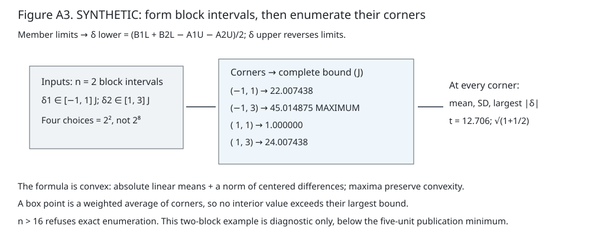
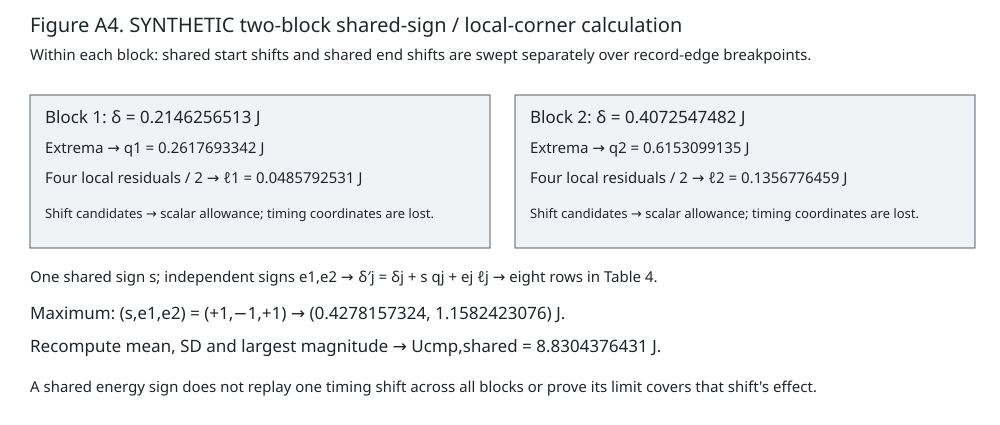
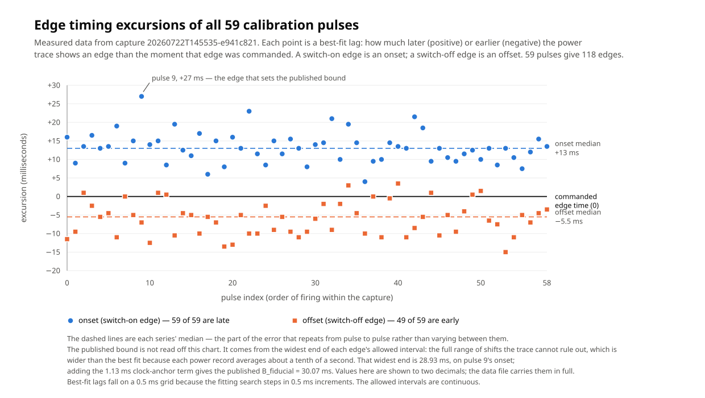
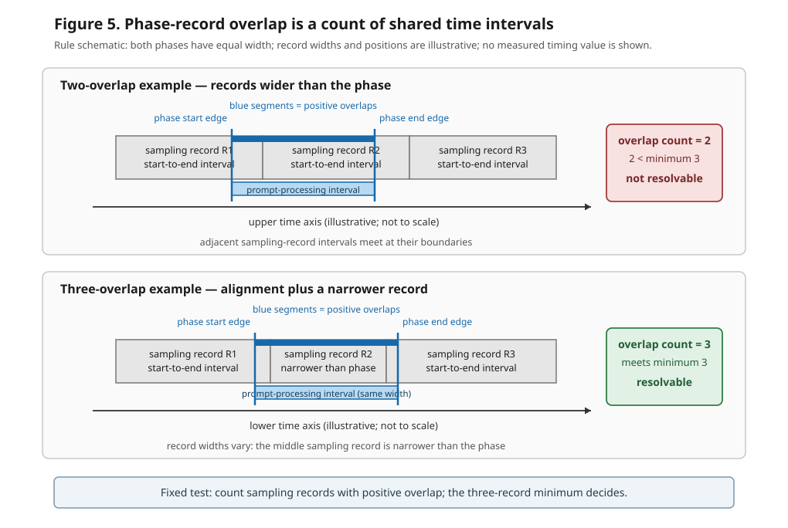
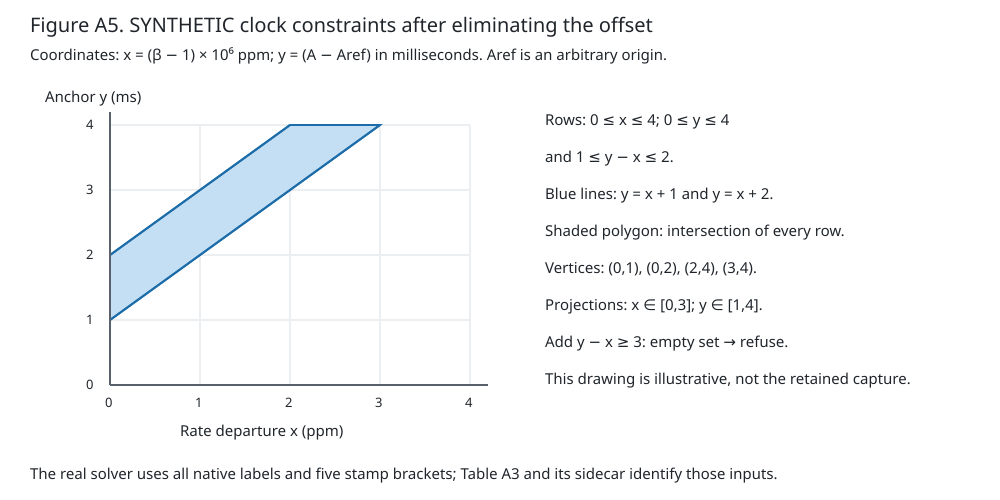
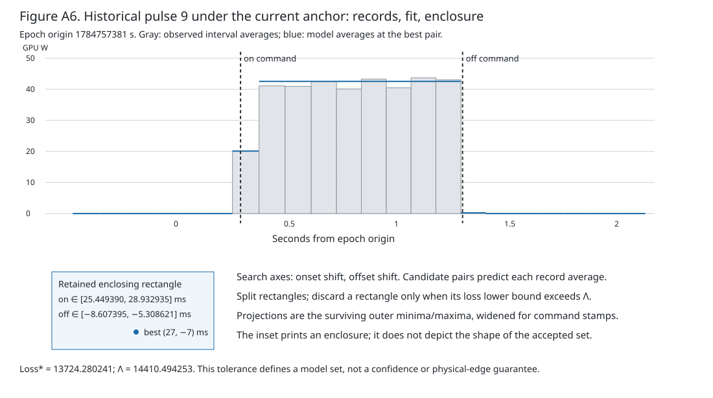
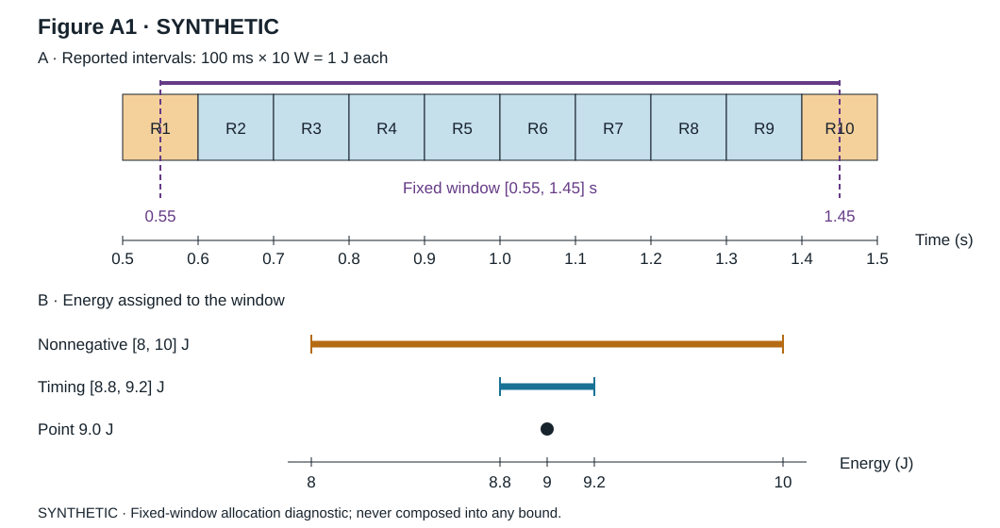

<!-- METHODS/DIAGNOSTIC SUBMISSION DRAFT — selected 2026-09-05 under D-174.
Authority: docs/process_traces/2026-09-05-readiness/02-magistrate-ruling-fallback.md.
Source rows and retired placements remain in results-fill-registry.md.
No empirical outcome selection or prospective result fill remains.
-->

# JouleWise: Timing Sensitivity of Phase-Energy Assignments on Apple Silicon

## Abstract

macOS powermetrics is the power sampler used here. Each sampling record
reports average power between recorded start and end times. A record
can span two phases: prompt processing reads input through the first output
token, a piece of generated text; token generation emits later tokens.
JouleWise assigns energy to each phase as average power times overlap
duration. Moving the dividing time, the phase boundary, reallocates energy
without changing the request total. The method specifies
clock placement, calibration using commanded graphics-processor pulses (work
with time-stamped start and stop commands), and sensitivity calculations over
the registered timing domain—the edge movements fixed before collection.
The allocation holds each record at its reported average; it does not bound
physical phase energy under arbitrary within-record allocations. Fitted
onsets and offsets are switch-on and switch-off times selected by matching
predicted interval-average power to the recorded trace. In a current-method
re-analysis of one historical GPU (graphics-processor) pulse capture, all 59
fitted onsets occur after their commands and 49 of 59 fitted offsets occur
before them; transfer of its timing allowance to inference remains untested.
For historical Qwen2.5-1.5B-Instruct-4bit requests, 37 of 50 prompt-processing
phases crossed two sampling records and failed the three-record minimum; 13
crossed three and passed. Qwen2.5-7B-Instruct-4bit passed in all 50 phases:
33 crossed three records and 17 crossed four.
Labelled synthetic examples make these distinctions reproducible.
The historical evidence covers one Apple computer across retained
measurement windows using macOS processor-power records. It supplies no
new model-energy comparison or phase-energy dominance result.
<!-- Headline: DX-001/003/012/013; record support: DG-067/068/069/072/073/135–142. -->

## 1. Introduction

This methods/diagnostic paper asks how a software power record can support
an allocation to separate parts of an inference request. macOS `powermetrics` is the power sampler used here. A sampling record
is one sampler output that averages processor power from its recorded
start time to its recorded end time. An inference request first reads its
input through production of the first output token; this paper calls that
prompt processing, or *prefill*. It then emits later output tokens; this is
token generation, or *decode*. Prompt processing and token generation are
this paper’s two phases. The runtime-recorded time between them is the
**phase boundary**.

One sampling record can begin during prefill and end during decode. It then
reports one average power for a span that contains both parts, rather than one
value for each. The measurand is energy assigned to each phase by
**interval-overlap allocation**: each sampling record's energy is divided
between the two phases in proportion to the share of its interval falling on
each side of the phase boundary. The record's integrated energy is the time integral \(\int P(t)\,dt\) over its full
span. The **timing envelope** is the range of assigned energies over the
registered timing domain—the edge movements fixed before collection—conditional on the **held-average reconstruction**,
which holds each record at its reported average. This range does not locate actual energy within records, establish pulse-to-model
timing agreement, or guarantee how often future errors stay inside. Moving the edge
within the same record reassigns a slice of recorded energy from one phase to
the other, but the request total does not change. Repeating the request can
narrow ordinary run-to-run scatter; it does not remove this allocation
sensitivity.

In a **synthetic enclosure diagnostic**, a 0.9-s window crossing ten 100-ms
records that each report 10 W is assigned 9 J. Its \(\pm10\)-ms two-edge timing
envelope is [8.8, 9.2] J, while allowing each record's energy to sit anywhere
inside its own interval gives the nonnegative partial-record enclosure
[8, 10] J: the eight records lying wholly inside contribute 8 J, and the two
records the window only partly covers contribute between 0 and 1 J each.
The latter is a diagnostic of allocation ambiguity at the registered window; it is reported, never composed into any bound.
Appendix Figure A1 shows the records, window, and three energy results for this synthetic example.

The historical evidence is deliberately narrow. It measures one Apple M3 Max with
128 GB of unified memory and one configuration of `powermetrics`. MLX is
Apple's on-device inference framework used to run the models. The resulting
allocation sensitivities do not transfer to another machine,
software stack, workload, or power sampler.

Edge placement also depends on clock placement. A rate-aware clock mapping
does not assume that the computer's wall clock and its monotonic clock—a counter
that advances but is never corrected to civil time—advance at exactly the same
rate. Instead, it places each wall-clock reading between the monotonic-clock
readings taken immediately before and after it. Those are the bracketed
readings; the method retains every fixed-rate, offset mapping that they and the
power-record labels permit. The pulse calibration and clock mapping together
specify the allowed edge movements for recalculating assigned energy; using
those movements for inference requires the untested transfer assumption.

To measure the edge problem rather than assume its size, JouleWise records
command timestamps for GPU pulses whose onset is fitted from the
power record. **Commanded graphics-processor pulses** are fixed-duration GPU
work with time-stamped start and stop commands, recorded inside a measurement
window—one uninterrupted measurement session.
The largest displacement between the commanded times and every edge position
allowed by the pulse records, plus the **clock-anchor bound**—the uncertainty in
placing the power record on wall-clock time—is the **pulse-derived limit**.
Applying that limit to inference assumes that the power record locates pulse edges and
model-work edges with the same error. Because pulses are not inference, an
**inserted-gap check**—commanding about 500 ms of no work between prefill and
decode and comparing the gap's independently time-stamped edges with the power
record—is registered as future diagnostic work; this paper did not run it.

A **configuration cell**, shortened below to **cell**, is the set of runs with
one phase, workload, model, hardware, software, and power-measurement boundary,
meaning which power is counted: here the processor power macOS reports, not power
at the wall outlet.
The registered comparison method has three distinct estimands, meaning
quantities the calculation is intended to estimate. It is specified here,
but no new comparison result is reported:

An A/B/B/A block is four runs in the order A, B, B, A.
Repeat the same model to measure false differences; enlarge their spread into
a threshold a model comparison must exceed. The absolute floor uses centered
repeat energies; the comparative floor uses same-model block differences. A
science contrast is a difference between two models.

| Source | Estimand |
|---|---|
| Same-model repeats | Absolute floor |
| Same-model null A/B/B/A blocks, with A = B | Comparative floor |
| Two-model A/B/B/A blocks | Science contrast |

Within a cell, repeated measurements of one model's assigned phase energy
produce a spread after their mean is subtracted. A same-model null A/B/B/A
block produces a false-difference diagnostic, whereas a two-model A/B/B/A
block produces the science contrast. JouleWise bounds each floor source
separately; each separately bounded source is a component. The cell's
**resolution bound**—the **detection floor** in the advisor's terminology—is a
registered operational resolution guard for assigned-energy differences in
that cell before the safeguards in protocol P.3; the artifacts call the final
gate value after those safeguards the **cell floor**.

The registered sensitivity question is whether permitted edge movement—every lower-or-upper
edge position allowed by that calibration and mapping—at least doubles each
component's source of false difference. Let \(U_{\mathrm{point}}\) be a component bound calculated
at the recorded edges; this is the **point-only value**. Let
\(U_{\mathrm{corner}}\) be its counterpart after every allowed
lower-or-upper edge choice for that component is evaluated jointly and the
largest result retained. This **moved-edge limit** is called the
**independent-edge corner bound** in the artifacts. Their quotient,
\(U_{\mathrm{corner}}/U_{\mathrm{point}}\), is the **independent-edge ratio** because each
run's edge may move separately. In the same-model null blocks, A and B are
condition-slot labels set equal to each other; the science contrast assigns the
two models to different conditions.
The comparative replay also retains an **energy-allowance sign**, which says
which direction a nonnegative block-level allowance moves assigned energy. A
shared sign is one choice applied across all blocks, while a local sign is
chosen separately for each block. This replay uses a different numerator:
let \(U_{\mathrm{cmp,point}}\) be the four-run comparison's point-only value, and
let \(U_{\mathrm{cmp,shared}}\) be its largest limit after one energy-allowance sign
is replayed across all blocks and one local sign is chosen per block. Their
quotient is \(R_{cm}=U_{\mathrm{cmp,shared}}/U_{\mathrm{cmp,point}}\). This
\(R_{cm}\) quantity is a **shared-energy-sign/local-corner sensitivity
diagnostic**: it retains one shared sign for block-level energy allowances and
one local sign per block. It does not globally replay one physical common-time
shift and has no proven conservatism for common-time motion. Both ratios
measure enlargement under specified perturbation sets; they do not estimate
how often or how strongly those errors occur.

The short-prefill question is narrower: when prompt processing is brief, do
enough sampling-record intervals overlap it to support a phase reduction—that
is, computing separate phase energies from the overlapping sampler records? A
failure of the fixed three-record minimum is a measurement refusal, a no-result
stop rather than evidence of zero prompt-processing energy or a model
comparison.

The evidence tests clock placement and record support. The unperformed comparison
campaign, its identities, characterization requirements, claim rules, and input-verification
requirements are specified in the [prospective comparison protocol](protocol/prospective-comparison-protocol.md).
The following sensitivity calculations remain useful without that campaign:
they show how fixed timing allowances change assigned-energy statistics.

## 2. In-window calibration method

Prompt processing (*prefill*) reads the prompt through the first output token; token generation (*decode*) emits later output tokens. A phase boundary is the runtime-recorded time separating those phases. macOS's built-in power sampler, *powermetrics*, emits one record containing the CPU (general-purpose processor), GPU, and neural-engine (specialized neural-network processor) average power over one shared start-to-end interval; JouleWise assigns that sampling record to a phase using the boundary and multiplies each channel's average power by the part of the interval in that phase. A phase boundary is therefore a separate measurement problem from repeatability. Moving a boundary 0.010 s inside a 30-W record transfers 0.30 J between assigned phases under the held-average reconstruction. The request total does not change: energy removed from one phase is added to the other. Repetition can reduce random scatter, but it cannot remove this systematic reassignment.

Figure 1 shows interval-average power around the recorded boundary between prompt processing and token generation, with the allowed boundary positions marked as a band. The hatched area is the energy reassigned between phases when the boundary moves across that band; the request total does not change.


*Figure 1. Synthetic boundary-allocation arithmetic. The gray rectangle is one
30-W average over [1.000,1.100] s. The solid boundary at 1.040 s assigns
1.20 J to prefill and 1.80 J to decode; the dashed boundary at 1.050 s assigns
1.50 J to each. The blue hatched slice has the full 30-W height and 0.010-s
width, hence 0.30 J. Axes give power and time; all values are illustrative and
the 3.00-J request total is unchanged.*

### Bracketed pulse-train algorithm

Immediately before and after each science window—one uninterrupted measurement session—JouleWise records a calibration under the same declared machine state, meaning the hardware and operating conditions recorded before collection. Each capture carries an instrument-validation manifest, a list of its calibration artifacts and their SHA-256 fingerprints. Under the current mint—the analysis run that issues the paper's fixed results—JouleWise hashes that manifest's bytes and compares the result with `validation_manifest_sha256` recorded in the capture, then hashes every listed artifact and compares the result with the manifest's entry; either mismatch refuses the capture as `instrument_calibration_invalid` in `joulewise/reduce.py`. Separately, it hashes the bytes of the frozen reservation plan, the file that names the reserved collection slots, and checks both that digest and the plan identifier against pins in the calibration ledger's session record; either mismatch is `PLAN_HASH_MISMATCH` in `joulewise/calibration_ledger.py`. The calibration-acceptance file, which contains the fixed rule used to judge a bracket, gets its expected digest from the in-code `ISSUED_ACCEPTANCE_REGISTRY`, or from `GENESIS_FIXTURE_ACCEPTANCE_SHA256` for the retained genesis test fixture, before its bytes are accepted by `joulewise/calibration_bracketing.py`. **Frozen** means fixed and fingerprinted before collection. The capture's timestamps must place it before the first or after the last science run and no more than 24 hours from the window's far end. After three warm-up pulses, which are discarded, it commands 59 one-second GPU matrix-multiplication pulses on preallocated \(4096\times4096\) 16-bit floating-point matrices. A fixed base-two varied-gap schedule—gaps generated by reversing binary digits as specified in Appendix A.3.2—prevents the pulse edges from repeatedly lining up with the requested 100-ms sampler cadence. Five seconds of quiet trace (no commanded pulse) are requested on both sides of the train, of which at least 4.5 s must be present.

Before using the checks, define resting power b as the median of quiet records
and σ=max(1.4826 × median absolute deviation from b, 0.001 W). The quiet-record
threshold is b+max(5 W,5σ). With b=0 W and σ=0.001 W, consecutive quiet
records of 6 W and 7 W exceed 5 W and fail the uncommanded-plateau check.
A pulse must rise at least 10 W and have amplitude/σ≥10. Its fitted loss must
be strictly below half the no-pulse loss: losses 4 and 10 pass; 5 and 10 fail.
Both fitted shifts must have absolute value strictly below 0.5 s: 0.499 s
passes and 0.500 s fails. Trace coverage must extend at least 0.75 s beyond
each command. These numeric rules define “far enough,” “better,” and “accepted”
in the following summary; Appendix A.3.5 specifies the loss and full checks.

For each commanded pulse, the detector estimates resting GPU power from samples outside the fixed time margin around every pulse and pulse height from samples wholly inside its flat high-power portion, called the plateau. It predicts each reported interval average from the fraction of that interval covered by a shifted rectangular pulse, then scores the difference between predicted and observed power with a rule that limits the influence of one large discrepancy while moving the onset and offset separately. After finding the best pair, it encloses every pair close enough to that fit: a rectangle is rejected only when a mathematical lower bound proves that none of it can pass, and every surviving rectangle is split to a fixed resolution. The four outer edge values are widened for uncertainty in the two command timestamps. A capture is refused unless all 59 pulses pass five kinds of check: the signal rises far enough above resting power; the fitted pulse explains the trace better than a no-pulse model; the fitted onset and offset stay inside the accepted shift range; trace coverage extends through the fixed margin on both sides of the pulse; and the required pulses, file fingerprints, and machine-and-protocol fields are complete. Appendix A.3.5 gives the signal, fit, range, and trace-coverage calculations, and Appendix A.3.6 gives the completeness test. No uncommanded plateau may appear. The shared search-work limits cap both the number of search rectangles evaluated and the elapsed search time for the whole capture; exhausting either limit refuses the capture (Appendix A.3.7). The accepted capture bound is the largest allowed edge displacement among all pulses plus the trace's clock-anchor bound, the uncertainty in placing the trace on wall-clock time, built next.

The clock anchor uses five wall-clock readings, each bracketed by readings from a monotonic clock—a counter that advances but is never corrected to civil time—together with every whole-second label embedded in the native power records. The **first-record endpoint** is the wall-clock time assigned to the end of the first native power record. The method retains every straight-line mapping whose rate and offset satisfy four evidence constraints: each wall reading lies inside its monotonic stamp bracket; each native whole-second label contains its modeled record end; the first record starts after sampler launch; and that record is parsed only after it is written. Appendix A.3.3 gives the inequalities. The method permits the two clocks to run at slightly different fixed rates and charges the full allowed departure of a native label from that line. It refuses missing or malformed inputs, an empty set or an unbounded one (the allowed rate reaches the edge of its search box), inadequate capture span, implausible clock rate, active automatic network-time correction, or a bound outside the accepted range. Otherwise it finds the earliest and latest allowed first-record endpoint and adds four allowances: half the endpoint range, the observed wall-versus-monotonic span, the largest reported clock resolution, and a fixed numeric-rounding pad. This corrected rate-aware model replaced the false equal-rate assumption, which could move every fitted edge in the same direction.

Finally, the pre-window and post-window capture bounds form a bracket. The frozen **calibration-acceptance rule** is the pre-collection rule that decides whether those two captures may bracket one window; it derives two constants from its retained 17-capture corpus. Student-\(t\) is a small-sample bell curve whose 99% quantile—the two-sided 99% point, written \(t_{0.995,16}\) because it leaves 0.5% in each tail with 16 degrees of freedom, and larger than the normal curve's because the spread is estimated from only 17 captures—sets the maximum permitted pre/post difference. For \(n=17\) per-capture bounds, the sample standard deviation (the \(n-1\) formula of Section 3) is \(s_b = 2.460856\) ms (unrounded, \(2.460856207694636\) ms) and \(t_{0.995,16}=2.92078162242509999197\); the two-draw rule—two fresh capture bounds are drawn, and the spread of their difference is \(\sqrt{2}\) times one capture's spread—so \(t_{0.995,16}\times s_b\times\sqrt{2}\) records \(10.164834757777545\) ms, printed as the \(10.164835\)-ms maximum permitted pre/post difference. The separately retained **minimum allowance** starts from the corpus range, \(9.723589288793850\) ms, rounded to the nearest microsecond, with an exact tie going to the even digit (`ROUND_HALF_EVEN`), giving \(9.724\) ms; Appendix A.3.8 prints the 17 bounds from the retained calibration acceptance file `configs/calibration/calibration_acceptance_d079_v2_n17_r3.json` (registry source S17). The minimum prevents two numerically matching captures from erasing the finite change allowance fixed from that corpus. A larger difference refuses the window. Appendix A.3.6 calls one capture's pulse-derived limit \(B_{\mathrm{fiducial}}\). The window's distinct **operative timing bound** \(b\) is the larger capture bound plus \(\max(|B_{\mathrm{post}}-B_{\mathrm{pre}}|,9.724\ \mathrm{ms})\), added once. For example, a 25-ms pre-window bound and a 29-ms post-window bound differ by 4 ms, pass the 10.164835-ms limit, and give \(b=29+\max(4,9.724)=38.724\) ms. If the post-window calibration widens a bound already used, the affected phase energies are recomputed with the wider bound or refused. Appendix A.3 formally defines the complete sets of pulse-edge positions and clock mappings that satisfy every fixed constraint, along with objectives, ranges, and refusal conditions.

Commanded GPU pulses calibrate edge placement, but applying that bound to sustained mixed inference is an assumption. The before-and-after bracket tests for change across the measurement window; it does not test whether the pulse-derived limit applies to inference.

A **stage** is one declared group of runs measured back-to-back inside a
window. A stage is **admitted**, meaning allowed to begin its measured runs,
when its machine-state checks pass. Appendix Figure A2 orders the
before-and-after pulse calibrations, the **entry check**, the pass/fail checks on recorded machine state that a stage must satisfy before its first run is measured, fixed reference workloads repeated at the
window's opening, midpoint when present, and close to track drift, and science blocks within
one measurement window. Those repeated workloads are the **reference runs**.
Each science block uses A/B/B/A order—condition A, condition B,
condition B, condition A—and names its four **members**, meaning its four
individual runs, \(A_1,B_1,B_2,A_2\) in that order. Its block difference is
\((B_1+B_2-A_1-A_2)/2\); a positive value means condition B used more energy
than condition A. The order balances conditions and suppresses a linear trend
only when the sums of the A and B run midpoints match; unequal runtimes or
cooldowns can break that symmetry. Reference runs measure change only at selected times. A separately measured
**whole-window allowance** is one joule
amount for each **energy family**, a group reduced under the same energy
definition, later added once to its component bound, equal to the larger of
the **reference-trajectory excursion**—the spread among the mean energies of
the opening, midpoint, and closing reference runs (largest minus smallest)—and
that family's **issued repeatability bound**—a repeatability bound on
reference-run energy issued from an earlier retained window, not re-estimated
in this one.

## 3. How the method quantifies assigned-energy sensitivity

To clip a record is to keep only the part of its time interval inside the
phase, then multiply that duration by the record's average power. For example,
a 30-W record from 1.000 to 1.100 s cut at a phase boundary of 1.040 s gives
prompt processing \(30\times0.040=1.20\) J and token generation
\(30\times0.060=1.80\) J. Moving the permitted boundary to 1.050 s would
instead give 1.50 J to each phase. This 0.30-J movement is the allocation
sensitivity calculated under the held-average reconstruction; it is not a
physical enclosure for arbitrary within-record power allocations.

### Comparing the moved-edge limit and point-only value

The forcing problem is that any positive boundary interval can make a
moved-edge limit exceed a point-only value, so mere exceedance cannot show
that boundary placement is the limiting uncertainty. The comparison therefore
asks for a fixed twofold increase in the complete bound, not just a positive
increase in one timing term.

A cell groups runs that use the same phase, workload, model, hardware,
software, and power-measurement boundary. It has two false-difference
components. The **absolute component** measures spread among repeated runs of
one model. The **comparative component** measures differences from four-run
blocks executed in A, B, B, A order. If the four phase energies in one block
are \(A_1,B_1,B_2,A_2\), the block difference is

\[
\delta=(B_1+B_2-A_1-A_2)/2.
\]

A positive difference means condition B used more assigned phase energy than
A. A/B/B/A balances order and suppresses a linear trend only under the
specified timing symmetry: the A and B run-midpoint sums must match. Unequal
runtimes or cooldowns break that balance; curved change is addressed only by a
separate empirical whole-window allowance.

A later factor that widens a result to allow for limited repetition is applied
before the whole-window allowance; neither enters the first calculation. For
either component, first calculate its **point-only unguarded value**;
“unguarded” means that neither has yet been applied. An
**admitted energy** is an energy from a run that passed the required entry
checks; this validity condition alone does not establish statistical independence. “Point only” means using each admitted
energy at its recorded value. The later factor is the **small-sample
multiplier**. Here \(n\), the number of
**independent units**, counts one repeated run for the absolute component and
one four-run A/B/B/A block for the comparative component. These are the
observations the statistical model assumes independent; admission does not
establish that independence.
For repeated energies \(E_i\), calculate their mean \(\bar E\), residuals
\(r_i=E_i-\bar E\), and residual mean \(\bar r\). Calculate the sample
standard deviation as

\[
s_r=\sqrt{\frac{\sum_i(r_i-\bar r)^2}{n-1}}.
\]

Let \(t_{.975,n-1}\) be the value below which 97.5% of a Student-\(t\)
distribution with \(n-1\) degrees of freedom lies; this distribution widens
the prediction when only a few independent units exist. Then take

\[
U_{\mathrm{abs,point}}=
\max\!\left(\max_i|r_i|,
t_{.975,n-1}s_r\sqrt{1+1/n}\right).
\]

The first term preserves the largest displacement already observed. Under the
independent-normal model, the second is a two-sided 95% prediction amount for
one further observation; it is not a deterministic future-error bound. For block
differences \(\delta_i\), calculate their mean \(\bar\delta\) and sample standard
deviation

\[
s_\delta=\sqrt{\frac{\sum_i(\delta_i-\bar\delta)^2}{n-1}},
\]

then take

\[
U_{\mathrm{cmp,point}}=
\max\!\left(\max_i|\delta_i|,
|\bar\delta|+t_{.975,n-1}s_\delta\sqrt{1+1/n}\right).
\]

For a worked example of that bound, take five repeated energies 8, 9, 10, 11,
and 12 J. Their mean is 10 J, their residuals are −2, −1, 0, 1, and 2 J,
and their sample standard deviation is \(\sqrt{10/4}=1.581139\) J. Using the
code's fixed three-decimal lookup-table convention, \(t_{.975,4}=2.776\), and
using the unrounded standard deviation, the prediction amount is
\(2.776\sqrt{10/4}\sqrt{1.2}\approx4.808173\) J,
larger than the 2 J observed residual, so
\(U_{\mathrm{abs,point}}=4.808173\) J. If five
block differences are 0, 1, 2, 3, and 4 J, their mean is 2 J and their sample
standard deviation is again 1.581139 J; therefore
\(U_{\mathrm{cmp,point}}=\max(4,2+4.808173)=6.808173\) J. These values
demonstrate the formulas and are not campaign evidence (registry SYN-03).

### Moving edges and enumerating endpoints

Each admitted repeat energy has lower and upper values obtained by moving its
phase boundaries through the permitted timing domain. For the absolute
component, enumerate the \(2^n\) lower/upper choices for the n repeat energies.
For the comparative component, first form each block’s difference interval:
\[
\delta_j^-=(B_1^L+B_2^L-A_1^U-A_2^U)/2,\qquad
\delta_j^+=(B_1^U+B_2^U-A_1^L-A_2^L)/2.
\]
Then enumerate the \(2^n\) block endpoints, not \(2^{4n}\) member combinations.
At each corner recalculate the complete applicable formula, including the
mean, largest magnitude, and sample standard deviation. Retain its maximum
as \(U_{\mathrm{abs,corner}}\) or \(U_{\mathrm{cmp,corner}}\).
The comparative formula is convex in the block differences: the absolute mean
is convex, the standard deviation is a norm of a linear centering operation,
and a maximum preserves convexity. Every point in a box is a convex combination
of corners, so its bound cannot exceed the largest corner value. The absolute
formula has the same property after centering the repeat energies.
Exact enumeration refuses above 16 independent units; it never substitutes an
approximation. Independence here is a statistical assumption, not conferred by
successful admission.

For a labelled two-block illustration, intervals [−1,1] and [1,3] J give four
corners (Figure A3). With \(t_{.975,1}=12.706\), their complete bounds are
22.007438, 45.014875, 1.000000, and 24.007438 J in the displayed order.
At (−1,3), the mean is 1 J, the sample SD is \(\sqrt8\) J, and
\(1+12.706\sqrt8\sqrt{1.5}=45.014875\) J is the maximum. This is
synthetic diagnostic arithmetic, below the five-unit publication minimum
(registry SYN-05).



*Figure A3. Synthetic endpoint enumeration. The left box forms two block
intervals; the central box lists every corner and its complete bound in
joules. The right-hand calculation uses the mean, sample standard deviation
and largest magnitude at each corner. The marked maximum is the retained
bound. Arrows show calculation order; the notes explain convexity and the
refusal above 16 units. The two-block example is diagnostic only.*

The independent-edge ratio is

\[
R=\frac{U_{\mathrm{corner}}}{U_{\mathrm{point}}}.
\]

The moved-edge limit and point-only value therefore use the same complete
unguarded formula, once after allowed edge movement and once at the recorded points.
Neither is a timing term alone or a value after the multiplier or
whole-window allowance is added. In this paper, allowed boundary movement
**dominates** a component only when \(R\ge2\): it adds at least one entire
point-only value. Exact equality at \(R=2\) passes. A threshold merely above 1
would let any positive interval width do the decisive work. If
\(U_{\mathrm{point}}=0\), the program refuses with the fixed reason name
`dominance_ratio_zero_denominator`; it does not print infinity.

Here, **authenticated** means that each named input carries its expected
SHA-256 fingerprint and the inputs its record names agree with the files on
disk. A missing fingerprint, a mismatch, or a required input that cannot be
checked is unauthenticated and cannot select a ratio outcome.

### Combining shared movements and local widths

The comparative \(R_{cm}\) diagnostic first derives a block-level energy
allowance from shared start and end movements within each A/B/B/A block. This
within-block construction is not a global common-time replay across blocks.
For a block \(j\), start
with its admitted point difference \(\delta_j\). Reintegrate the four retained
power traces after moving all four phase starts by the same shift while holding
their ends fixed. The shift candidates are \(-b,0,+b\), where \(b\) is the
window's authenticated operative timing bound from Section 2, plus every shift
within \([-b,b]\) that makes a retained power record's start or end coincide
with one of the four phase starts. The resulting block differences form the
onset set \(O_j\). Repeat for the four phase ends, using the analogous
record-edge coincidences and holding starts fixed, to form the offset set
\(P_j\). Both sets include the zero-shift value \(z_j\).

Define the shared lower and upper excursions

\[
d_j^-=(\min O_j-z_j)+(\min P_j-z_j),\qquad
d_j^+=(\max O_j-z_j)+(\max P_j-z_j),
\]

and let

\[
q_j=\max(|d_j^-|,|d_j^+|)+|z_j-\delta_j|.
\]

Thus \(q_j\) is the nonnegative block-level energy allowance from the farther
shared start-plus-end movement, plus any difference between recomputing energy
at zero shift and the admitted block value. The
implementation prevents a printed interval from rounding inward. In
**binary64**, the usual 64-bit floating-point format, `ulp(1.0)` is the gap
between 1 and the next larger representable number. The **member-envelope
integral sum** is
\(\sum_{m\in\{A_1,B_1,B_2,A_2\}}|c_m|\int_{\mathrm{start}_m-b}^{\mathrm{end}_m+b}P_m(t)\,dt\),
where \(c_m=(-1/2,+1/2,+1/2,-1/2)\) and \(P_m(t)\) is member \(m\)'s
interval-average-power trace, held at each record's reported average across
that record's time interval. This nonnegative joule sum supplies a scale
large enough to cover all four member integrals before their signed contrast
is formed. It sets
\(M=\max(1,|\delta_j|,|z_j|,\max_{o\in O_j}|o|,\max_{p\in P_j}|p|,\text{member-envelope integral sum})\), takes
\(p=64\,[\operatorname{ulp}(1.0)/2]M\), subtracts \(p\) from the lower
extreme and adds \(p\) to the upper extreme, and then moves each resulting
endpoint four representable binary64 values outward. The factor 64 pays for
the finite set of floating-point operations before the enclosure is printed.
For block 1 of the two-block fixture below, the four member-envelope integral
contributions are summed with absolute contrast weights of 1/2. Their
registered sum, 103.06152807459057 J, exceeds the absolute contrast and every
onset/offset sweep value; hence M=103.06152807459057 J gives

\[
p=64(2^{-53})(103.06152807459057)=7.322962010973595\times10^{-13}\ \mathrm{J},
\]

before the four outward binary64 steps. The amount is small, but its direction
is fixed: the printed enclosure cannot become narrower through rounding.

Next set the shared calibration-pulse timing movement to zero and, for each of
the four block members, recompute phase energy from the same power trace while
moving only that member's remaining local clock and edge uncertainty. Let the
largest absolute energy change for member \(m\) be
\(r_{jm}\). The local half-width of the block difference is

\[
\ell_j=(r_{j1}+r_{j2}+r_{j3}+r_{j4})/2.
\]

Enumerate one shared sign \(s\in\{-1,+1\}\) for the entire set of blocks and
one independent local sign \(e_j\in\{-1,+1\}\) for each block. At every one of
the \(2\times2^n\) choices, replace each point difference with

\[
\delta'_j=\delta_j+s q_j+e_j\ell_j,
\]

recalculate the complete comparative unguarded formula, and retain the largest
value \(U_{\mathrm{cmp,shared}}\). Divide that complete shared/local replay
bound by the comparative point-only value. Retaining the same sign for the
scalar \(q_j\) allowances does not preserve or replay one physical time shift;
their extrema can arise at different timing coordinates. This quotient is the
comparative **shared-energy-sign/local-corner ratio** \(R_{cm}\):

\[
R_{cm}=\frac{U_{\mathrm{cmp,shared}}}
             {U_{\mathrm{cmp,point}}}.
\]

The same zero-denominator refusal applies. A comparative \(R_{cm}<2\)
withdraws the boundary-doubling sentence even when \(R\ge2\). Absolute
\(R_{cm}\) remains `not_applicable` because the registered replay is
comparative-only, not because absolute timing uncertainty vanishes.

A retained two-block fixture makes the replay checkable. SYNTHETIC ARITHMETIC
ONLY: it is a test fixture, not a new hardware result or campaign evidence. The Student-\(t\) critical used by the two-block interval is
\(t_{0.975,1}=12.706\), the fixed-table value `_T_CRITICAL_95[1] = 12.706` in
`joulewise/aggregate.py`, returned by `student_t_critical_95` and used by
`joulewise/detection_floor.py`; the artifact records
`t_critical_source: joulewise.aggregate.student_t_critical_95.v1`.
Block 1 has
\(\delta_1=z_1=0.2146256513\) J, onset values from 0.1098764207 to
0.2243993676 J, and offset values from 0.0576055478 to 0.3349382543 J. Hence
\(d_1^-=-0.2617693342\) J, \(d_1^+=0.1300863192\) J, and
\(q_1=0.2617693342\) J. Its four local residual half-widths are
0.0015589205, 0.0337198644, 0.0491358083, and 0.0127439131 J, so
\(\ell_1=0.0485792531\) J. Block 2 has
\(\delta_2=0.4072547482\) J and \(z_2=0.4072547482\) J. Its onset extrema are 0.1874032042 and 0.4087521588 J, and its offset extrema
are 0.0117963786 and 0.5328227055 J. Therefore d₂⁻=−0.6153099135 J and
d₂⁺=0.1270653679 J. Its local residuals are 0.0796336877, 0.0882882319,
0.0500411281, and 0.0533922441 J; summing and halving gives
\(\ell_2=0.1356776459\) J, while \(q_2=0.6153099135\) J.
The retained trimmed member traces reconstruct these integrals at
b=0.03678263869781979 s.
For block 1 the four enlarged-window integrals are 51.7925236532,
51.4297001503, 51.6016978076, and 51.2991345381 J; halving their unrounded
sum gives M₁=103.06152807459057 J. For block 2 they are 51.4136529737,
51.3521324018, 51.3994292387, and 51.7540189975 J; halving their unrounded
sum gives 102.95961680584864 J. This member-envelope integral sum exceeds
the other scale candidates, so M₂=102.95961680584864 J. Each integrates the sum of the three
record-average channels over [start−b,end+b], using times relative to the
first retained record endpoint to avoid epoch-scale rounding. The replay
script and `worked-examples.json#synthetic.blocks` retain the four integrals,
b, trimmed-file fingerprints, and all full-precision operands (registry SYN-01). Enumerating both
shared signs and all four local-sign pairs yields
\(U_{\mathrm{cmp,point}}=2.4305766103\) J and
\(U_{\mathrm{cmp,shared}}=8.8304376431\) J, so
\(R_{cm}=3.6330628732\), which passes 2. A replay from the printed
10-decimal operands agrees to nine significant figures. The fixture demonstrates
the arithmetic only. Source map: `tests/fixtures/fcm_r4_real_blocks/measured_pair.json`
contains `blocks` with each point difference, onset/offset extrema and local
member residual; `joulewise/detection_floor.py` implements the shared/local
enumeration. The filename is a historical fixture label and confers no
empirical authority. The full fixture and its SHA-256 are recorded in registry
SYN-01; the printed operands above reproduce the quotient to the stated
precision without a raw capture.

Table 4. All eight sign cases from the full-precision SYN-01 fixture. Values
are joules, rounded to ten decimals after calculation; signs label energy
allowances, not physical timing directions.

| s | e₁ | e₂ | δ′₁ | δ′₂ | Mean | Sample SD | Complete bound |
|---:|---:|---:|---:|---:|---:|---:|---:|
| -1 | -1 | -1 | -0.0957229360 | -0.3437328112 | -0.2197278736 | 0.1753694646 | 2.9487587953 |
| -1 | -1 | 1 | -0.0957229360 | -0.0723775195 | -0.0840502277 | 0.0165077023 | 0.3409366257 |
| -1 | 1 | -1 | 0.0014355703 | -0.3437328112 | -0.1711486204 | 0.2440709032 | 3.9692844226 |
| -1 | 1 | 1 | 0.0014355703 | -0.0723775195 | -0.0354709746 | 0.0521937363 | 0.8476894571 |
| 1 | -1 | -1 | 0.4278157324 | 0.8868870158 | 0.6573513741 | 0.3246124176 | 5.7088426776 |
| 1 | -1 | 1 | 0.4278157324 | 1.1582423076 | 0.7930290200 | 0.5164895845 | 8.8304376431 |
| 1 | 1 | -1 | 0.5249742387 | 0.8868870158 | 0.7059306273 | 0.2559109789 | 4.6883170503 |
| 1 | 1 | 1 | 0.5249742387 | 1.1582423076 | 0.8416082731 | 0.4477881458 | 7.8099120158 |

The largest case uses (s,e₁,e₂)=(+1,−1,+1), giving differences
0.4278157324 and 1.1582423076 J and bound 8.8304376431 J.
Using the rounded ten-decimal inputs alone gives about 8.8304376433 J;
the two final digits differ because the registered fixture is unrounded.



*Figure A4. Synthetic shared-sign calculation. The two boxes show each block’s
point difference, shared energy allowance and local half-width in joules.
The lower rows apply one shared sign and one local sign per block, enumerate
the cases in Table 4, and identify the maximum complete bound. These signs
move energy allowances; they do not preserve one physical time shift.*

The prospective publication safeguards and their synthetic composition example
are specified in protocol P.3. The calculations above stop at the sensitivity
ratios; no new component floor is published here.

## 4. Historical diagnostic results

### Evidence validity

A missing clock stamp, a malformed native record, a failed calibration predicate,
or a mismatched source fingerprint stops the corresponding reconstruction and
records its reason. This behavior is *fail-closed*: the program supplies no
replacement value. The retained historical sources below have
separate diagnostic authority; passing their checks does not authorize a new
model comparison.

### One diagnostic reconstruction

The following table and arithmetic reconstruct one retained diagnostic capture from raw clock readings through its maximal pulse. Wall stamps use seconds since 1970; monotonic stamps use the machine's never-adjusted counter. The protocol offsets use the commanded pulse schedule's own origin at its first protocol pulse. Three warm-up pulses occur before that origin, and sampling began earlier still, so those offsets are neither times since sampling began nor observed edge times. A **best-fit lag** is fitted edge time minus its matching command time. Each onset lag or offset lag uses that commanded edge as zero; bounds are elapsed durations rather than positions on either clock.

| Stamp \(s\) | \(W_s\) (s) | \(M_s^-\) (s) | \(M_s^+\) (s) | \(R_s\) (s) |
|---|---|---|---|---|
| `pre_spawn` | 1784757335.502742 | 458736.4081875 | 458736.408188666 | 0.0000010000000000000002 |
| `first_parse` | 1784757336.604396 | 458737.509839458 | 458737.509840291 | 0.0000010000000000000002 |
| `sampling_started` | 1784757337.0900722 | 458737.995513416 | 458737.995514666 | 0.0000010000000000000002 |
| `sampling_stopped` | 1784757533.877846 | 458934.782846541 | 458934.782848041 | 0.0000010000000000000002 |
| `post_parse` | 1784757533.8891652 | 458934.794166 | 458934.7941665 | 0.0000010000000000000002 |

*The rows above are the five paired clock readings of one retained diagnostic capture. Wall values are seconds since 1970; monotonic values are seconds on the machine's never-adjusted counter. \(R_s\) is the larger of the two resolutions recorded with the stamp — the wall clock's \(1.0000000000000002\times10^{-6}\) s against the monotonic clock's \(4.166666666666666\times10^{-8}\) s — so the wall figure governs every row here. The two monotonic readings bracket each wall reading, which is what makes the pair usable: the wall value is known to have been taken somewhere inside that bracket.*
<!-- evidence: runs_window_a_20260722/instrument_validation/20260722T145535-e941c821/instrument_evidence.json -> clock_anchor.clock_stamps; row order is joulewise/uncertainty_evidence.py STAMP_ORDER; R_s composition is max(wall_resolution_s, monotonic_resolution_s) per the same module -->
<!-- replay fence: scripts/check_paper_replay_fence.py is the mechanical re-derivation check for this table — it reads the five stamp rows back out of the retained evidence file in solver order and requires each printed value to be the same double, failing closed if a row is dropped or the caption is reworded. -->

*Worked historical-capture arithmetic.* One retained current-estimator derivation reports all \(59\) pulses detected, \(122{,}859\) evaluated rectangles, a local clock-anchor bound of \(0.0011349971959968978\) s, and a final capture bound of \(0.030067931757111657\) s. Therefore the largest pulse residual before the anchor term is \(0.030067931757111657-0.0011349971959968978=0.0289329345611147592\) s. Re-running the detector over that capture's retained raw power trace and event log, under the current anchor method, reproduces both the capture bound and the evaluated-rectangle count exactly, and identifies the pulse attaining the maximum: the tenth commanded pulse of the capture, scheduled to switch on \(26.625\) s and off \(27.625\) s measured from the origin of the commanded pulse schedule, which is where the schedule places its first protocol pulse rather than an observed onset. Its two commands were stamped at \(1784757381.2856488\) s and \(1784757382.293089\) s of wall time, expressed as seconds since 1970. The fit leaves its onset lag anywhere in \([0.02544938965763524,\,0.02893293456111476]\) s and its offset lag anywhere in \([-0.008607394549133255,\,-0.005308621075866744]\) s, about a best-fit pair of \(+0.027\) s and \(-0.007\) s. The retained residual bound for the pulse is the largest absolute value those four endpoints allow — \(0.02893293456111476\) s, the upper end of the onset interval — and adding the local clock-anchor bound to it returns the capture bound quoted above. These values support only the diagnostic reconstruction of this retained calibration capture; they do not supply the prospective Qwen3 comparison.
<!-- evidence: runs_window_a_20260722/instrument_validation/20260722T145535-e941c821/{events.jsonl,instrument_evidence.json}; commanded edges from events.jsonl pulse_command_on/off #10 metadata.clock_stamp.epoch_s (planned offsets 26.625 s / 27.625 s). The v3-anchored fit rows are re-derived deterministically by joulewise.powermetrics_fiducial.rederive_detection_from_artifacts over the retained raw plist + events.jsonl, reproducing b_fiducial_s = 0.030067931757111657 and projection_evaluated_cell_count = 122859 exactly; the byte-retained pulses[] in this 2026-07-22 file are v2-anchor-era, while fresh _v5 captures byte-retain v3. -->
<!-- evidence: docs/process_traces/2026-08-19-refreeze-execution/r6-issuance/r4-derivation.json -->
<!-- replay fence: scripts/check_paper_replay_fence.py is the mechanical re-derivation check for this paragraph — it re-runs the anchor and the 59 pulse fits from the capture's primary bytes and requires every literal above to be the same double it re-derives (stored rows and the stored bound are never inputs). -->

### Historical current-method edge result

The following are diagnostic-era instrument statistics — a desk
re-derivation over retained captures whose energy values the repository decision D-078
voids for energy-claim use; they characterise the timing calibration of the instrument and are not
evidence for any new model-energy result. Here diagnostic-era means collected
in the historical July 2026 period. The source is the single capture
`20260722T145535-e941c821`, re-derived under the current rate-aware anchor
`powermetrics_native_second_rate_aware_set_membership_v1`. Its historical
stored pulse fits used an earlier anchor; this analysis recalculates them
from the retained raw power bytes and command events. Re-deriving a historical
capture under the current method does not make it a supplier for a prospective
energy claim.

A best-fit lag is fitted edge time minus its command time: positive means late,
negative means early. Onsets switch work on; offsets switch it off. The 59
onset lags are all positive; 49 of 59 offset lags are negative, eight positive,
and two zero. Their medians—the middle sorted values—are +13.0 ms and
−5.5 ms. These are 59 onset and 59 offset values (118 edges) from one capture,
not independent calibration draws; these sample statistics make no coverage
or independence claim.



*Figure 2. Historical current-method re-derivation, one GPU pulse capture.
The horizontal axis is pulse index 0–58 in command order; the vertical axis
is signed fitted lag in milliseconds, with pale horizontal grid lines and
labelled ticks. Blue circles are the 59 fitted onset lags; orange squares are
the 59 fitted offset lags. The solid black zero line is each edge's commanded
time. Blue and orange dashed horizontal lines mark the respective medians,
+13.0 ms and −5.5 ms; they describe this sample, not a repeatable error or
future coverage. The title, explanatory subtitle, right-hand line labels,
bottom shape legend and notes name those marks and the late/early counts.
The leader at pulse index 9 marks its +27-ms best-fit onset. An **allowed region** contains every edge
pair surviving the fit's discrepancy limit. The allowance
is a different quantity: the largest endpoint displacement in an allowed
region, 28.93293456111476 ms on that onset, equals the retained worst edge
excursion. Adding the 1.1349971959968978-ms clock-anchor allowance gives
30.067931757111657 ms. The endpoint displacements and anchor
allowance are described in the notes but are not plotted. The 0.5-ms fitted
lag grid reflects the search step; allowed edge positions range continuously.
The edges share a capture and are dependent. These historical timing
statistics establish neither phase-energy dominance nor transfer to inference
nor future-error coverage.*

A source map links each displayed value or figure mark to its supplying
artifact and field. Source map: registry DX-001 binds `round7/excursion-decomposition.json`;
DX-003 binds this SVG; DX-010/011 bind the two medians; DX-012/013 bind the
59/59 and 49/59 counts. The same JSON's `per_pulse` array supplies each mark;
its `summary.offset_best_fit_lag` supplies the eight positive and two zero
counts. DG-024–042 bind the capture and pulse-9 arithmetic above. Reproduction
from a directory containing the retained `runs_window_a_20260722` tree is:

```bash
python3 -B scripts/paper_excursion_decomposition.py --corpus-root /path/to/corpus --out /tmp/excursion.json --svg /tmp/excursion.svg
```

The producer checks primary-file fingerprints and recalculates the anchor and
pulse fits. Compare its numerical payload and SVG with the registered parents;
the JSON replay-command locator records the supplied corpus path. Section 7
states why public raw-byte replay is currently limited.

### Record support in two historical model stacks

Section 1 introduced a sampling record as one sampler output that averages
processor power from its recorded start time to its recorded end time. That
start-to-end span is the sampling record's interval; its duration is the
**record width**. For a prompt-processing phase with start and end times
\(p_s\) and \(p_e\), and a sampling record with start and end times \(r_s\) and
\(r_e\), the sampling record has **positive overlap** with the phase exactly when
\[
\min(p_e,r_e)>\max(p_s,r_s).
\]
The **overlap count**, also called **record support**, is the number of sampling
records with positive overlap. A sampling record that crosses a phase boundary
counts because the shared part has positive duration; one that only touches an
edge does not. Record support is a count; three is a chosen cutoff, not proof of adequate
phase-energy precision. Three allows a phase to cross two boundary records
and contain a middle record; the rule excludes a split supported only by
edge-straddling averages. It does not guarantee three complete records.
Calculate phase energy only when the count reaches this minimum. For this use,
**resolvability** asks only whether record support reaches that minimum. With
fewer than three overlapping sampling records, the phase prints **not
resolvable** because its record support is too small, using the label
`not_resolvable_sample_count`. The same verdict words can separately describe
a value below a cell floor; here they mean only insufficient record support.

The Qwen2.5-1.5B-Instruct-4bit (1.5B) population consists of short
prompt-processing phases in 50 bundles: 10 from `runs_window_a10_20260725`
and 40 from `runs_window_c_20260726` (DG-140–142). Across this retained
population, 37 of 50 phases overlapped two sampling records and the remaining
13 of 50 overlapped three. Accordingly, in this 1.5B population, 37 failed
the three-record minimum (`not_resolvable_sample_count`) and 13 passed
(`identifiable`). This describes the retained population; it does not estimate the failure rate on future requests, show
zero prompt-processing energy, or supply a model comparison.

The same artifact also retains the Qwen2.5-7B-Instruct-4bit (7B) stack from
`runs_window_7bfloor_20260729`: all 50 prompt-processing phases were
identifiable under the record-support rule. Of these, 33 overlapped three
records and 17 overlapped four (registry DG-135–139). Median prefill duration
was 0.2815 s for 7B versus 0.1365 s for 1.5B (DG-143–144), compared with the
120.9-ms median record width (the duration of a sampling record’s interval)
in the retained a10 sample described below (DG-071). The longer 7B phases
leave more room for a whole middle record;
duration alone does not establish the overlap count. Record identifiability
depended on the model/stack in these retained populations. Phases with only
two overlapping records failed the three-record minimum: 37 of the 50 1.5B
phases and none of the 50 7B phases, which overlapped three or four records each.
This comparison does not isolate a causal effect of model size or imply
that short requests always fail the minimum.

Figure 3, the phase–record overlap diagram, names the phase boundaries, adjacent
sampling-record intervals, shared portions, overlap count, and three-record
minimum for both sides of the decision.



*Figure 3. Phase–record overlap diagram. Both prompt-processing intervals have
the same illustrative width. In the upper row, sampling records about as wide
as the phase are misaligned with it: the phase straddles one record boundary and
overlaps two records. In the lower row, a shorter middle sampling record lies
entirely between the phase boundaries, producing three positive overlaps. Every
drawn data mark is labelled: each sampling record, prompt-processing interval,
phase boundary, positive-overlap segment, count box, decision, and axis. Widths and
positions are not to scale; the count labels explain the three-record minimum
rather than population frequencies, and the diagram contains no measured timing
value.*

The forcing problem appears in one run whose power trace was retained, meaning
kept on disk as preserved evidence and never overwritten. Its prompt-processing phase
lasted 0.121034145 s, rendered as 0.121 s for the comparison below. Over that
run's retained power trace, the 406 sampling records had a record-width median
of 120.9186 ms. An
interquartile range (IQR) is the upper edge minus the lower edge of the middle
half of sorted values; the width IQR was 5.9508 ms. Using exact decimal
timestamps, interpolate quartiles at zero-based positions (n−1)p for p=0.25
and 0.75, subtract, then round milliseconds to four decimals, ties to even.
These digits describe stored values, not the instrument’s physical resolution. Across the 405 differences
between consecutive unique recorded timestamps, record spacing had median
120.9224 ms and IQR 5.8949 ms. The program that issued these statistics refuses
the trace unless each sampling record's interval-end label is identical to its
timestamp label. It also checks that each sampling record begins within
0.000001 s of the previous record's end. The [issued statistics
artifact](round7/dg071-dg075-statistics.md) reports that 100 of 405 boundaries
have a nonzero gap and that the largest is 0.0000004 s. The enforced endpoint
equality makes a spacing statistic over consecutive timestamps a statistic over
consecutive end times.

The 0.121-s phase is only barely longer than the median-width sampling record,
and dividing phase duration by either issued median cannot reproduce the
decision because division discards the phase's position relative to record
boundaries. Three overlaps require one whole middle sampling record to lie
between the phase boundaries: the phase must start before that record and end after
it. When the phase and middle record have about the same width, only a very
narrow range of relative positions satisfies both conditions. A middle record
at the short end of the issued middle-half width spread leaves more room for
both phase boundaries to fall outside it, making that full fit easier rather than
first making it possible. Alignment, not width alone, therefore denies the
third overlap in most phases of the Qwen2.5-1.5B-Instruct-4bit population.
In the 1.5B run r03,
relative to epoch 1784978933 s, the phase [0.267684,0.3887181]
overlaps records [0.1945653,0.3210495] and [0.3210495,0.434475] for
0.0533655 and 0.0676686 s: this phase fails the three-record minimum.
The adjacent records have zero overlap. The same retained absolute campaign’s
r08 provides a three-overlap case: relative to epoch 1784981672 s, its phase is
[0.671041,0.807431]. The middle record lies wholly inside it. All endpoints below
come from the named event log and CSV bytes (registry DG-131/132).

| Run | Record index (0-based) | Start (relative s) | End (relative s) | Positive-overlap duration (s) |
|---|---:|---:|---:|---:|
| r03 | 364 | 0.0726435 | 0.1945655 | 0 |
| r03 | 365 | 0.1945653 | 0.3210495 | 0.0533655 |
| r03 | 366 | 0.3210495 | 0.434475 | 0.0676686 |
| r03 | 367 | 0.434475 | 0.5463145 | 0 |
| r08 | 360 | 0.4395304 | 0.5621388 | 0 |
| r08 | 361 | 0.5621388 | 0.6849675 | 0.0139265 |
| r08 | 362 | 0.6849675 | 0.799845 | 0.1148775 |
| r08 | 363 | 0.799845 | 0.9133315 | 0.007586 |
| r08 | 364 | 0.9133313 | 1.0261726 | 0 |

The event-duration statistic subtracts binary64 epoch values before rounding;
these displayed relative endpoints use exact subtraction of stored decimal
strings. Their last digits need not equal the binary64 duration statistic.

D-078 voids these captures’ energy values for claim use. Record support
counts overlapping record intervals, uses no energy value, and is reported
here as a descriptive property of each retained population.

Source map: registry DG-067/068/069 binds the 37/50/13 counts to
`docs/process_traces/2026-08-09-prefill-phase-proof/results.json`,
`stack_summaries[stack="1.5B"].bundle_count` and `.resolvability`.
DG-072/073/076/077 bind the two/three overlaps and minimum to the same
artifact's per-bundle records and `prefill_overlap_sample_count` histogram.
DG-070/074 bind the example's duration to its phase-start/end events;
DG-071/075 bind its record widths and spacings to the issued statistics JSON
and Markdown. Each bundle occurs once within its named population. The source
report's raw-to-CSV checks matched the native power records; its source-code
provenance and per-bundle configuration fingerprints are retained. This is
historical descriptive evidence, not a prospective inference-energy result.

Future selection should count actual overlaps for every probe. A longer phase
can improve support, but duration divided by typical record width cannot
replace the interval-overlap calculation.

## 5. Discussion and limitations

The historical calibration shows asymmetric fitted edge placement in one
capture. Record support differs between the retained model stacks: the
Qwen2.5-1.5B-Instruct-4bit population contains phases with too few overlaps,
while Qwen2.5-7B-Instruct-4bit meets the minimum throughout. A short phase
can cross too few records even when the records tile continuously. Neither
result establishes a prospective energy difference between models. The
synthetic examples explain how recorded averages support an allocation and
how permitted timing changes alter it; they do not validate the physical
power distribution within a record.

Transfer of the pulse-derived timing allowance to inference was not tested.
The shared-energy-sign/local-corner ratio is a sensitivity calculation with
no proven conservatism for physical common-time motion. The floor construction in protocol P.3 is operational; it supplies no new model
comparison or empirical coverage guarantee.

### Further limitations

<!-- Source: docs/paper/round7/survival-map.md; reviewer items C9, D6, D7, D8, D9, D11; ranked items 12, 15, 16. -->

First, the pulse-to-inference transfer was not tested. The calibration commands
long, square GPU work and measures how its reported edges differ from the
commanded edges, whereas inference has a different sequence of GPU work at the
transition from prompt processing to token generation. A difference in those
two physical edge responses could make the pulse-derived limit either
too narrow or unnecessarily wide; its effect on the reported phase energies is
unquantified. The retained diagnostic capture's pulse-derived limit was
\(0.030067931757111657\) s. <!-- DG-027; MEASURED / DIAGNOSTIC_ERA / REPLAY_FENCED. --> This is a calibration value, not a bound on real inference. The paper therefore does not apply it as an inference-error bound or make a later inserted-gap result a submission predicate.

Second, the evidence covers one physical machine and macOS processor-power
records across retained measurement windows. It does not isolate effects of
model or software changes. A different chip, firmware, software build or
sampler implementation could change the edge response, power scale or both;
the direction and size of that change are unquantified.
An independent reader could close this limit by repeating the complete
calibration, admission, workload, and analysis protocol on another Apple
Silicon machine and comparing the resulting transfer check, cell floors, and
contrast decisions under the same pre-registered workload.

Third, the reported joules come from internal CPU, GPU, and neural-engine
counter channels, with no external gain check. CPU, GPU, and neural-engine
power share the same start-to-end averaging window, so the same phase boundaries
clip all three channels before their energies are summed; no separate timing
bound for the CPU or neural-engine channel is issued. <!-- Reviewer D8; the channel-window answer is fixed by the Section 1 record definition. -->
An external power meter—a separate instrument measuring the machine's physical
input on the wall side of its power supply—could test whether the counter's
whole-request totals track physical energy over controlled loads. Without that
comparison, a gain error, meaning a mismatch between reported and physical
energy, could move the absolute and comparative joule values upward or downward
by an unquantified amount. Such a comparison would address this limit at
whole-request scale, but would not by itself validate a phase split. We report
joules rather than counter-internal units because watts integrated over seconds
give an interpretable energy quantity, while the
unmeasured gain means that quantity is validated only on the counter's reported
scale. <!-- Reviewer D7; ranked item 16. -->

### Future work

<!-- Source: docs/paper/round7/survival-map.md; reviewer items C1 and M1; ranked item 16 / TRANSFER-FIDUCIAL-01. -->

A future inserted-gap experiment could compare independently stamped pauses
between prompt processing and token generation with fitted power edges. Its
actuation, stamp method, and selection rule remain to be fixed before collection.
An external meter could separately compare whole-request counter energy with
wall-side energy over matched intervals; loads, synchronization, and acceptance
limits remain unspecified. Neither proposed study was performed here.

## 6. Related work

### From counter gain to counter time

Running Average Power Limit (RAPL) is a processor-exposed energy counter. Khan et al.'s *RAPL in Action* and Jay et al. own the gain axis: how accurately a software counter reports the magnitude of energy use [4] [5]. For phase-resolved `powermetrics` inference on Apple Silicon, JouleWise opens the complementary time axis: where in time a counter places the energy it reports. Khan et al. align lag, model the relationship between RAPL and wall power, account for temporal correlation, and inspect update granularity, sampler overhead, jitter, overflow, and timestamps [4]. Jay et al. show through controlled regression against wall power that disagreement changes with load, and they decline component claims that their reference meter cannot test [5]. Those studies establish how to validate counter gain; an external wall meter still cannot determine how a software trace should divide a correct total between prompt processing and token generation.

Hähnel et al. are the closest ancestor to this boundary problem. RAPL's update interval limits how short a code path can receive a defensible energy attribution, and they respond by aligning the start and end of the measured path to the counter's own update boundaries — spinning on the register until it advances before entering the code path, and again on leaving it — then enumerating the errors that remain when entry and exit fall inside a single update interval [19]. That is edge placement as an explicit technique, on a different interface and at a different scale. Dauner et al. provide the strongest corroboration. Across RAPL and the NVIDIA Management Library (NVML) software power counter, they show that counter-update behavior and requested sampling frequency can materially change an energy reading; on one evaluated GPU, very frequent polling severely underestimated integrated power, with agreement recovering only at a much longer interval [15]. JouleWise fits GPU pulse edges and calculates phase-allocation sensitivity; transfer to inference is untested (Sections 2 and 3).

### Large-language-model energy measurement

A large-language model (LLM) generates text by predicting successive tokens,
its units for representing text.

*The Illusion of Power Capping in LLM Decode* is the closest methodological rival. It is phase-aware, repeats configurations, and independently checks sufficiently long sampled-power integrals against a hardware energy counter [13]. JouleWise lacks that independent cross-check. Its narrower advance is different: the power-capping study reports counter agreement, repetition, and timing regimes as separate diagnostics, whereas JouleWise carries registered phase-edge perturbations into the allocation-sensitivity calculation that decides whether a phase contrast may be reported.

TokenPowerBench reports prefill and decode energy and groups measurements by context length [6]. Its disclosed method does not specify the boundary events, alignment rule, repetition and variance protocol, idle baseline, or external validation needed to reconstruct a phase-attribution error budget. Ruf and Detyniecki isolate prefill by generating one token and infer decode by subtraction, from one run per context length without error bars [12]. Broader efforts such as ML.ENERGY, Intelligence per Watt, and Apple-focused inference characterizations map energy across useful deployed configurations [7] [14], and Benazir and Lin characterize inference throughput on Apple silicon without energy measurement [10]. They answer system-selection questions; JouleWise instead asks whether one named software-counter boundary can support a phase claim at all.

### Benchmark and metrology lineage

JouleSort established that an energy-efficiency benchmark needs a fixed workload, a comparison metric, and explicit rules for executing the workload and measuring energy [3]. Its boundary is specific: wall power includes conversion losses and every participating component, including idle components; any net change in stored battery energy must be shown no greater than zero with 95% confidence or included in the total. JouleSort also identified synchronization between meter readings and the actual run, alongside the meter's ±1.5% specification, as a reason not to use a fixed-energy-budget metric. JouleWise inherits that boundary discipline rather than replacing it: JouleSort names the synchronization problem at whole-run scale; JouleWise measures its consequence at phase scale.

SPECpower fixes a graduated-load server workload and accepted-analyzer reporting discipline [11]. MLPerf Power extends public energy benchmarking across machine-learning systems, while its associated SPEC methodology requires load-specific analyzer uncertainty, fixed ranges, minimum measurement intervals, invalid-sample accounting, clock synchronization, and controlled battery behavior [1] [2]. JouleWise translates their run-level refusal discipline to a consumer software counter: missing timing evidence invalidates the phase claim rather than disappearing into an average.

Rigorous performance metrology supplies the experimental lineage. Georges, Buytaert, and Eeckhout make repetition, warmup, independence, and uncertainty part of performance evaluation [20]. Mytkowicz et al. show that apparently harmless experimental choices can create systematic measurement bias [21]. JouleWise operationalizes those warnings through paired order, bracketed calibration, fixed-before-collection rules, and explicit refusals, while evidence from one host and configuration cannot establish generality.

Paired minimum-detectable-effect methods use paired variation to estimate the smallest effect a planned study has adequate power to detect. They can allow observed variability to raise, but not lower, a threshold fixed by pre-registration—before results are seen [16]. That work concerns quantization-accuracy benchmarking, not energy. JouleWise borrows its prospective discipline, but treats movement over the registered phase-edge domain as deterministic allocation sensitivity and does not combine it statistically as though it were independent random noise; doing so would take credit for cancellation that the instrument has not demonstrated.

Split and disaggregated inference remain a demanding application rather than this capstone's contribution. Prior work reports whole-run or GPU-only energy for disaggregation and phase-aware placement [17] [9] [8], while SplitZip makes no energy claim [18]. A future JouleWise study would need named boundaries at both endpoints, cross-device clock alignment, and a resolution bound established before collection.

## 7. Evidence and code availability

The project checkout contains the source code, registered plans, tests,
synthetic fixtures, figure SVGs and small issued diagnostic JSON/Markdown
artifacts named in the source maps. Those files allow inspection of the
algorithms and reproduction of the synthetic arithmetic. No public submission
release, evidence-archive locator, release revision, or complete public
fingerprint manifest has issued (registry DS-34). We therefore provide
repository-relative source locations, not a claimed archival release.

The historical native `raw/powermetrics.plist` captures, `events.jsonl`
command/phase logs, `instrument_evidence.json` clock records, and run bundles
are retained under project custody outside Git. **Custody** means that
each named input's fingerprint still matches its recorded bytes. The calibration source is
`runs_window_a_20260722/instrument_validation/20260722T145535-e941c821/`;
the Qwen2.5-1.5B-Instruct-4bit record-support population comprises
10 named members of `runs_window_a10_20260725/` and
40 of `runs_window_c_20260726/` (DG-140–142). Qwen2.5-7B-Instruct-4bit contributes
50 members of `runs_window_7bfloor_20260729/` (DG-135/139).
Both populations are enumerated with per-file fingerprints in
`docs/process_traces/2026-08-09-prefill-phase-proof/results.json`.
The registry and issued diagnostic artifacts retain their source fingerprints.
These raw bytes have not been released as a complete public reproduction
archive. Derived JSON and a source hash permit consistency checks but cannot
replace unavailable primary bytes; an outside reader cannot presently repeat
the complete historical raw-byte analysis from the repository alone.

## 8. Conclusion

The current-method re-analysis places all 59 fitted onsets after their
commands and 49 of 59 fitted offsets before them in the historical GPU
pulse capture. Transfer of its timing allowance to inference remains
untested.

JouleWise specifies interval-overlap-assigned phase energy—average power times
overlap duration—and its sensitivity to the registered timing domain,
conditional on the held-average reconstruction, which holds each record at
its reported average. It does not enclose physical phase energy under arbitrary
within-record allocations. In the historical Qwen2.5-1.5B-Instruct-4bit
(1.5B) population, 37 of 50 phases crossed two records and failed the
three-record minimum; 13 crossed three and passed. Qwen2.5-7B-Instruct-4bit
(7B) passed in all 50 phases: 33 crossed three records and 17 crossed four.
Record identifiability depended on the model/stack. Phases with only two
overlapping records failed the three-record minimum: 37 of the 50 1.5B
phases and none of the 50 7B phases, which overlapped three or four records each.
The synthetic partial-record enclosure and two-block fixture make the distinct calculations explicit and
reproducible. The result is a methods/diagnostic contribution on one machine
across retained measurement windows; it supports no new model-energy
comparison, empirical phase-energy dominance, or future-error coverage.
<!-- Headline: DX-001/003/012/013; record support: DG-067/068/069/072/073/135–142. -->

## 9. References

1. A. Tschand et al. “MLPerf Power: Benchmarking the Energy Efficiency of Machine Learning Systems from μWatts to MWatts for Sustainable AI.” *IEEE International Symposium on High-Performance Computer Architecture (HPCA)*, 2025, pp. 1201–1216. DOI:10.1109/HPCA61900.2025.00092; arXiv:2410.12032.
2. Standard Performance Evaluation Corporation. *Power and Performance Benchmark Methodology*, V2.3. SPECpower Committee. https://www.spec.org/power/docs/SPEC-Power_and_Performance_Methodology.pdf.
3. S. Rivoire, M. A. Shah, P. Ranganathan, and C. Kozyrakis. “JouleSort: A Balanced Energy-Efficiency Benchmark.” *Proceedings of the 2007 ACM SIGMOD International Conference on Management of Data*, 2007, pp. 365–376. DOI:10.1145/1247480.1247522.
4. K. N. Khan, M. Hirki, T. Niemi, J. K. Nurminen, and Z. Ou. “RAPL in Action: Experiences in Using RAPL for Power Measurements.” *ACM Transactions on Modeling and Performance Evaluation of Computing Systems* 3(2), 2018, Article 9. DOI:10.1145/3177754.
5. M. Jay, V. Ostapenco, L. Lefèvre, D. Trystram, A.-C. Orgerie, and B. Fichel. “An Experimental Comparison of Software-Based Power Meters: Focus on CPU and GPU.” *23rd IEEE/ACM International Symposium on Cluster, Cloud and Internet Computing (CCGrid)*, 2023, pp. 106–118. DOI:10.1109/CCGrid57682.2023.00020; HAL:hal-04030223.
6. C. Niu, W. Zhang, J. Li, Y. Zhao, T. Wang, X. Wang, and Y. Chen. “TokenPowerBench: Benchmarking the Power Consumption of LLM Inference.” *Proceedings of the Fortieth AAAI Conference on Artificial Intelligence* 40(38), 2026, pp. 32582–32590. arXiv:2512.03024.
7. J.-W. Chung et al. “The ML.ENERGY Benchmark: Toward Automated Inference Energy Measurement and Optimization.” *Advances in Neural Information Processing Systems, Datasets and Benchmarks Track*, Spotlight, 2025. arXiv:2505.06371.
8. Z. Li et al. “Prima.cpp: Fast 30-70B LLM Inference on Heterogeneous and Low-Resource Home Clusters.” *The Fourteenth International Conference on Learning Representations (ICLR)*, 2026. arXiv:2504.08791.
9. O. Basit, Y. Liu, Z. J. Kong, and Y. C. Hu. “DualScale: Energy-Efficient Disaggregated LLM Serving via Phase-Aware Placement and DVFS.” arXiv preprint, 2026. arXiv:2602.18755.
10. A. Benazir and F. X. Lin. “Benchmarking and Characterization of Large Language Model Inference on Apple Silicon.” *Proceedings of the ACM on Measurement and Analysis of Computing Systems (POMACS)* 9(3), December 2025, pp. 1–26. DOI:10.1145/3771563.
11. K.-D. Lange. “Identifying Shades of Green: The SPECpower Benchmarks.” *IEEE Computer* 42(3), 2009, pp. 95–97. DOI:10.1109/MC.2009.84.
12. B. Ruf and M. Detyniecki. “The Cost of Context: Profiling the Energy Footprint of Input Tokens in Large Language Models.” *HotCarbon '26*, 2026. https://hotcarbon.org/assets/2026/paper-17.pdf.
13. B. Ma, A. Afzal, J. Eitzinger, and G. Wellein. “The Illusion of Power Capping in LLM Decode: A Phase-Aware Energy Characterisation Across Attention Architectures.” arXiv preprint, 2026. arXiv:2605.11999.
14. J. Saad-Falcon, A. Narayan, et al. “Intelligence per Watt: Measuring Intelligence Efficiency of Local AI.” arXiv preprint, 2025. arXiv:2511.07885.
15. M. Dauner, M. Steinberg, A. Brunnert, B. Schicker, and B. Zönnchen. “Evaluating the Influence of Measurement Frequency on Energy Readings Using Intel RAPL and NVIDIA NVML.” *HotCarbon '26*, 2026. https://hotcarbon.org/assets/2026/paper-46.pdf.
16. Z. Zhuang, Y. Li, and Z. Fan. “Pre-Registering the Detectable Effect: A Paired-MDE Budget for 4-bit Quantization Benchmarks, with a Pilot Audit.” arXiv preprint, 2026. arXiv:2605.28873.
17. J. Li, Y. Zhu, B. Chen, E. K. Lee, and K. Nahrstedt. “Revisiting Disaggregated Large Language Model Serving for Performance and Energy Implications.” *Proceedings of the 2026 European Workshop on Machine Learning and Systems (EuroMLSys '26)*, 2026, pp. 397–406. DOI:10.1145/3805621.3807662; arXiv:2601.08833.
18. Y. Guo and S. Joshi. “SplitZip: Ultra Fast Lossless KV Compression for Disaggregated LLM Serving.” arXiv preprint, 2026. arXiv:2605.01708.
19. M. Hähnel, B. Döbel, M. Völp, and H. Härtig. “Measuring energy consumption for short code paths using RAPL.” *ACM SIGMETRICS Performance Evaluation Review* 40(3), 2012, pp. 13–17. DOI:10.1145/2425248.2425252.
20. A. Georges, D. Buytaert, and L. Eeckhout. “Statistically Rigorous Java Performance Evaluation.” *Proceedings of the 22nd Annual ACM SIGPLAN Conference on Object-Oriented Programming Systems, Languages and Applications (OOPSLA '07)*, 2007, pp. 57–76. DOI:10.1145/1297027.1297033.
21. T. Mytkowicz, A. Diwan, M. Hauswirth, and P. F. Sweeney. “Producing Wrong Data Without Doing Anything Obviously Wrong!” *Proceedings of the 14th International Conference on Architectural Support for Programming Languages and Operating Systems (ASPLOS XIV)*, 2009, pp. 265–276. DOI:10.1145/1508244.1508275.

<!-- Source: draft-v1.md Section 11; bibliography-audit-2026-08-27.md;
round7/bibliography-verification.md (HotCarbon locators); contiguous mapping
per round7/bibliography-renumber-plan.md. Unresolved citations: none.
No new references added. -->

## Appendix A. Reproducing this work

This appendix separates two tasks. *Re-derivation* recomputes reported values from preserved bytes; it needs the pinned code and preserved evidence, not Apple hardware or administrator privilege. *Fresh collection* creates new evidence and requires the named machine and measurement conditions. A *fingerprint* below is a SHA-256 digest of exact file bytes. A *refusal* is a recorded decision that the supplied evidence does not authorize a requested result, together with a reason name.

The code repository is available to the project; Section 7 states which small
artifacts are included and which raw evidence remains unreleased. Complete
historical replay is **not presently open to independent re-reduction** from
Git alone. A release manifest—the file naming every archived input and its
SHA-256 fingerprint—must supply the missing raw evidence. Synthetic arithmetic needs only the repository at the pinned development revision.

### A.1 What a reader needs

Historical replay needs unreleased raw data at the Section 7 custody locators. Synthetic replay uses the pinned code baseline `2d96783857741f03ad9d634328efaf8bc6d676bc` in the JouleWise repository and Python 3.11 or later; this development revision contains the worked-example producers and is not
a public release. Any later explicitly issued replay pin supersedes it. JouleWise's core declares no third-party dependencies in `pyproject.toml`; `env/analysis-lock.txt` records the environment used for retained reductions. Optional plotting and Mac inference dependencies are not part of the numeric replay.

### A.2 Scientific artifacts and their bindings

The repository contains programs and plans, but measured run directories are excluded from Git. A complete historical replay archive would need these connected objects:

1. A run bundle at `<runs root>/<run id>/`. `config.json` identifies the condition; `events.jsonl` supplies phase boundaries; `raw/powermetrics.plist` is the native power capture; `power_trace.csv` is its parsed trace; and `summary_metrics.json` contains the reduction. `metadata.config_sha256` binds the stored result to the exact configuration bytes. Strict validation independently rebuilds the trace and summary rather than trusting either derived file.
2. The bundle's `instrument_calibration/` subtree. Its `raw/powermetrics.plist` and `events.jsonl` hold the calibration trace and commanded pulse times; `instrument_evidence.json` names the clock-anchor method and published pulse-edge bound. Removing any member breaks the scientific binding. Section A.3 gives the complete estimators that turn those inputs into the bound.
A fingerprint proves equality to disclosed bytes, not who created the original capture. The source map records the analyzed members; directory membership alone is insufficient.

### A.3 Formal calibration algorithms

This appendix specifies the two calculations behind the calibration numbers in Section 4 precisely enough that a reader can rebuild them from this text alone: the **clock-anchor estimator**, which places the instrument's power trace on the controller's wall clock and prices how far that placement can be wrong, and the **pulse-fit (accepted-region) algorithm**, which measures how far the instrument's reported edge timing departs from commanded edges and turns the worst departure into the calibration bound. Table A3 supplies the current-anchor example’s clock constraints, command stamps, local GPU records, predicted averages, and losses; the earlier-anchor pulse-0 example is labelled separately. Constants are quoted with their values; a reader who wants the source line for any equation, constant, or rule will find it in `docs/paper/artifact-guide.md` Section 10, the code-location index for this appendix.

Two conventions hold throughout. All times are in seconds unless marked "ns" (nanoseconds). "Wall clock" means the controller's Unix-epoch UTC clock (`time.time()`), and "monotonic clock" means the controller's monotonic counter (`time.monotonic()`), which cannot jump backward or be adjusted but has an arbitrary origin. "binary64" means the IEEE-754 double-precision floating-point format that Python floats use. "Exact floating summation" means a compensated, correctly rounded sum (Python's `math.fsum`): the result is the true sum of the inputs rounded once to binary64, so summation order cannot change it. "ppm" is parts per million.

#### A.3.1 The objects the algorithms operate on

**The instrument and its records.** The instrument is macOS `powermetrics`, run with the samplers `cpu_power,gpu_power,ane_power,thermal` at a commanded sampling interval of 100 ms. It emits a stream of property-list documents (Apple's `plist` XML format). Each document is one *record*; record *i* (counting from 0) carries:

- `elapsed_ns`, written *e_i*: the length in nanoseconds of the averaging window the record summarises.
- a `timestamp` date, written *n_i* once converted to Unix-epoch nanoseconds. The instrument writes this date at whole-second granularity, and the estimator refuses any record whose *n_i* is not a whole number of seconds. *n_i* labels the **end** of the record's averaging window, quantised down to the second.
- three processor power fields, `cpu_power`, `gpu_power`, `ane_power`, each in milliwatts; and three processor energy counters, `cpu_energy`, `gpu_energy`, `ane_energy`, each an integer in millijoules.
- an `is_delta` flag, which must be `true` (the record is an interval aggregate, not a cumulative counter).

From those fields the parser derives, for every record *i*:

- the per-channel powers in watts, `rail_power_w[ch] = field_ch / 1000` for each channel *ch* in {`cpu_power`, `gpu_power`, `ane_power`};
- the **combined power** *p_i* = Σ_ch `rail_power_w[ch]`, i.e. cpu + gpu + ane, in watts, formed by converting each channel to watts first and then summing the three;
- the **record energy** *E_i* = (`cpu_energy` + `gpu_energy` + `ane_energy`) / 1000, in joules, formed by summing the three integer millijoule counters (with exact floating summation) and then dividing by 1000.

*p_i* and *E_i* are used for only one thing: a health check that the record's power and energy agree, |*p_i* · (*e_i*/10⁹) − *E_i*| ≤ 0.002 J + 0.001·|*E_i*|. Worked example (capture `20260722T145535-e941c821`, record 0): *e_0* = 111 242 541 ns; the parsed channel powers are 0.9169149999999999 W + 0.00898937 W + 0.0 W, giving *p_0* = 0.9259043699999999 W; counters 102 + 1 + 0 mJ give *E_0* = 0.103 J; and *p_0* · 0.111242541 s = 0.10299995484180416 J, which differs from *E_0* by 4.5·10⁻⁸ J, far inside the tolerance. The pulse fit itself never uses *p_i*; it reads only the `gpu_power` channel (Section A.3.5).

**Cumulative elapsed time.** Define *q_0* = 0 and *q_i* = *e_1* + *e_2* + … + *e_i* (nanoseconds) for *i* ≥ 1. *q_i* is the instrument's own count of time from the end of record 0 to the end of record *i*. Note that *e_0* is deliberately excluded: record 0's end is the reference point, so its own length does not enter *q*.

**Clock stamps.** The controller reads time with a *paired stamp*: it reads the monotonic clock, then the wall clock, then the monotonic clock again, and records all three values together with the operating system's stated resolution of each clock. A stamp *S* therefore has five fields: *w* (wall epoch seconds), *mb* (monotonic before), *ma* (monotonic after), and the two resolutions, from which we define *r* = max(wall resolution, monotonic resolution). The wall read happened somewhere between the two monotonic reads. The stamp's **half-width** is

    u(S) = (ma − mb)/2 + r,

the largest amount by which the wall value can be wrong as a label for the midpoint of the monotonic bracket. On the capture used below every stamp reports a wall resolution of 0.0000010000000000000002 s (the closest binary64 value to 1 µs) and a monotonic resolution of 4.166666666666666e-8 s, so *r* = 0.0000010000000000000002 s for every stamp.

**Trace intervals.** After the trace is anchored (A.3.4), each record becomes a *trace interval* *I_i* = [*t_i* − *e_i*/10⁹, *t_i*) carrying one power value *y_i* = `gpu_power` in watts, where *t_i* is the wall-clock time of the record's end. |*I_i*| denotes its length in seconds.

**Commanded pulses.** A commanded pulse *P* is a pair of stamps, one taken immediately before the controller starts driving the GPU and one immediately after it stops. It is stored as four numbers: *on* = wall time of the on-stamp, *off* = wall time of the off-stamp, *u_on* = half-width of the on-stamp, *u_off* = half-width of the off-stamp. Pulses are numbered *j* = 0 … 58.

#### A.3.2 The capture procedure

The forcing problem: the instrument labels its records only to the whole second, and the operating system tells us nothing about when the first record's window began. Without a deliberate protocol there is no way to know where the trace sits on the wall clock, let alone how sharply it reports an edge. The protocol below manufactures both kinds of evidence.

The capture is protocol `powermetrics_pulse_fiducial_v3`. (*Fiducial* here means a commanded reference edge whose wall-clock time is known independently of the instrument; it is not fiducial inference in the statistical sense.) In order, the controller:

1. Takes stamp **S_pre** (named `pre_spawn`), then spawns `powermetrics`.
2. Polls the output file until the first record parses, then takes stamp **S_parse** (named `first_parse`). Because the poll succeeded, record 0 had been completely written before S_parse.
3. Waits until the whole-second `timestamp` label of a record advances at least once (a *rollover*), so that the anchor interval is bounded on both sides before any work happens. (The estimator in A.3.3 later requires at least *two* such label increases across the whole capture; the capture-time wait guarantees only the first, and a 197-second capture supplies the rest.)
4. Takes stamp **S_start** (`sampling_started`), then rests 5 s (the pre-train quiet baseline, `BASELINE_S`).
5. Drives 3 **warm-up pulses**, each 1 s of GPU work followed by a 1.5 s rest. Each warm-up on/off edge is stamped and logged as `warmup_command_on` / `warmup_command_off`, but warm-ups are not protocol pulses (see A.3.4 for what happens to them).
6. Rests 5 s.
7. Drives the **59 measured pulses**. Pulse *j* (0-based) is commanded on at planned schedule offset *τ_j* and off at *τ_j* + 1.0 s, where *τ_0* = 0 and *τ_{j+1}* = *τ_j* + 1.0 + gap(*j*+1), with gap(*k*) = 1.5 + vdC₂(*k*). vdC₂ is the base-2 van der Corput sequence: write *k* in binary, reverse its digits, and read the result as a binary fraction after the point. Equivalently, if *k* = Σ_m d_m·2^m with binary digits d_m, then vdC₂(*k*) = Σ_m d_m·2^(−m−1). So vdC₂(1) = 0.1₂ = 0.5, vdC₂(2) = 0.01₂ = 0.25, vdC₂(3) = 0.11₂ = 0.75, vdC₂(4) = 0.001₂ = 0.125, and vdC₂(1…8) = 0.5, 0.25, 0.75, 0.125, 0.625, 0.375, 0.875, 0.0625. The first five gaps are therefore 2.0, 1.75, 2.25, 1.625, 2.125 s. The purpose of the irregular gaps is to stop pulse edges from landing at the same phase of the ~10 Hz sampling cadence pulse after pulse. Offsets are measured from a monotonic reading taken immediately before the loop starts (after step 6), not from S_start. Each on/off edge is stamped and logged as `pulse_command_on` / `pulse_command_off` with the full stamp. The GPU work is repeated 4096×4096 float16 matrix multiplications with a fence after each (`mx.eval`), on buffers allocated before the capture, so that the commanded off-edge is honest: no queued work spills past the off-stamp.
8. Rests 5 s, takes stamp **S_stop** (`sampling_stopped`), terminates `powermetrics`, and takes stamp **S_post** (`post_parse`).

The five stamps S_pre, S_parse, S_start, S_stop, S_post are recorded in that order; the pulses are recorded in `events.jsonl`; the raw record stream is retained byte-for-byte and hashed. Every quantity below is re-derived from those primary bytes; stored summary values are never inputs.

#### A.3.3 The clock-anchor estimator

The estimator's identity is `powermetrics_native_second_rate_aware_set_membership_v1`. Its output is the wall-clock time of the **end of record 0**, called the **anchor** and written *A*, together with a bound on how wrong *A* can be. The design principle is *set membership*: rather than estimating *A* and attaching a statistical error, the estimator writes down every constraint the evidence imposes and computes the exact set of (*A*, rate) values consistent with all of them. The reported interval is that set's extent in *A*; the point value is its midpoint. Arithmetic is exact rational (Python `Fraction`); only the final outputs are converted to binary64. Every *limit* and *bound* is rounded *outward* (a lower limit toward −∞, an upper limit or a bound toward +∞) to the nearest binary64 in that direction; the point anchor (the midpoint) is converted with ordinary round-to-nearest.

**The clock model.** Search for anchor A, offset α, and rate β; eliminate α, then solve for A and β. The offset and rate are:

- *β*, the rate of the wall clock relative to the monotonic clock (dimensionless; 1 means the two clocks tick at the same speed);
- *α*, the wall time (ns) at the monotonic instant *m_0* = *mb*(S_pre) · 10⁹, i.e. at the first monotonic read of the pre-spawn stamp.

The wall clock is assumed affine in monotonic time over the capture: wall(*m*) = *α* + *β*·(*m* − *m_0*) for any monotonic reading *m* (ns). The causal constraints bound the third unknown, *A*, jointly with this offset and rate; they do not uniquely express it.

**Model condition (stated because the containment claim depends on it).** The estimator's interval contains the true anchor *provided that* (i) the wall clock has a single rate across the capture with no step adjustment, and (ii) each whole-second label departs from the affine relation by at most 250 µs (`MAX_AFFINE_CLOCK_RESIDUAL_S`), an allowance charged in full and never shrunk to the observed residual. Disabling network-time correction removes one adjustment source; constant clock rate between stamps remains an unverified assumption. An excursion between stamps can be invisible to this arithmetic.

**Inputs and their admission checks.** All five stamps must be present and
finite, with monotonic-before no greater than monotonic-after, nonnegative
resolutions, and nondecreasing monotonic-before readings in the stated stamp
order. Records must exist, have positive integer elapsed nanoseconds and
integer whole-second timestamp labels, carry `is_delta=true`, finite energy,
and pass the power/energy agreement test in A.3.1. Labels must be nondecreasing;
a jump exceeding the later record's elapsed duration plus 1 s is refused.
At least two label increases are required. The final cumulative elapsed value
must cover at least 60 s, and the controller span from monotonic-before at
`pre_spawn` to monotonic-after at `post_parse` must cover at least that duration.
Failure returns `clock_anchor_unresolved`; the artifact guide Section 9 maps
each failed condition to its diagnostic detail string.

**Wall-minus-monotonic span.** Index the five stamps by *v* (reserving *j* for pulses). For each stamp *v* compute the raw offset range [*w_v* − *ma_v*, *w_v* − *mb_v*]. The **span** is

    span = max_v (w_v − mb_v) − min_v (w_v − ma_v)

over the five stamps, in seconds. These two subtractions are the one place the estimator does not use exact rational arithmetic: they are performed in binary64 on the stored stamp values, and the resulting float is then exactified — which is what the 10⁻⁶ s padding term below pays for. The span measures how much the wall clock drifted against the monotonic clock over the whole capture, including any slew (gradual rate adjustment applied by the operating system's time discipline). If span > 0.005 s the capture is refused (`wall_minus_monotonic_span_exceeded`). Worked example (same capture; wall origin is the Unix epoch, monotonic origin is the machine's boot): the largest raw upper offset *w* − *mb* is 1784298599.0949996 s (at S_stop) and the smallest raw lower offset *w* − *ma* is 1784298599.0945535 s (at S_pre); the difference is span = 0.00044608116149902344 s (446 µs), the second of the four terms in the final bound.

**Numeric-padding check.** Let *w_max* = the largest |*w_v*| over the five stamps. The estimator requires 4·ulp(*w_max*) ≤ 10⁻⁶ s, where ulp is the spacing of binary64 numbers at that magnitude, and refuses otherwise (`numeric_padding_insufficient`). For epochs in 2004–2038 the ulp is 2⁻²² s ≈ 238 ns, so the term is ≈ 954 ns and the check passes. Why four: at most four epoch-scale floating-point roundings can lean inward in the emitted bound (two inside the span's subtractions, one per anchor endpoint).

**Stamp constraints.** For each stamp *v* (all quantities converted to ns by multiplying by 10⁹; *r_v* is the stamp's resolution in ns):

    α ≤ h_v(β) := (w_v + r_v) − β·(mb_v − r_v − m_0)
    α ≥ g_v(β) := (w_v − r_v) − β·(ma_v + r_v − m_0)

These say: the wall value *w_v*, padded by ±*r_v*, must lie between the affine wall times of the monotonic bracket ends, each end padded outward by *r_v*.

**Native-label constraints.** For each record *i*, with *δ* = 250 µs = 250 000 ns:

    n_i − δ ≤ A + β·q_i ≤ n_i + 10⁹ + δ

*A* + *β*·*q_i* is the model's wall time for the end of record *i* (record 0's end, advanced by the instrument-counted elapsed time *q_i* scaled by the rate). The label *n_i* is that time rounded down to the second, so the true value lies in [*n_i*, *n_i* + 1 s), widened by the 250 µs allowance on each side.

**Causal constraints, and the two symbols k_pre and k_parse.** Two facts tie *A* to *α*. First, record 0's averaging window cannot have started before `powermetrics` was spawned, which happened after S_pre; so the window's end is at least *e_0* after the earliest possible time of S_pre's monotonic bracket. Second, record 0 had been fully written by S_parse; so its end is no later than the latest possible time of S_parse's monotonic bracket. In monotonic nanoseconds relative to *m_0*:

    k_pre   := (mb(S_pre)·10⁹ − r_pre − m_0) + e_0  =  e_0 − r_pre        (all in ns)
    k_parse := ma(S_parse)·10⁹ + r_parse − m_0                          (all in ns)

and the constraints are

    α + β·k_pre ≤ A ≤ α + β·k_parse.

Because *m_0* is *by definition* *mb*(S_pre) · 10⁹, the first bracket collapses and **k_pre equals e_0 minus one resolution unit r_pre**. This is by design, not error: *k_pre* is the earliest monotonic instant (relative to *m_0*) at which record 0 can end, and the pre-spawn stamp's own monotonic read is uncertain by *r_pre*, so the earliest instant is pushed *earlier* by exactly that amount. Worked example: *e_0* = 111 242 541 ns and *r_pre* = 0.0000010000000000000002 s ≈ 1000 ns, so *k_pre* = 111 241 541 ns; and *k_parse* = (458737.509840291 − 458736.4081875)·10⁹ + 1000 ns = 1.1016537909669094·10⁹ ns, i.e. record 0 ended between 0.111 s and 1.102 s after *m_0*. If *k_pre* > *k_parse* the stamps are inconsistent and the capture is refused (`clock_stamp_invalid`).

**Eliminating α.** *α* appears with coefficient 1 in every stamp and causal constraint, so it is removed exactly by Fourier–Motzkin elimination, leaving linear constraints in (*β*, *A*) only:

- for every ordered pair of stamps (*v*, *v′*), including *v* = *v′*: *g_v′*(β) ≤ *h_v*(β) (25 rows; these say some *α* exists);
- for every stamp *v*: *A* ≤ *h_v*(β) + *β*·*k_parse* (5 rows);
- for every stamp *v*: *A* ≥ *g_v*(β) + *β*·*k_pre* (5 rows).

**The feasible set and the solver.** The variables are boxed: *β* ∈ [1 − 10⁻³, 1 + 10⁻³] and *A* ∈ [min_i *n_i* − 2·10⁹, max_i *n_i* + 2·10⁹] ns, a bracket deliberately far wider than any feasible extent; only *β* attaining a box edge is treated as a refusal (step 4 below). The feasible set is the polygon cut from that box by all native, stamp, and causal rows (two native rows per record; 1665 records give 3330 rows on the example capture). Every optimum below is an exact two-variable linear programme over that polygon; the code uses an incremental (Seidel-type: rows are added one at a time and the optimum repaired after each) exact rational solver with a fixed-seed row order, but any exact LP solver returns the same optimal *values*, which is all that is used.

The solver is applied in this order, each step refusing on infeasibility:

1. Native rows alone infeasible → `rate_aware_native_set_empty`.
2. Native + stamp rows infeasible → `affine_clock_fit_empty`.
3. All rows infeasible → the native rows are re-formed with *δ* = 1 s and recombined with the same stamp and causal rows; if that full relaxed set is feasible the detail is `affine_clock_residual_exceeded`, otherwise `admissible_interval_empty`.
4. *β_lo* = min *β*, *β_hi* = max *β* over the full set. If either equals its box edge → `clock_fit_unbounded`. If *β_lo* < 1 − 50·10⁻⁶ or *β_hi* > 1 + 50·10⁻⁶ (50 ppm, `MAX_CLOCK_RATE_DEVIATION_PPM`) → `clock_rate_limit_exceeded`. The rate is refused, never clipped.
5. *A_lo* = min *A*, *A_hi* = max *A* over the full set.
6. First-parse lag: the largest value over the feasible set of min_v (*h_v*(β) + *β*·*k_parse* − *A*), computed by solving one LP per stamp with the other stamps' forms constrained to be no smaller and taking the best. This is the longest time, consistent with all evidence, between record 0's end and the latest instant the first-parse stamp allows for it — how loosely the causal upper constraint holds. A negative value means the causal constraint is inconsistent with the rest; a value above 0.25 s (`MAX_FIRST_PARSE_LAG_S`) means the controller noticed record 0 too long after it was written for the upper causal constraint to be trusted as a tight physical bound; either → `first_parse_lag_exceeded`. On the example capture it is 0.05247795879145338 s.
7. For a diagnostic that does not enter the bound, bisect the native-label allowance δ over [0, 250 µs] for 24 steps: at each midpoint, move the upper endpoint down to it if the full set is feasible, otherwise move the lower endpoint up to it. Report the final upper endpoint as `min_l_infinity_residual_upper_bound_s`.

**Composing the bound.** With *A_lo*, *A_hi* in ns:

    H       = (A_hi − A_lo) / 2 / 10⁹                       (seconds)
    r_max   = max over the five stamps of r_v               (seconds)
    B_anchor = roundup( H + span + r_max + 10⁻⁶ )

where roundup is outward rounding to binary64 and 10⁻⁶ s is `NUMERIC_PADDING_S`. The point anchor is *A* = (*A_lo* + *A_hi*)/2 converted to seconds. If *B_anchor* > 0.005 s the capture is refused (`effective_clock_anchor_bound_exceeded`).

The four terms price four different errors and none subsumes another:

1. **H** prices *where record 0's end sits on the wall clock* — the half-width of the exact admissible interval for *A*.
2. **span** prices *within-capture wall-versus-elapsed drift*. It is needed because the trace anchoring of A.3.4 advances the trace from the single point *A* at rate exactly 1 using the instrument's elapsed counts, while the pulse edges the fit of A.3.5 compares it against carry wall-clock stamps; if the wall clock ran fast or slow relative to elapsed time during the capture, every later trace interval is displaced by up to the span, and *H* knows nothing about it.
3. **r_max** prices the *reported resolution of the clocks* that produced the stamps.
4. **10⁻⁶ s** prices *binary64 representation error* of the epoch-scale inputs that were exactified into rationals (see the numeric-padding check above).

Worked example (capture `20260722T145535-e941c821`, wall origin the Unix epoch): *A_lo* = 1784757336.5519202 s and *A_hi* = 1784757336.5532944 s after outward rounding, point anchor *A* = 1784757336.5526073 s, and the four terms are

    H      = 0.0006869160344978743
    span   = 0.00044608116149902344
    r_max  = 0.0000010000000000000002
    pad    = 0.000001
    sum    = 0.0011349971959968977402  →  roundup  →  0.0011349971959968978 s

so *B_anchor* = 0.0011349971959968978 s (1.135 ms). The sum is exact in decimal; the published value is that sum rounded outward to the nearest binary64, which is the one shown. *H* is computed from the exact rational endpoints, before they were rounded to the printed *A_lo* and *A_hi*: recomputing (*A_hi* − *A_lo*)/2 from the printed endpoints gives 0.0006871223449707031 s, 0.0000002063105 s above the exact *H* — less than one binary64 spacing at the epoch magnitude 1.78·10⁹ s, which is 2.4·10⁻⁷ s — because each endpoint was rounded outward before printing. A reader who does that subtraction should not expect the headline sum to close from the printed endpoints. Fitted rate window: [1.0000022202281935, 1.0000022646196323], i.e. the wall clock ran about 2.2 ppm fast against the monotonic clock over the 197-second capture; 197 rollovers and 1665 records were checked.

#### A.3.4 Placing the trace on the wall clock, trimming warm-ups, and authenticating the schedule

**Anchoring.** With the point anchor *A* (seconds), record *i*'s end time *t_i* is produced by floating-point accumulation as the records are read: *t_0* = *A* exactly, and each later record adds its own *e_i*/10⁹ to a running binary64 sum. That accumulation is the normative definition; *t_i* = *A* + *q_i*/10⁹ is its exact-arithmetic equivalent. Its trace interval is *I_i* = [*t_i* − *e_i*/10⁹, *t_i*) with *y_i* = the record's `gpu_power` in watts. The whole trace therefore moves rigidly with *A*, at rate 1 — the reason the span term exists.

**Reading the pulses.** Scan `events.jsonl` for `warmup_command_on`,
`warmup_command_off`, `pulse_command_on`, and `pulse_command_off`. An on-event
opens a pending pulse of that kind and the next off-event of the same kind
closes it at a strictly later wall time. Store the two command times and their
stamp half-widths as defined in A.3.1. Unpaired, ambiguous, or missing stamps
are refused; exactly three warm-up and 59 measured pairs are required.

**Trimming warm-ups.** Let *T_warm* = the wall time of the last warm-up's off-stamp. Every trace interval whose start is earlier than *T_warm* is discarded; only intervals with start ≥ *T_warm* survive. Consequently **warm-up pulses do not participate in the baseline set and are never fitted**: their plateaus are removed from the trace altogether, along with the pre-train quiet baseline and everything else before *T_warm*. The 1.5 s rest plus 5 s rest that follow the last warm-up remain in the trace and supply quiet support before the first measured pulse. Warm-ups exist to bring the GPU to its operating state before the measured train; leaving them in the trace would make the baseline classifier (A.3.5) report them as uncommanded plateaus and invalidate the capture.

**Authenticating the executed schedule.** From the pulse stamps and the trimmed trace, all of the following must hold, else the capture is refused: every measured pulse's *off* − *on* lies in [0.8 s, 1.2 s]; for every consecutive pair (*j*, *j*+1), counting *k* = *j*+1 from 1, the executed gap *on_{j+1}* − *off_j* is within 0.25 s (`MAX_AUTHENTICATED_GAP_ERROR_S`) of 1.5 + vdC₂(*k*); the trimmed trace begins at least 4.5 s before pulse 0's *on*; and it ends at least 4.5 s after pulse 58's *off*. No planned-offset metadata is trusted; only stamps and trace extent.

#### A.3.5 The pulse-fit algorithm

The forcing problem: a 1 s rectangular GPU pulse, sampled by an instrument averaging over ~100 ms windows, appears in the trace as a plateau with two smeared edges. We calculate fitted edge displacements from the commands and the whole model-defined set allowed by the chosen loss tolerance. Its extent supplies a timing sensitivity domain; it does not establish a physical-edge or future-error guarantee.

**Baseline set and robust scale.** Define the *margin window* of pulse *j* as [*on_j* − 0.75 s, *off_j* + 0.75 s] (`LOCAL_MARGIN_S` = 0.75). The **baseline set** *O* is every trace interval (after trimming) that overlaps no measured pulse's margin window, where "overlaps" means min(interval end, *off_j* + 0.75) > max(interval start, *on_j* − 0.75). Only the 59 measured pulses define margin windows; as established in A.3.4, warm-up intervals are already gone. There must be at least 3 intervals in *O*. Then

    b = median{ y_i : I_i ∈ O }                                    (baseline power, W)
    σ = max( 1.4826 · median{ |y_i − b| : I_i ∈ O },  0.001 W )    (robust scale)

The median absolute deviation (MAD) is the median of the absolute distances from the median; 1.4826 converts it to a standard-deviation equivalent for Gaussian noise; the 1 mW floor prevents a perfectly flat baseline from producing σ = 0. Worked example: on the example capture the idle GPU channel reads 0.0 W throughout the baseline set, so *b* = 0.0 W, the MAD is 0, and the floor engages: σ = 0.001 W.

**Spurious-plateau check on the baseline set.** The check is evaluated once, after every pulse in the train has been fitted, not as a gate before the fits; a capture that exhausts the work budget of A.3.7 is therefore recorded as nonconvergent (the search ended by budget, not by a found fit) whether or not it also carries a spurious plateau. Sort *O* by start time. With threshold *b* + max(5.0 W, 5σ), count each run of at least 2 consecutive baseline intervals above the threshold as one spurious plateau (a run of any length ≥ 2 counts once). Any spurious plateau invalidates the capture — it means the GPU did work when nothing was commanded, and a fit could not distinguish that from instrument timing.

**Per-pulse fit.** For pulse *j* with commanded (*on*, *off*, *u_on*, *u_off*):

1. **Local set** *L*: all trace intervals overlapping the margin window [*on* − 0.75, *off* + 0.75], by the same overlap test as above. Everything below sums over *L* only.
2. **Interior set**: intervals in *L* with start ≥ *on* + 0.25 and end ≤ *off* − 0.25 (`PLATEAU_INSET_S` = 0.25) — the part of the plateau that no plausible edge smear reaches. If empty → reject `no_plateau_interior_intervals`.
3. **Amplitude** *a* = median{ *y_i* : interior } − *b*, and **robust SNR** = *a*/σ. Reject if *a* < 10 W (`plateau_below_minimum`) or SNR < 10 (`robust_snr_below_minimum`). The amplitude is fixed at this value for the rest of the fit; it is not a free parameter. Example (pulse 0 of the capture): *a* = 40.6667 W, SNR = 40 666.7. All pulse-0 fit values quoted in this section were computed when the capture was first processed, under an earlier anchor point 1784757336.5528765 s, about 0.27 ms later than the current point quoted in A.3.3; a refit under the current anchor would move them slightly. They are quoted to show magnitudes, not as claim values.
4. **Edge coverage**: the earliest start in *L* must be ≤ *on* − 0.75 and the latest end in *L* ≥ *off* + 0.75; otherwise → `edge_coverage_missing`. A trace truncated near either edge cannot certify that edge.
5. **The model and the objective.** For candidate edge shifts (*d_on*, *d_off*) in seconds, the model predicts interval *i*'s power as

       ŷ_i(d_on, d_off) = b + a · | I_i ∩ [on + d_on, off + d_off] | / |I_i|

   i.e. baseline plus amplitude times the fraction of the averaging window that the shifted pulse covers. The overlap length is max(0, min(end_i, off + d_off) − max(start_i, on + d_on)). The objective is the Huber loss of the standardised residuals,

       Loss(d_on, d_off) = Σ_{I_i ∈ L} ρ( (y_i − ŷ_i) / σ ),
       ρ(x) = x²/2            if |x| ≤ 1.345,
       ρ(x) = 1.345·(|x| − 0.6725)   otherwise,

   summed with exact floating summation. Huber's loss is quadratic for small residuals and linear for large ones. Linear growth reduces a large discrepancy's influence relative to squared error; the loss remains unbounded.

6. **The search (constrained coordinate descent).** The two shifts are searched one at a time on explicit grids, starting from *d_on* = *d_off* = 0, with the half-range *R* = 0.75 s (`FIT_HALF_RANGE_S`), a coarse step *s_coarse* = 0.005 s and a fine step *s_fine* = 0.0005 s. Define the candidate grid centred on a value *c* with step *s* as the explicit set

       G(c, s) = { c + s·k : k ∈ ℤ, −N ≤ k ≤ N,  N = ⌈R / s⌉ } ∩ { d : |d| ≤ R }.

    The coarse grid has 301 candidates before clipping and the fine grid 3001. Generate the candidates in increasing order, then remove those outside ±0.75 s; a grid centred away from zero can therefore have fewer candidates.

   The procedure is exactly:

       for s in (s_coarse, s_fine):
           repeat 2 times:
               d_on  ← argmin over d ∈ G(d_on,  s) of Loss(d, d_off)
               d_off ← argmin over d ∈ G(d_off, s) of Loss(d_on, d)

    Eight one-dimensional searches in all — onset and offset at the coarse step, then the same pair at the fine step. Ties resolve to the smallest (most negative) candidate: candidates are visited in increasing order and the first minimum is retained. Write *Loss\** for the loss at the pair (*d_on*, *d_off*) the procedure ends with — the fit's best loss. It is used in steps 7 and 8 and in the loss limit below.

7. **Significance.** Let *Loss_flat* = Σ_{I_i ∈ L} ρ((*y_i* − *b*)/σ), the loss of a model with no pulse at all. Require *Loss\** < 0.5·*Loss_flat*; otherwise → `model_fit_not_significant`.
8. **Shift limit.** Require |*d_on*| < 0.5 s and |*d_off*| < 0.5 s (`MAX_VALIDATED_EDGE_SHIFT_S`); a fitted shift of 0.5 s or more → `fitted_shift_exceeds_validation_limit`. The search range (±0.75 s) is deliberately wider than the acceptance range (±0.5 s) so that a true shift near the acceptance edge is found rather than pinned.

**The set of acceptable edge pairs.** The fitted point is not the output. Define the **loss limit**

    Λ = Loss* + max(1.0, 0.05 · Loss*).

The **accepted region** is the set of all (*d_on*, *d_off*) in the square [−0.75, 0.75]² whose loss is at most Λ — the model-defined set under the chosen tolerance, not a confidence region or physical-edge guarantee. Split rectangles and reject those whose minimum possible score exceeds the cutoff; enclose the surviving set by interval branch-and-bound:

- **Cell lower bound.** For a rectangle *C* = [on_lo, on_hi] × [off_lo, off_hi] of shifts, the covered fraction of any interval is monotone: it decreases as the onset moves later and increases as the offset moves later. So over *C* the model prediction for interval *i* lies between ŷ_i(on_hi, off_lo) and ŷ_i(on_lo, off_hi). Writing *z_i* = (*y_i* − *b*)/σ and the two normalised predictions *ẑ_lo* ≤ *ẑ_hi* (amplitude times fraction, over σ), the distance from *z_i* to the nearest point of [*ẑ_lo*, *ẑ_hi*] is 0 if *z_i* lies inside, else min(|*z_i* − *ẑ_lo*|, |*z_i* − *ẑ_hi*|). LB(*C*) = Σ_i ρ(distance_i). No point of *C* can have loss below LB(*C*), because each term is the smallest Huber value its interval can attain anywhere in *C*.
- **Procedure.** Start with the single cell [−0.75, 0.75]² on a last-in-first-out stack. Repeatedly pop the most recently pushed cell: if LB(*C*) > Λ, discard it (no accepted point can lie inside). Otherwise, if both of its side lengths are ≤ 10⁻⁴ s (`REGION_COVERAGE_RESOLUTION_S`), *retain the entire cell*. Otherwise bisect it at the midpoint of its wider side (the onset side when the two are equal) and push the lower half first, then the upper half, so the upper half is processed next (depth-first). Because a cell is discarded only on a rigorous lower bound and retained cells are kept whole, every accepted point is inside some retained cell — including points between resolution cells. Starting from a side of 1.5 s, 14 halvings bring a side to 1.5/2¹⁴ ≈ 9.16·10⁻⁵ s ≤ 10⁻⁴ s, so a full-depth cell is 28 bisections deep.
- **Projection.** The region's enclosure is the bounding box of the retained cells:

      [on_lo, on_hi]   = [min over retained cells of on_lo,  max of on_hi]
      [off_lo, off_hi] = [min over retained cells of off_lo, max of off_hi]

  If no cell is retained the run raises an error (the best-fit point always satisfies Loss ≤ Λ, so this cannot happen for a fit that reached this step).

**Widening by stamp uncertainty.** The commanded edges themselves are known only to the stamp half-widths, so

    on_lo ← on_lo − u_on,   on_hi ← on_hi + u_on,
    off_lo ← off_lo − u_off,  off_hi ← off_hi + u_off.

Example: pulse 0's on-stamp has *ma* − *mb* = 2.500019036233425e-7 s as executed in binary64 and *r* = 0.0000010000000000000002 s, so *u_on* = 1.1250009518116714e-6 s. Its reported onset region (under the earlier anchor noted above) is [0.014921970702173189, 0.017213039063451813] s and its offset region is [−0.012269482911167666, −0.009886278807582334] s: the instrument reported this pulse starting about 16 ms late and ending about 11 ms early, and the model-defined allowed onset band is about 2.3 ms wide; it is not a physical-edge guarantee.

The pulse's record retains the fitted shifts, the widened edge intervals, and, for a rejected pulse, its reasons; the repository artifact guide gives the exact record shape.

#### A.3.6 The calibration bound B_fiducial and validity

A pulse is **detected** when it passes every check of A.3.5 and so carries two widened edge regions; a pulse rejected at any of those checks is not detected and carries none. For every detected pulse and each of its two edges, take the **worst excursion** of that edge's widened region, max(|lo|, |hi|). The bound below is formed only when all 59 pulses are detected, so it always draws on exactly 118 values. Then

    B_fiducial = max over the 118 edge excursions  +  B_anchor

where *B_anchor* is the clock-anchor bound of A.3.3 for the same capture. The anchor term is added because the whole trace was placed on the wall clock from a single point with its own placement allowance. Adding allowance magnitudes bounds their combined displacement without assuming independence. Two diagnostics are also reported and are not used for any claim: the median of the 118 values — the mean of the 59th and 60th smallest, the count being even — and their 95th percentile, defined as the ⌈0.95·118⌉ = 113th smallest value.

Worked example (capture `20260722T145535-e941c821`, re-derived under the anchor estimator of A.3.3): *B_fiducial* = 0.030067931757111657 s, of which *B_anchor* = 0.0011349971959968978 s and the difference between the two printed bounds is 0.0289329345611147592 s (28.9 ms). That difference is what the two published numbers give when subtracted; it is not itself the value the code retains for the worst edge excursion, which is computed and stored separately.

The evidence file is marked `valid` only if all of the following hold: every one of the 59 pulses is detected; the spurious-plateau count is 0; every region limit is finite; the pulse count equals the protocol's 59; the raw record stream and `events.jsonl` both carry 64-hex-character SHA-256 digests; a capture wall time is recorded; the projection completed within budget (next section); and all ten binding fields are present and non-empty (`hardware_model`, `os_build`, `powermetrics_sha256`, `sampling_interval_ms`, `anchor_method_version`, `mlx_version`, `pulse_protocol_id`, `power_policy`, `estimator_revision`, `protocol_sha256`), whose hash pins the calibration to one machine, operating system build, instrument binary, and protocol. Otherwise the status is `invalid` and the reasons are listed from a closed vocabulary; a numerical bound may still be printed in an invalid file (for example when the detection succeeded but a binding field is missing), and it then has no standing. The pulse portion of the calibration bound is the largest of 118 observed onset and offset excursions from 59 commanded pulses in one capture; the clock-anchor allowance is then added. Because those pulses share one capture and independence across pulse order and between onset and offset errors has not been shown, this value is an observed sample maximum, not a bound covering 95% of future edge errors with 95% confidence. It is not a deterministic out-of-sample guarantee.

#### A.3.7 The work budget and the 120 s work clock

The branch-and-bound of A.3.5 shares one limit of 165,000 evaluated cells and
one supplementary 120.0-s monotonic-clock deadline across all 59 pulses.
Before each cell's lower-bound evaluation, test the cell count first, then
the deadline, and consume one cell unit. The deadline is checked only before
a cell, so the last evaluation can finish after 120 s. Exhausting either
limit discards every partial fit and yields `detection_nonconvergent`, no
fitted pulse list, and no capture bound; an incomplete region is never a
calibration result. The cell-count stop is reproducible for the stated
traversal; a deadline stop depends on the host. These constants and behavior
are fixed in `joulewise/powermetrics_fiducial.py`.

**Origin of the 120 s work clock.** The clock starts at the moment the budget object is created, which is inside the detection routine immediately after the baseline set, *b*, and σ have been computed and immediately before the first pulse's fit begins. It is a monotonic-clock reading, not a wall-clock one, and it is not reset between pulses. It excludes the anchor estimation, trace anchoring, trimming, and schedule authentication of A.3.3–A.3.4, all of which finish before the budget exists.

#### A.3.8 Retained calibration corpus (2026-07-22 to 2026-07-25 instrument-validation captures), diagnostic, not campaign data

These are the 17 per-capture \(b_{\mathrm{fiducial}}\) bounds used by the n17
acceptance generation, not pre/post differences. Values reproduce the retained
decimal strings in the retained calibration acceptance file
`configs/calibration/calibration_acceptance_d079_v2_n17_r3.json` (registry
source S17).

| Capture member | \(b_{\mathrm{fiducial}}\) (s) |
|---|---:|
| `20260722T145535-e941c821` | 0.030067931757111657 |
| `20260722T194118-9dc0749d` | 0.027365018417518542 |
| `20260722T214220-1acdbbc0` | 0.03289849371536248 |
| `20260722T215127-eeef661a` | 0.02317490442656863 |
| `20260722T232509-82642517` | 0.028744604461883507 |
| `20260723T023058-8732d1c9` | 0.025549688302808828 |
| `20260723T052051-d9358c8a` | 0.026112736870656926 |
| `20260723T194632-d04e038e` | 0.025120423355537637 |
| `20260723T195730-bc4ba14a` | 0.025462798878078775 |
| `20260723T221449-e9ae755e` | 0.027201280356104838 |
| `20260723T223406-314f6d9e` | 0.025993442258292716 |
| `20260724T014109-57844352` | 0.02562670977988252 |
| `20260725T005132-a64711b7` | 0.02366861961761718 |
| `20260725T011533-0b5ec77c` | 0.029273357215668885 |
| `20260725T022712-0a9534f5` | 0.028733193582380412 |
| `20260725T030533-d3f076e5` | 0.026415695490612106 |
| `20260725T060617-97c5cba6` | 0.02501695592329986 |

#### A.3.9 Table A3: current-anchor worked inputs and scores

The current-anchor example is pulse 9, not the earlier-anchor pulse 0 in A.3.5.
Its on command has (wall, mono-before, mono-after) =
(1784757381.2856488, 458782.19098725, 458782.190989791) s;
its off command has (1784757382.293089, 458783.198425958,
458783.198426833) s. Both resolutions are the same as the Section 4 stamps.
The native record-0 label is 1784757336 s and q₀=0, giving the numeric row
1784757335.99975 ≤ A ≤ 1784757337.00025 s. Record 1 has
q₁=0.118530666 s and the same label, giving
1784757335.99975 ≤ A+β(0.118530666) ≤ 1784757337.00025 s.
The five numeric stamp triples in Section 4 enter the A.3.3 stamp inequalities;
its causal constants are k_pre=0.111241541 s and
k_parse=1.1016537909669094 s. All 1665 native labels and elapsed counts,
the five clock stamps, and the two command stamps are retained in
`figures/worked-examples.json`, under `historical.native_constraints`,
`clock_stamps`, `command_on`, and `command_off` (registry DG-133).
The complete set, not these first two rows alone, gives the reported anchor.



*Figure A5. Synthetic clock-constraint intersection. The horizontal axis
is clock-rate departure in parts per million; the vertical axis is anchor
displacement in milliseconds from an arbitrary origin. Blue lines and the
coordinate bounds delimit the shaded feasible polygon. The right-hand rows
list its constraints, vertices and projections. The projections need not
correspond to one joint point; adding the conflicting inequality empties
the intersection and produces a refusal.*

Table A3 uses the current point anchor 1784757336.5526073 s and b=0 W,
σ=0.001 W, amplitude a=42.5514 W. Every local record is shown; the native label
is the raw whole-second label, while the start/end columns use anchored
binary64 times relative to epoch 1784757381 s. Predicted power uses the best
shifts (+0.027,−0.007) s. Display columns are rounded; replay uses full
binary64 inputs from the sidecar, so summing rounded losses need not reproduce
the final digits of the unrounded sum.

| Native record i | Native end label (epoch s) | Start − 1784757381 (s) | End − 1784757381 (s) | GPU (W) | Predicted (W) | Huber loss |
|---|---|---:|---:|---:|---:|---:|
| 374 | 1784757380 | -0.475673914 | -0.354168177 | 0.00000000 | 0.00000000 | 0.000000 |
| 375 | 1784757380 | -0.354167938 | -0.233243942 | 0.04134830 | 0.00000000 | 54.708951 |
| 376 | 1784757380 | -0.233243942 | -0.112263680 | 0.00826581 | 0.00000000 | 10.213002 |
| 377 | 1784757381 | -0.112263680 | 0.009370327 | 0.03288550 | 0.00000000 | 43.326485 |
| 378 | 1784757381 | 0.009370327 | 0.129299164 | 0.00000000 | 0.00000000 | 0.000000 |
| 379 | 1784757381 | 0.129299164 | 0.249166965 | 0.01668500 | 0.00000000 | 21.536812 |
| 380 | 1784757381 | 0.249166965 | 0.369609356 | 20.05940000 | 20.12374988 | 85.646075 |
| 381 | 1784757381 | 0.369609356 | 0.487690210 | 41.08210000 | 42.55140000 | 1975.303988 |
| 382 | 1784757381 | 0.487690210 | 0.606175423 | 40.93340000 | 42.55140000 | 2175.305488 |
| 383 | 1784757381 | 0.606175423 | 0.721071720 | 42.55140000 | 42.55140000 | 0.000000 |
| 384 | 1784757381 | 0.721071720 | 0.833894491 | 40.11610000 | 42.55140000 | 3274.573988 |
| 385 | 1784757381 | 0.833894253 | 0.946806192 | 43.29040000 | 42.55140000 | 993.050487 |
| 386 | 1784757382 | 0.946806431 | 1.059272289 | 40.47450000 | 42.55140000 | 2792.525988 |
| 387 | 1784757382 | 1.059272289 | 1.171886206 | 43.68910000 | 42.55140000 | 1529.301987 |
| 388 | 1784757382 | 1.171885967 | 1.285473108 | 43.05950000 | 42.55140000 | 682.489987 |
| 389 | 1784757382 | 1.285473108 | 1.398676872 | 0.25617500 | 0.23148214 | 32.307385 |
| 390 | 1784757382 | 1.398677111 | 1.519393206 | 0.03313560 | 0.00000000 | 43.662869 |
| 391 | 1784757382 | 1.519393206 | 1.639148235 | 0.00835038 | 0.00000000 | 10.326749 |
| 392 | 1784757382 | 1.639148235 | 1.756973028 | 0.00000000 | 0.00000000 | 0.000000 |
| 393 | 1784757382 | 1.756973028 | 1.877019405 | 0.00000000 | 0.00000000 | 0.000000 |
| 394 | 1784757383 | 1.877019405 | 2.001579285 | 0.00000000 | 0.00000000 | 0.000000 |
| 395 | 1784757383 | 2.001579046 | 2.122416973 | 0.00000000 | 0.00000000 | 0.000000 |

For example, substituting a record’s overlap fraction f into ŷ=42.5514 f
then x=(y−ŷ)/0.001 gives its displayed Huber contribution. Independently,
x=1 gives ρ=0.5; x=2 gives ρ=1.345(2−0.6725)=1.7854875, illustrating
quadratic and linear branches. Summing the unrounded local rows gives
Loss*=13724.280240837228; the no-pulse loss is 478338.47061854997.
Thus Loss*<239169.23530927498 passes the half-flat-loss check, and
Λ=Loss*+0.05 Loss*=14410.494252879089.



*Figure A6. Historical current-anchor pulse fit. Gray rectangles are observed
record-average GPU power and blue segments are the averages predicted at
the best edge pair. Dashed lines mark the on/off commands; axes give GPU
watts and seconds from the stated epoch origin. The inset prints the
rectangle’s outward-rounded onset and offset limits and the best pair.
It encloses the model-defined tolerance set, without depicting that set’s
shape or asserting a confidence region. Its limits already include
command-stamp widths and correspond to the four endpoints in the historical
reconstruction in Section 4.*
The baseline median and σ are derived from the entire quiet-record set, not
only these local rows. Registry DG-134 binds this table and its score outputs.
The sidecar also records A.3.1 record 0 and the explicitly earlier-anchor
pulse-0 commands and stored fit, so their different clock placement is visible.

### A.4 Executable verification order

Use the development pin in A.1 and check the registry’s source fingerprints
before comparing outputs. The article has three replay paths:

1. Recompute the historical clock stamps, pulse fits and capture bound with
   `python3 -B scripts/check_paper_replay_fence.py --corpus-root /path/to/corpus`.
   Rebuild Figure 2 with the excursion command in Section 4. Both need the
   unreleased calibration bytes described in Section 7.
2. For historical record support, use the exact members and file fingerprints
   in the population artifact named in Section 4. Its retained producer is
   `docs/process_traces/2026-08-09-prefill-phase-proof/audit_prefill_phase.py`;
   the record-width/spacing producer and input fingerprint are in
   `docs/paper/round7/dg071-dg075-statistics.md`. Compare their counts and
   statistics with the registered parents; do not infer membership from
   directory contents. These replays need the unreleased run bytes.
3. Recompute the synthetic examples using repository files only. At the A.1
   pin, the following invocation prints the synthetic payload without opening
   any historical corpus. Compare it with the `synthetic` member of
   `docs/paper/figures/worked-examples.json`. Appendix A.6 separately gives
   the partial-record enclosure command.

```bash
python3 -B -c 'import json, runpy; m = runpy.run_path("docs/paper/figures/reproduce_worked_examples.py"); print(json.dumps(m["synthetic"](), indent=2, sort_keys=True))'
```

For readers with the historical bytes, the worked-example producer’s
`--corpus-root /path/to/corpus --output-dir /tmp/paper-worked-replay` options
rebuild the complete sidecar and pulse table.

### A.5 Interpreting a refusal

A matching refusal is a reproduced result, not a failed replication. Given identical bytes and a fixed plan, the program should emit the same reason name. A different reason, a different admitted member set, a changed phase energy or pulse bound, or a changed final verdict is the discrepancy to report.

### A.6 Synthetic partial-record enclosure

<!-- [FILL:PE-01] SYNTHETIC appendix placement; no measured value is issued. -->


Figure A1. Synthetic; no hardware observation. The artwork label "SYNTHETIC P1" is the desk script's name for this fixture: one synthetic phase inside a fixed window. Panel A's ten numbered
rectangles R1–R10 are adjacent records from 0.5 to 1.5 s: record Ri covers
\([0.5+0.1(i-1),\,0.5+0.1i]\) s and reports an interval average of 10 W,
so each contains \(10\times0.1=1\) J. The horizontal purple segment marks
the fixed window [0.55, 1.45] s; its dashed vertical lines mark the window's
edges. The time axis and ticks are in seconds. The eight blue rectangles
R2–R9 lie wholly inside and contribute 8 J. The two orange rectangles R1
and R10 straddle the edges: each may place anywhere from 0 to its full 1 J
inside the window when power is nonnegative and no within-record shape is
assumed. Adding gives \([8+0+0,\,8+1+1]=[8,10]\) J. Holding each record
at its reported average instead assigns half of each boundary record:
\(8+0.5+0.5=9.0\) J. Independently moving each window edge by up to 10 ms
under that held-average reconstruction gives the shortest window
[0.56, 1.44] s and longest [0.54, 1.46] s, hence the timing envelope
\([10(1.44-0.56),\,10(1.46-0.54)]=[8.8,9.2]\) J. In panel B, the orange
capped segment shows the nonnegative enclosure at the original fixed
window, the blue capped segment shows the timing envelope, and the black
dot shows the 9.0 J point; caps mark endpoints, and the shared energy axis
and ticks are in joules. These are distinct calculations, not confidence
intervals; the enclosure is never composed into any bound.

The adjacent `figA_partial_record_enclosure.json` records every input,
the four timing corners, unrounded computed outputs, and SHA-256 fingerprints
of the numerical producer and displayed SVG. The presentation step below
replaces the producer’s internal example label in the two SVG titles; it
leaves all geometry and numerical inputs unchanged. From the repository root,
regenerate both files with:

```bash
PYTHONDONTWRITEBYTECODE=1 python3 - <<'PYFIG'
from pathlib import Path
from scripts.paper.partial_record_enclosure import write_synthetic_p1_figure
p = Path("docs/paper/figures/figA_partial_record_enclosure")
write_synthetic_p1_figure(p.with_suffix(".svg"), p.with_suffix(".json"))
PYFIG
```

### A.7 Measurement-window schematic


*Figure A2. Schematic structure of one measurement window. The upper session-time arrow orders the pre-calibration, admission gate, three opening references, two groups of A/B/B/A science stages around one midpoint reference, three closing references, and post-calibration. The blue spanning bracket joins the two pulse trains; the lower inset's axes, dashed drift line, four A/B/B/A circles, common-time line, and averaging brackets show the equal-midpoint timing symmetry under which linear drift cancels. Unequal runtimes or cooldowns break that balance, and references sample change only at selected times: their empirical allowance cannot bound an arbitrary rise and fall between them. Stage widths are not to scale, and no measured value is shown.*
