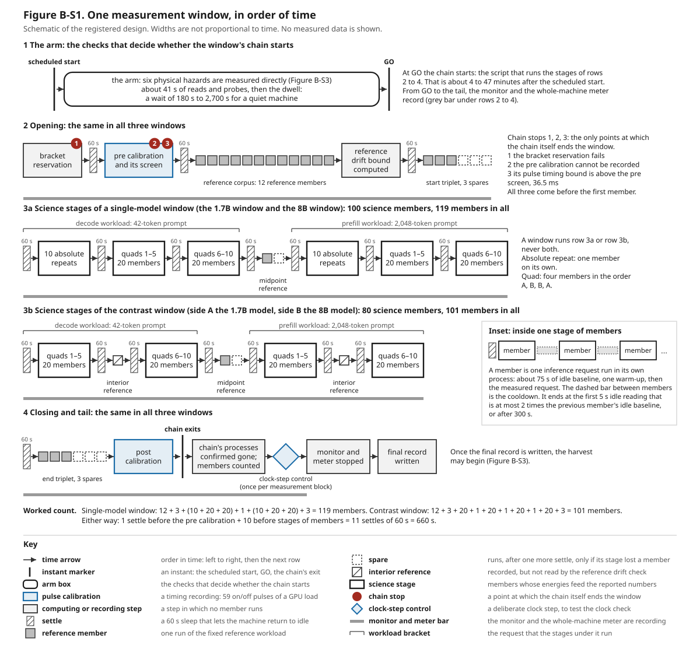
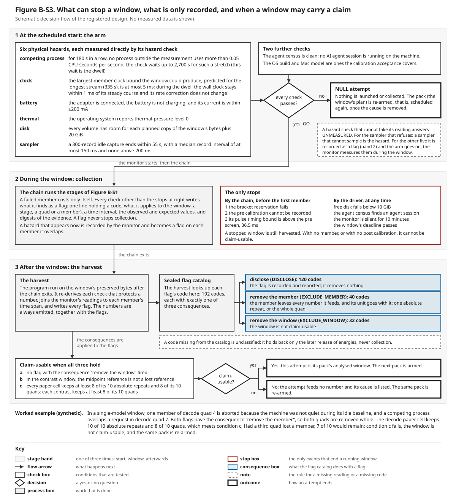

# Captions for Figures B-S1 and B-S3

<!--
Paper B, work-list item 14. Conventions for whoever edits this file (they follow the lexicon, 01-terms.md):
1. A term is set in bold once per caption, at the sentence that glosses it, and is not used above that sentence in
   that caption. Each caption stands alone: a term glossed under Figure B-S1 is glossed again under Figure B-S3.
   Bold is used for nothing else.
2. Every number is accounted for by a comment in its own paragraph: "rv:" names entries of
   docs/paper/paper-b/registered-values.json; "src:" names the section and line(s) of the registration or the
   analysis plan (configs/campaigns/v5_claim_25g83/, revision 9, DRAFT, as they stand at commit 9b0c680ed);
   "calc:" shows arithmetic done here on sourced numbers or names figure labels; "synthetic:" lists invented
   example values. After the seal every "src:" and "rv:" comment must be re-read.
   tests/test_paper_b_figures_s1_s3.py checks the accounting; for "src:" it checks the section, not the line.
3. A repository label (a code name, a flag code) appears in parentheses, where its plain name is glossed.
4. Neither figure nor caption states or hints at a result of the windows this paper reports.
5. Each caption's table of drawn elements must list exactly the element names of its SVG (the test compares them),
   and must quote every labelled instance.
The two SVGs are generated, never edited: python3 -B docs/paper/figures/b5/build_window_and_flow.py
(add --check to compare with the committed files, --sources to print every value with the line it was read from).
-->

Both figures are schematics of a design that was fixed before the data it governs existed. They are drawn by a
program from the committed design files, and a test regenerates them byte for byte, so neither can show a value
that the design does not hold. Neither shows a measurement. The terms are those of the paper's terms section. Each
caption glosses a term again where it first uses it, so that the caption can be read with its figure alone.

## Figure B-S1. One measurement window, in order of time

### The problem the layout answers

One session of measurement lasts hours, and two things can change over hours with no change in the work being
measured. The machine can drift: it warms, and background activity comes and goes. The timing of the power readings
against the machine's clocks can drift as well. Either would move a measured energy. A session is therefore laid out
so that the runs whose energies are reported sit between measurements that would show such a change: a timing
recording before them and another after them, and one unchanging job run at the start, in the middle and at the end.
The figure shows that order. Its widths are not proportional to time.

### Terms the figure relies on

The **sampler** is the operating-system tool that reports the electrical power drawn by the processor. Each of its
readings is a **power record**: the average power over one short stretch of time, a little over a tenth of a second.
A language model reads and writes text as **tokens**, pieces of text that are each a word or part of a word. A
**request** is one prompt handed to a language model on the machine, together with the output the model generates in
reply. A **workload** is a fixed prompt together with a fixed rule for how much output is generated.
<!-- src: registration §0.2 l.270-273 -->

A **member** is one run of one request in its own operating-system process. A member first records the idle machine
for about 75 s, its **idle baseline**. It then answers the request once untimed, the **warm-up**, and answers it
again: the **measured request**, the answer whose energy is reported. A **stage** is a list of members run one after
another. The **chain** is the script that runs a session's stages in order. A **window** is one such session: the
stretch of machine time from a **scheduled start**, an instant fixed in advance, to the moment the chain exits. A
**science member** is a member whose energy feeds a number the paper reports. The other members of a window exist to
watch the machine and the sampler.
<!-- src: registration §0.3 l.277-303; registration §0.6 l.342-343; registration §0.7 l.410-411 -->

The paper measures two language models, the **1.7B model** (Qwen3-1.7B) and the **8B model** (Qwen3-8B). Each has a
window of its own, the **1.7B window** and the **8B window**, which together are the **single-model windows**
(repository labels ALPHA and BETA). A third window, the **contrast window** (GAMMA), runs both models. The three
windows together are the **measurement block** this paper reports.

### Row 1: the arm

At the scheduled start the operating system's job scheduler starts the **driver**, the program that runs one try at
a window from beginning to end. The driver begins with the **arm**: the sequence of checks that decides whether the
window's chain starts. The arm measures six **physical hazards**, conditions of the machine that would corrupt a
measured energy if collection ran through them; Figure B-S3 lists the six with their limits. The arm's reads and
probes take about 41 s. Then comes the **dwell**, a wait of 180 s to 2,700 s. It ends as soon as 180 s in a row have
passed with no competing process, that is, with no process outside the measurement using more than a small share of
a processor core. If every check passes, the arm ends in GO, its decision to start, and the chain starts about 4 to
47 minutes after the scheduled start. The figure marks the scheduled start and GO as instants and draws the arm as
one rounded box.
<!-- src: registration §4.1 l.1181-1186 -->
<!-- rv: arm.contention.clean_s, arm.contention.cap_s -->

At GO the driver also starts two background recorders. They run until the tail of the window, the short stretch
after the chain exits, and are drawn as the grey bar under rows 2 to 4. The **monitor** logs the quantity behind
each physical hazard through the window: the clock, the battery, whether the operating system is slowing the
processor to shed heat, each process's use of the processor, and free disk space. The **whole-machine meter** is a
power meter in the cable between the mains adapter and the laptop. It records the whole machine's input power as a
cross-check and enters no reported number.
<!-- calc: rows 2 to 4 are labels in the figure -->

### Row 2: the opening, the same in all three windows

The chain first makes the **bracket reservation**. It opens an entry that names this window's plan in the
**calibration ledger**, the append-only file that records every timing recording taken on the machine, so that the
window's two timing recordings are tied to it. A **settle** follows: a wait of 60 s in which nothing runs, so that the
machine is back at idle before what comes next. Then comes the **pre calibration**. It is a **pulse calibration**: a
recording in which a load on the GPU is switched on and off 59 times at noted instants while the sampler runs. From
it a program bounds the largest timing error between the instant a switch was commanded and the instant the power
records show it; that bound is the recording's **pulse timing bound**. The pre calibration is followed by its
screen, a pass-or-fail comparison of its pulse timing bound with the **pre screen**, 0.036462861644980 s, which the
figure prints as 36.5 ms. The pre screen is the largest pulse timing bound among the 24 pulse calibrations from
which the timing limits for this operating-system build were derived.
<!-- rv: chain.settle_s -->
<!-- src: registration §0.11 l.458-477; registration §5.1 l.1544 -->
<!-- calc: 0.036462861644980 s = 36.46 ms, drawn to one decimal as 36.5 -->

The red circles numbered 1, 2 and 3 are the three **chain stops**, the only points at which the chain itself ends a
window. Chain stop 1: the bracket reservation fails. Chain stop 2: the pre calibration cannot be recorded. Chain
stop 3: its pulse timing bound is above the pre screen. All three come before the first member.
<!-- src: registration §5.1 l.1543-1545 -->
<!-- calc: 1, 2 and 3 are labels in the figure -->

Next come the grey squares. Each is a **reference member**: a member that runs the **reference workload**, one
unchanging job that is not one of the paper's own workloads. It is a third model, Qwen2.5-1.5B, with a prompt of
1,024 tokens and 256 output tokens. Because the job never changes, a change in its energy across a window can only
come from the machine or the sampler. The chain runs 12 reference members in a row, the **reference corpus**
(repository label: NEG-8 corpus). If fewer than 10 of the 12 finish successfully, the corpus stage runs once more,
and that second run measures only members that left no record the first time. From the corpus energies the chain
then computes the **reference drift bound**: the largest difference, between the mean of the reference members at a
window's start and the mean of those at its end, that the corpus's own scatter could produce when nothing drifts.
The figure draws this as the box "reference drift bound computed".
<!-- rv: pack.ALPHA.reference_corpus_members, workload.reference.prompt_tokens, workload.reference.output_tokens, reference.corpus_minimum_n -->

The opening ends with the **start triplet**, three reference members. Beside it the figure draws three dashed
squares, its **spares**. A spare is an extra reference member, planned in advance, that runs only if its stage ended
with fewer successful members than planned. The chain then runs as many spares as members are missing, once, after
one more settle, and each spare takes a missing member's place. A spare never runs because of an energy value.
<!-- rv: reference.endpoint_references_planned, reference.spares.start -->

### Row 3: the science stages

This is the only part that differs between windows. A window runs row 3a or row 3b, never both, and every stage in
either row is preceded by a settle.

An **absolute repeat** is one science member run on its own. A **quad** is four consecutive science members in the
order A, B, B, A, where A and B are two conditions, the quad's two sides. The order is chosen because a steady drift
cancels inside it: if each member reads a fixed amount more than the one before, the two A members and the two B
members gain the same amount on average, so their difference gains nothing.
<!-- src: registration §0.8 l.418-429 -->

In a single-model window (row 3a) the two sides of every quad are the same model and the same workload. Each of the
two workloads gets 10 absolute repeats in one stage and then 10 quads in two stages of five, drawn as the boxes
"10 absolute repeats", "quads 1–5" and "quads 6–10". That is 50 members for each workload and 100 science members.
In the contrast window (row 3b) side A is the 1.7B model and side B is the 8B model, and each workload gets 10 quads:
40 members for each workload and 80 science members.
<!-- src: registration §0.8 l.427-432; registration §0.9 l.438-443 -->
<!-- rv: pack.ALPHA.science_members, pack.GAMMA.science_members -->
<!-- calc: 10 + 10 x 4 = 50; 2 x 50 = 100; 10 x 4 = 40; 2 x 40 = 80; quads 1 to 5 and 6 to 10 are labels in the figure -->

The brackets above each row name the workload of the stages beneath them. The **decode workload** has a prompt of
42 tokens and exactly 512 output tokens; its stages are the source of the energy of writing output tokens. The
**prefill workload** has a prompt of 2,048 tokens, also with 512 output tokens; its stages are the source of the
energy of reading the prompt.
<!-- rv: workload.decode.prompt_tokens, workload.decode.output_tokens, workload.prefill.prompt_tokens, workload.prefill.output_tokens -->

Between the two workloads sits the **midpoint reference**: one reference member, with one spare, run after science
member 50 of 100 in a single-model window and after science member 40 of 80 in the contrast window. It is the only
reference member among the science stages, so only it can show a drift that rises and falls back between the start
and the end. The contrast window also runs two **interior references**, drawn as squares with a diagonal: one
reference member in the middle of each workload's stages, after science members 20 and 60. They are recorded as a
measure of drift inside each half. The check that compares the start with the end does not read them, and they have
no spares.
<!-- src: registration §0.12 l.489-510 -->

### Row 4: the closing and the tail, the same in all three windows

After the last science stage and one more settle comes the **end triplet**: three reference members, with three
spares. The **reference drift check**, made after the window, compares the mean of the end triplet with the mean of
the start triplet and passes when their difference is at most the reference drift bound. The **post calibration**,
a second pulse calibration, follows the end triplet after a countdown of 20 s and with no settle. With the pre
calibration it encloses every member of the window, so a change of the pulse timing bound across the window is
seen.
<!-- rv: reference.spares.end, chain.countdown_s.post_calibration -->

The instant "chain exits" ends the window, and the tail begins. The driver confirms that every process of the chain
is gone and counts the members that were collected (the box "chain's processes confirmed gone; members counted").
The **clock-step control**, drawn as a diamond, then runs. It runs once in the measurement block, at the tail of the
first window whose chain ran to its own exit. It switches on the operating system's automatic setting of the clock
from a time server, which the design keeps off during windows. The clock has drifted from true time while the
setting was off, so switching it on is expected to make the clock jump, and the control records whether the check of
the clock that the arm makes reports a jump. Without it, a check that always passed would look the same as a quiet
clock. The control runs after the chain's processes are gone, so it can touch no recording,
and it switches the automatic setting off again when it ends (repository label: G10). The driver then stops the
monitor and the whole-machine meter, no sooner than 5 s after the chain's exit ("monitor and meter stopped"), and
writes its final record ("final record written"). From then on the **harvest**, the program that processes the
window's files, may begin; Figure B-S3 shows what it does.
<!-- src: registration §3 l.1119-1139; registration §5.4 l.1762-1767 -->
<!-- rv: driver.monitor_post_chain_hold_s -->

### The inset: inside one stage of members

The inset expands one stage: its settle, then its members, with a **cooldown** between one member and the next.
During a cooldown the measuring program takes readings of the idle machine, 5 s of power records at a time. The next
member starts at the first reading whose mean power is at most 2 times the mean of the previous member's idle
baseline, provided the operating system reports that it is not slowing the processor to shed heat. If no reading
meets that rule, the next member starts anyway after 300 s. The first member of a stage has no cooldown.
<!-- rv: cooldown.subwindow_s, cooldown.tolerance_fraction, cooldown.cap_s -->
<!-- calc: the limit is the baseline x (1 + 1.0) = 2 times the baseline -->

### How long a window takes

The figure does not show durations. The **registration** is the document, written before any of the paper's energy
data existed, that fixes what is measured and by which rules. It gives two planning figures for the length of one
chain, a projection and a slower figure based on member times measured in an earlier session on this machine.
Neither is a measurement of this measurement block. On them one chain takes 5.4 to 8.8 h in the 1.7B window, 5.7 to
9.1 h in the 8B window and 4.8 to 7.7 h in the contrast window. A window can start at any hour, and windows are
scheduled back to back. If each window needs only one try, the three together take about 18 to 23 h on the
projection and about 28 to 33 h on the slower figure.
<!-- src: registration §5.5 l.1848-1852, 1903-1908 -->

### Worked count

Adding the members of a single-model window, in the order of the figure: 12 in the reference corpus, 3 in the start
triplet, 10 + 20 + 20 on the decode workload, 1 midpoint reference, 10 + 20 + 20 on the prefill workload and 3 in
the end triplet make 119. For the contrast window: 12 + 3 + 20 + 1 + 20 + 1 + 20 + 1 + 20 + 3 = 101. Either window
has 11 settles, one before the pre calibration and one before each of its 10 stages of members, 660 s in all.
<!-- rv: pack.ALPHA.reference_corpus_members, reference.endpoint_references_planned, pack.ALPHA.members, pack.GAMMA.members, pack.ALPHA.collection_stages, pack.ALPHA.span_part_s.settles -->
<!-- calc: 12 + 3 + 50 + 1 + 50 + 3 = 119; 12 + 3 + 20 + 1 + 20 + 1 + 20 + 1 + 20 + 3 = 101; 1 + 10 = 11; 11 x 60 = 660 -->

Worked example of a spare, with an invented loss. One member of the start triplet does not finish, because the
machine was not quiet during its idle baseline and its request was never run. So 2 of the 3 planned members
succeeded. The chain waits one more settle and runs 3 − 2 = 1 spare, and that spare is read as a member of the start
triplet. Had the same member been found faulty only after the window, no spare would have run: a spare repairs a
loss the chain can see, never one found later.
<!-- synthetic: one member that does not finish, 2 of 3 succeeded -->
<!-- calc: 3 - 2 = 1 -->

### Drawn elements

| Drawn element | What it stands for |
|---|---|
| time arrow | Order in time: left to right within a row, then on to the next row. |
| instant marker | An instant, drawn as a vertical tick with its name above: "scheduled start", "GO" and "chain exits". |
| arm box | "The arm": the checks that decide whether the chain starts. |
| pulse calibration | A timing recording made with a known on/off load on the GPU: the "pre calibration" and the "post calibration". |
| computing or recording step | A step in which no member runs: "bracket reservation", "reference drift bound computed", "chain's processes confirmed gone; members counted", "monitor and meter stopped" and "final record written". |
| settle | The 60 s wait before the pre calibration and before every stage of members, drawn as a hatched bar with its length above it. |
| reference member | One run of the reference workload, drawn as a grey square: the "reference corpus", the "start triplet", the "midpoint reference" and the "end triplet". |
| spare | A spare reference member, drawn as a dashed square beside the stage it belongs to. |
| interior reference | A reference member of the contrast window that is recorded and not read by the reference drift check, drawn as a square with a diagonal. |
| science stage | A stage of science members, with its content written inside: "10 absolute repeats", "quads 1–5" or "quads 6–10". |
| chain stop | One of the only three points at which the chain itself ends a window, drawn as a numbered red circle: chain stop 1, chain stop 2 and chain stop 3. |
| clock-step control | The deliberate clock jump that tests the arm's check of the clock, drawn as a diamond. |
| monitor and meter bar | The stretch during which the monitor and the whole-machine meter record, drawn as a grey bar under rows 2 to 4. |
| workload bracket | The workload that the stages beneath it run: "decode workload" or "prefill workload". |
| inset | The framed panel that expands one stage of members. |
| member | One member, drawn as a box in the inset. |
| cooldown | The wait between two members of a stage, drawn as a dashed bar in the inset. |
| separator rule | The thin grey line above the key. It carries no meaning. |
<!-- rv: chain.settle_s -->
<!-- calc: chain stops 1, 2, 3, rows 2 to 4, quads 1 to 5 and 6 to 10 are labels in the figure; 10 absolute repeats is a box label -->

### What the figure leaves out

Three steps of the chain take no measurement and are not drawn: a single re-fit of the pre calibration whose result
the members reuse, the listing of the corpus members that finished successfully (part of the box "reference drift
bound computed"), and a record of the bracket reservation's state after the post calibration. The second run of the
reference corpus described above is not drawn either.
<!-- src: registration §5.1 l.1558-1569, 1592-1600 -->

## Figure B-S3. What can stop a window, what is only recorded, and when a window may carry a claim

### The problem the flow answers

One session of measurement lasts hours, and most things that can go wrong in it do not make its energies wrong. An
earlier form of this design let a session start only after a long series of record checks had passed, and discarded
the whole session when a single run in it failed. The design's own planning figure shows what that would cost. It
takes from earlier sessions on this machine a rate of 1 failed run in 37. At that rate all 119 runs of a session
succeed with probability (36/37)^119, about 0.04. The present design therefore keeps three questions apart. What may
stop a session is a short closed list. Everything else is only recorded. What later removes data from the paper's
results is fixed in advance, one recorded condition at a time, in a list that is frozen before any data exist. Under
the removal rule drawn in the figure, the same planning figure gives such a session a probability of about 0.85 of
keeping both of its reported energies, counting those failed runs alone.
<!-- src: registration §6.6 l.2484-2488 -->
<!-- rv: pack.ALPHA.members -->
<!-- calc: 37 - 1 = 36; (36/37)^119 = 0.038 -->

### Terms the figure relies on

A **claim** is a sentence of the paper that reports a measured result. The **registration** is the document, written
before any of the paper's energy data existed, that fixes what is measured and by which rules; to **seal** a file is
to freeze it, through a ruling by a reviewer that took no part in writing it, before the data it governs exist. The
**sampler** is the operating-system tool that reports the electrical power drawn by the processor, and each of its
readings is a **power record**: the average power over one short stretch of time.
<!-- src: registration §0.2 l.270-273 -->

A **request** is one prompt handed to a language model on the machine, together with the output the model generates
in reply. A **member** is one run of one request in its own process; it records the idle machine first, its **idle
baseline**, and then answers the request. A **stage** is a list of members run one after another, and the **chain**
is the script that runs a session's stages in order. A **pack** is the complete plan of one session. An **attempt**
is one try at running one pack, and a **window** is the stretch of machine time an attempt occupies, from its
**scheduled start**, an instant fixed in advance, to the moment its chain exits. The paper measures two language
models, the **1.7B model** (Qwen3-1.7B) and the **8B model** (Qwen3-8B). It has three packs: one for each model (the
**1.7B window** and the **8B window**, together the **single-model windows**) and one that runs both (the **contrast
window**).
<!-- src: registration §0.3 l.277-303; registration §0.7 l.388-411 -->

### Band 1: at the scheduled start, the arm

At the scheduled start the operating system starts the **driver**, the program that runs the attempt. The driver
begins with the **arm**: the sequence of checks that decides whether the chain starts. A **physical hazard** is a
condition of the machine that would corrupt a measured energy if collection ran through it. Six are registered. Each
is measured as a physical quantity by its own **hazard check**, never inferred from the text of a setting or from a
receipt left by an earlier step. The box "six physical hazards" gives each check's limit. The reason for each is as
follows.
<!-- src: registration §0.15 l.750-757 -->
<!-- calc: band 1 is a label in the figure -->

- Competing process. Another process's work during a request adds energy that would be credited to the model. The
  check measures each process's processor time in intervals of 30 s. An interval is clean when no process outside
  the measurement used more than 0.05 CPU-seconds per second, which is 5% of one processor core. The arm waits for
  180 s of clean intervals in a row and gives up after 2,700 s. This wait is the **dwell**.
- Clock. Energy is assigned to a part of a request by placing power records against the instants that begin and end
  that part, and an error in the placement moves energy across the edge: an error of 5 ms while the processor draws
  40 W moves at most 0.2 J. The **member clock bound** is the upper limit, computed for each member, on that
  placement error. The check predicts the largest member clock bound the window could produce, for the longest
  sampler recording a member can have, 335 s, and requires it to be at most 5 ms. It also requires that through the
  dwell the machine's time-of-day clock stays within 1 ms of the course that the operating system's current
  correction to its rate predicts, and that this correction does not change.
- Battery. While the battery charges, or the machine runs without its adapter, the machine is not in the power state
  that every registered number assumes. The arm runs on an idle machine, so it requires the adapter connected, the
  battery not charging and a battery current within ±200 mA.
- Thermal. Under thermal pressure the operating system slows the processor to shed heat, which changes both power
  and duration. The check requires the thermal-pressure level the operating system reports to be 0.
- Disk. A write that fails for lack of space loses data in the middle of a window. Every disk volume that will
  hold a copy of the window's bytes must have room for each copy planned on it plus 20 GiB.
- Sampler. A sampler that delivers power records too slowly leaves short parts of a request with too few records.
  An idle recording of 300 records must end within 55 s, with a median record interval of at most 150 ms and none
  above 200 ms.
<!-- rv: arm.contention.interval_s, arm.contention.cpu_limit_s_per_s, arm.contention.clean_s, arm.contention.cap_s, arm.clock.t_stream_max_s, arm.clock.limit_ms, arm.clock.residual_max_ns, arm.battery.limit_ma, arm.thermal.max_level, arm.disk.headroom_bytes, arm.instrument.frames, arm.instrument.bound_s, arm.instrument.median_ms_max, arm.instrument.max_ms_max -->
<!-- src: registration §0.14 l.720-723; registration §4.2 l.1197-1206, 1232-1237, 1269-1272, 1277-1282, 1284-1293, 1308-1310, 1322-1325 -->
<!-- calc: 0.05 of one core = 5%; 0.005 s x 40 W = 0.2 J; 1,000,000 ns = 1 ms; 21,474,836,480 bytes = 20 GiB -->

The box "two further checks" holds two conditions that are not physical hazards. The **agent census** lists the
machine's running processes and searches them for agent sessions: running instances of an AI model working as a
software agent, which this project uses for its bookkeeping between windows. The census is clean when it finds none,
and the project's standing rule is that no measurement starts or continues while one is alive on the machine. The
second condition is that the machine's operating-system build and model are ones the **calibration acceptance**
covers. The calibration acceptance is the file of timing limits for this build, derived from recordings in which a
known load was switched on and off.
<!-- src: registration §4.5 l.1370-1375, 1416-1419; registration §4.7 l.1513-1519 -->

A hazard check answers PASS, REFUSE or UNMEASURED, the last when the measurement itself failed. The decision "every
check passes?" comes out yes only if no hazard check answered REFUSE, the sampler's check answered PASS, the agent
census is clean, and the build and model are covered. On yes the arm ends in GO, its decision to start ("yes: GO" in
the figure): the driver starts the **monitor**, a background program that logs the quantity behind each physical
hazard through the window, and then the chain. On no the attempt ends as a "NULL attempt". Nothing is launched and
nothing is collected, and the pack is **re-armed**, that is, a new attempt of it is scheduled, once the cause is
removed. The dashed note (the unmeasured hazard check) gives the rule for an UNMEASURED answer. It refuses only for
the sampler, because a sampler that cannot be read is itself the hazard. For the other five it is recorded as a
**flag**, a line of a file that states one observed fact and never stops collection, and the arm goes on, because
the monitor measures each of them through the window.
<!-- src: registration §0.15 l.754-766; registration §7.2 l.2829-2830 -->

Worked example of a pass and a refusal, with invented readings. During the dwell a background process uses 2.1
CPU-seconds in one interval of 30 s, which is 0.07 CPU-seconds per second. That is above 0.05, so the interval is not
clean and the count of clean time starts again. If the process then stops, six clean intervals follow, 180 s in a
row, and the check passes. If it never stops, no such run occurs within 2,700 s, the check refuses, the attempt is
NULL, and the pack is re-armed after the process has been identified and removed.
<!-- synthetic: 2.1 CPU-seconds in one interval -->
<!-- calc: 2.1 / 30 = 0.07; 6 x 30 = 180 -->
<!-- rv: arm.contention.interval_s, arm.contention.cpu_limit_s_per_s, arm.contention.clean_s, arm.contention.cap_s -->

### Band 2: during the window, collection

The box "the chain runs the stages" is the whole of Figure B-S1 after GO. A failed member costs only itself. Every
check other than the stops listed below writes what it finds as a flag. A flag holds a code that names what was
observed, what it applies to (the whole window, one stage, one planned group of four members, or one member), the
time interval it covers, the value observed and the value expected, and checksums of the raw bytes that show it. A
hazard that arises during the window is treated the same way. The monitor logs it, and after the window it becomes a
flag on each member it overlapped. For example, a competing process above 0.05 CPU-seconds per second in a 10 s
interval that overlaps a member's request removes that member from the paper's numbers and leaves the rest of the
window standing.
<!-- src: registration §0.16 l.771-774; registration §5.2 l.1613-1615; registration §6.4 l.2349-2350 -->
<!-- rv: arm.contention.cpu_limit_s_per_s, arm.contention.window_interval_s -->

The red box "the only stops" is a closed list of seven. Three are made by the chain, all before the first member.
The first is that the **bracket reservation** fails: the chain cannot open the entry that ties the window's two
timing recordings to its plan. The second is that the **pre calibration**, the timing recording made before the
first member, cannot be recorded. The third is that its **pulse timing bound**, the largest timing error it shows
between the instant a switch of the load was commanded and the instant the power records show it, is above the
**pre screen**, 0.036462861644980 s, which the figure prints as 36.5 ms. Four are made by the driver at any time:
free disk space falls below 10 GiB; the agent census, repeated through the window, finds an agent session; the
monitor has written no battery or competing-process reading for 10 minutes; or the window passes its deadline. The
deadline is 25 to 29 hours after the scheduled start, depending on the pack, and is sized as if every member took
the longest time it is allowed. A stopped window is still processed afterwards. It has either no member or no **post
calibration**, the timing recording made after the last member, so it cannot support a claim.
<!-- src: registration §0.11 l.458-477; registration §5.1 l.1543-1549; registration §6.5 l.2382-2383 -->
<!-- rv: arm.disk.low_bytes, driver.monitor_outage_s, pack.GAMMA.window_max_s, pack.BETA.window_max_s -->
<!-- calc: 0.036462861644980 s = 36.46 ms, drawn as 36.5; 10,737,418,240 bytes = 10 GiB; 600 s = 10 minutes; 91,020 s = 25.3 h and 104,580 s = 29.05 h, given as 25 to 29 -->

### Band 3: after the window, the harvest

The arrow "the chain exits" leads to the **harvest**, the program run on the window's preserved files after its
chain has exited. It recomputes from the raw bytes every check that protects a number, joins the monitor's logs to
each member's time span, and writes every flag. It always emits the numbers together with the flags: no flag
prevents a number from being computed.
<!-- src: registration §0.17 l.838-840; registration §7.1 l.2781-2782 -->
<!-- calc: band 3 is a label in the figure -->

The **flag catalog** is the file, sealed together with the registration, that gives each of its 192 flag codes
exactly one of three consequences (the box "sealed flag catalog"). **Disclose**, for 120 codes: the flag is recorded
and reported and removes nothing. **Remove the member**, for 40 codes: the member is taken out of every number it
feeds. **Remove the window**, for 32 codes: the window cannot support a claim. The repository's labels for the three
are DISCLOSE, EXCLUDE_MEMBER and EXCLUDE_WINDOW. The harvest only looks a consequence up; it never decides one. The
dashed note (the unclassified code) gives the rule for a code the flag catalog does not list. Such a code stops
nothing during collection, and it must be classified, without reading any energy, before any energy of the three
windows is read.
<!-- rv: catalog.codes, catalog.effect.DISCLOSE, catalog.effect.EXCLUDE_MEMBER, catalog.effect.EXCLUDE_WINDOW -->

The arrow "the consequences are applied to the flags" leads to the last test of the figure. Removal works on whole
**units**, the groups of members that the statistics treat as one draw. An **absolute repeat**, one member run on
its own, is one unit. A **quad**, four consecutive members in the order A, B, B, A with A and B two conditions, is
one unit. A steady drift, a slow change over time in what the same work costs, cancels inside that order, and a
removed member of a quad removes the whole quad so that the cancellation is never broken. A **workload** is a fixed
prompt with a fixed rule for how much output is generated; the paper has two, one for each of the two parts of a
request, reading the prompt and writing the output. A **paper cell** is one reported energy for one model and one of
those parts; it rests on the 10 absolute repeats and 10 quads that a single-model window runs on one workload. A
**contrast** is the mean difference between the 8B model and the 1.7B model over the 10 quads of one workload in the
contrast window. A window is **claim-usable** when three conditions hold. Condition a: no flag with the consequence
"remove the window" fired. Condition b applies to the contrast window only: its **midpoint reference** is not lost.
The midpoint reference is the one run of an unchanging reference job made between the window's two workloads (Figure
B-S1), and it is lost when its energy cannot be trusted for a reason other than its value, for example because it
did not finish. Without it, the amount that the contrasts' uncertainty allows for drift would rest on no reading
taken inside the window. Condition c: every paper cell keeps at least 8 of its 10 absolute repeats and 8 of its 10
quads, and each contrast keeps at least 8 of its 10 quads.
<!-- src: registration §0.8 l.418-434; registration §0.9 l.438-443; registration §0.16 l.788-793; registration §6.6 l.2473-2478 -->
<!-- rv: catalog.cell_unit_minimum -->

The decision "claim-usable?" has two outcomes. On yes ("claim-usable") this attempt is its pack's **analysed
window**: the pack is never armed again, and the next pack is armed, in the fixed order 1.7B window, 8B window,
contrast window. On no ("not claim-usable") the attempt is an input to no number, it is listed with its cause in the
paper's history of attempts, and the same pack is re-armed. Attempts are never mixed: no member, quad or paper cell
is pooled or replaced across attempts.
<!-- src: registration §7.2 l.2791-2796; analysis plan §2.1 l.70-72 -->

### Does re-arming select on the result?

The function that decides whether a window is claim-usable reads each flag's code, what the flag applies to, its
time interval and its identifier, and the pack's planned list of members. It reads no energy, power or duration. The
checks that wrote the flags do read the energies of runs of the reference job, idle power, timing and the physical
hazards, and one of them is a pass-or-fail timing test that depends on the energy of a member that feeds a paper
cell. Every reported number is therefore conditional on a window that passed those checks. The analysis plan, the
registration's companion that fixes every formula and what is printed, prints beside every paper cell and contrast
the number of attempts of its pack and the cause of each. When two attempts of the same pack in a row fail for the
same kind of cause, the cause is reviewed before a third attempt is made; there is no cap on attempts.
<!-- src: registration §0.16 l.781-787; registration §7.3 l.2835-2839; registration §7.6 l.2877-2881 -->

### Worked example

The example is the one printed in the figure, with invented removals. The figure calls the part of a request in
which the model writes its output decode. The example concerns the decode paper cell of a 1.7B window, which is the
energy of that part, and the ten quads that feed it, the decode quads. One member of decode quad 4 does not finish,
because the machine was not quiet during its idle baseline and its request was never run (repository flag code
`member.admission_aborted`). The monitor's log shows a competing process during the request of one member of
decode quad 7 (`contention.request_overlap`). The flag catalog gives both codes the consequence remove the member,
so quads 4 and 7 are removed whole. The decode paper cell keeps 10 of 10 absolute repeats and 10 − 2 = 8 of 10
quads, which meets condition c. If the window's other paper cell also keeps at least 8 and 8, and no flag removes
the window, the window is claim-usable and the 8B window is armed next. Had a member of a third decode quad been
removed, 7 quads would remain. Condition c would fail (the harvest records this as `cell.below_minimum`, whose
consequence is remove the window), the window would not be claim-usable, and the 1.7B window would be re-armed as a
new attempt.
<!-- synthetic: quads 4 and 7, a third quad -->
<!-- calc: 10 - 2 = 8; 10 - 3 = 7 -->
<!-- src: registration §6.6 l.2473-2478 -->
<!-- rv: catalog.cell_unit_minimum -->

### Drawn elements

| Drawn element | What it stands for |
|---|---|
| stage band | One of three times, drawn as a pale panel with a numbered title: band 1 (at the scheduled start), band 2 (during the window) and band 3 (after the window). |
| flow arrow | What happens next. Some carry a label: "no", "yes: GO", "the chain exits", "the consequences are applied to the flags" and "yes". |
| check box | Conditions that are tested: "six physical hazards", "two further checks" and the "claim-usable test". |
| decision | A yes-or-no question, drawn as a diamond: "every check passes?" and "claim-usable?". |
| process box | Work that is done, drawn as a grey box: "the chain runs the stages", "the harvest" and the "sealed flag catalog". |
| stop box | "The only stops": the closed list of events that end a running window, drawn with a red border. |
| consequence box | What the flag catalog does with a flag, drawn as a blue box: "disclose", "remove the member" and "remove the window". |
| note | The rule for a missing reading or a missing code, drawn with a dashed border: the unmeasured hazard check and the unclassified code. |
| outcome | How an attempt ends, drawn with a heavy border: "NULL attempt", "claim-usable" and "not claim-usable". |
| separator rule | The thin grey line above the key. It carries no meaning. |
<!-- calc: bands 1, 2 and 3 are labels in the figure -->

### What the figure leaves out

Each attempt ends with one of four verdicts, and the figure names only NULL. The other three are COLLECTED, when the
chain started; NO_COLLECTION, when the chain started and stopped before any stage of members ran; and HARVEST_FAULT,
when the harvest program itself failed on files that are present, which is repaired and run again on the identical
files and is never an outcome of the measurement.
<!-- src: registration §7.1 l.2781-2787 -->
