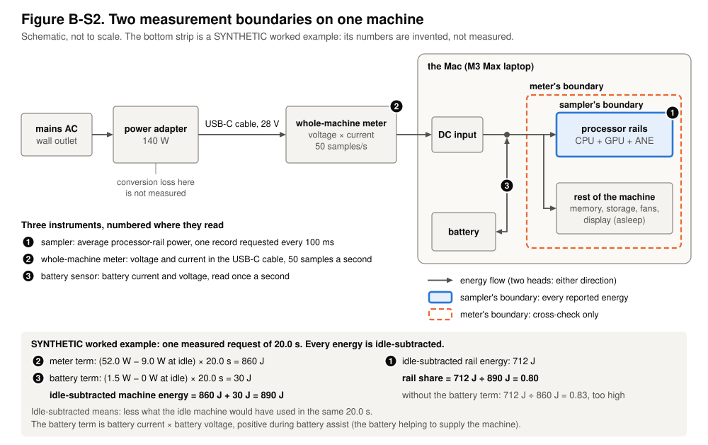
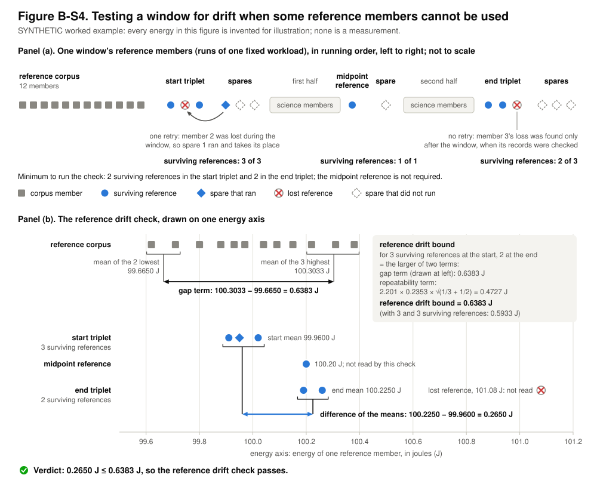
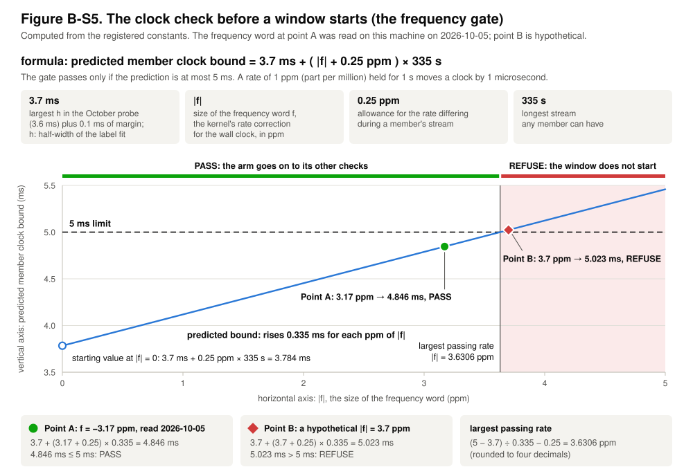

# Captions for Figures B-S2, B-S4 and B-S5

<!--
Paper B, work-list item 15. Conventions for whoever edits this file (they follow the lexicon, 01-terms.md, and the
sibling file captions-s1-s3.md):
1. A term is set in bold once per caption, at the sentence that glosses it, and is not used above that sentence in
   that caption. Each caption stands alone: a term glossed under one figure is glossed again under the next. Bold is
   used for nothing else. Headings are navigation and are exempt.
2. Every number is accounted for by a comment in its own paragraph: "rv:" names entries of
   docs/paper/paper-b/registered-values.json; "src:" names the section and line(s) of the registration or the
   analysis plan (configs/campaigns/v5_claim_25g83/, revision 9, DRAFT, as they stand at commit 9b0c680ed);
   "calc:" shows arithmetic done here on sourced numbers or names figure labels; "synthetic:" lists invented
   example values. After the seal every "src:" and "rv:" comment must be re-read.
   tests/test_paper_b_figures_s2_s4_s5.py checks the accounting; for "src:" it checks the section, not the line.
3. A repository label (a code name, a symbol of the registration) appears in parentheses, where its plain name is
   glossed.
4. Neither a figure nor its caption states or hints at a result of the windows this paper reports. The worked
   examples are the registration's own invented numbers.
5. Each caption's table of drawn elements lists exactly the element names of its SVG (the test compares them), and
   every number the builder computes and prints in a figure is printed in its caption too.
The three SVGs are generated, never edited: python3 -B docs/paper/figures/b5/build_boundary_survivors_gate.py
(add --check to compare with the committed files).
-->

The three figures are drawn by a program from design values that were fixed before the data they govern existed,
and a test regenerates them byte for byte. Figure B-S2 is a schematic. Figure B-S4 is a worked example whose
energies are invented. Figure B-S5 is computed from registered constants. None shows a measurement from the windows
this paper reports. The terms are those of the paper's terms section. Each caption glosses a term again where it
first uses it, so that the caption can be read with its figure alone.

## Figure B-S2. Two measurement boundaries on one machine

### The problem the figure answers

Every energy the paper reports is measured at one place inside the laptop: the supply to the processor. A reader
will ask two things that this measurement cannot answer by itself, because it sees nothing else: what share of the
whole machine's energy that is, and whether it rises and falls together with the machine's energy from one run of a
model to the next. A second, independent instrument, placed where energy enters the machine, can answer both
without touching any reported number. The figure shows where each instrument reads and what each reading includes.
<!-- src: registration §5.8 l.2004-2007 -->

### Terms the figure relies on

The **registration** is the document, written before any of the paper's energy data existed, that fixes what is
measured and how.

The **processor rails** are the three power channels the operating system reports for the processor chip: the CPU,
the GPU and the neural-network accelerator that Apple calls the Neural Engine (ANE). A rail is a power supply line
inside a computer. The **sampler** is the operating-system tool, macOS `powermetrics`, that reports the power the
processor rails draw. Each of its readings is a **power record**: the average power over one short stretch of time.
The paper's programs ask it for one power record every 100 ms.
<!-- src: registration §0.2 l.270-273; registration §1 l.889-890 -->
<!-- rv: member.sampler_rate_hz -->
<!-- calc: a rate of 10 a second is one every 100 ms -->

A **measurement boundary** is the set of components whose energy an instrument's reading includes. The sampler's
measurement boundary is the processor rails, so every energy the paper reports is an energy of the processor rails
(the registration calls this the claim boundary).
<!-- src: registration §1 l.888-893; registration §5.8 l.2014-2015 -->

The **whole-machine meter** is the second instrument: a power meter placed in the USB-C cable between the power
adapter and the laptop (a POWER-Z KM003C), which records the voltage and current entering the laptop 50 times a
second. Its measurement boundary is wider than the sampler's: everything in the laptop that consumes energy. It is
a recorded cross-check. It never stops a measurement, never removes one, and never enters a reported number.
<!-- src: registration §5.8 l.2023-2024, 2032-2033, 2091-2092 -->

**Battery assist** is the battery supplying part of the machine's power while the adapter is connected and the
battery is not charging. It happens whenever the machine draws more than the adapter is delivering. That energy
reaches the machine without passing through the whole-machine meter, so it is read separately, by the **battery
sensor**: the battery's current and voltage, read once a second from the machine's power-management controller
(Apple's System Management Controller, SMC; its keys B0AC and B0AV).
<!-- src: registration §4.2 l.1244-1247, 1260-1262; registration §5.8 l.2027-2028 -->

A **request** is one prompt handed to a language model on the machine, together with the output the model generates
in reply. A **member** is one run of one request in its own operating-system process. Before it answers, a member
records the idle machine for a fixed time, its **idle baseline**. The **measured request** is the answer whose
energy is reported. An energy is **idle-subtracted** when the mean power of the idle baseline, multiplied by the
duration of the measured request, has been taken off it: what is left is what the request cost beyond what the idle
machine would have used anyway.
<!-- src: registration §0.3 l.277-303; registration §5.8 l.2049-2053 -->

### How to read the figure

Energy moves along the arrows from left to right: from the wall outlet, through the power adapter and the USB-C
cable, into the laptop's DC input, the socket the cable plugs into. The whole-machine meter sits in the cable, at
disc 2, and measures what enters the laptop. The battery joins the path at the dot, just after the DC input, and
the battery sensor reads on that branch, at disc 3. The orange dashed outline is the whole-machine meter's
measurement boundary. Energy enters it by those two routes, so the energy that crosses it is the meter's reading
plus the battery's contribution. The blue outline is the sampler's measurement boundary, the processor rails, where
the sampler reads at disc 1. What the adapter loses in turning the outlet's AC into DC is lost before the meter and
lies inside neither boundary: the wider boundary is the laptop's DC input plus the battery, not the wall outlet.
<!-- src: registration §5.8 l.2009-2033 -->
<!-- calc: discs 1, 2 and 3 are labels in the figure -->

### The cross-check as arithmetic

For one measured request lasting T seconds, the registration fixes three quantities (it writes them ΔE_machine,
ΔE_rail and ρ). They are built from two terms.

- The **meter term** is the whole-machine meter's mean power during the request, minus its mean power during the
  idle baseline, multiplied by T.
- The **battery term** is the same expression for the battery's power, which is the battery's current times its
  voltage, counted positive during battery assist.
- The **idle-subtracted machine energy** is the meter term plus the battery term.
- The **idle-subtracted rail energy** is the sampler's energy for the same request, idle-subtracted.
- The **rail share** is the idle-subtracted rail energy divided by the idle-subtracted machine energy. It is left
  undefined when the idle-subtracted machine energy is zero or negative.
<!-- src: registration §5.8 l.2049-2056 -->

When the battery sensor has no reading inside the request or inside the idle baseline, the battery term is marked
unavailable and the idle-subtracted machine energy is the meter term alone.
<!-- src: registration §5.8 l.2054-2055 -->

### Worked example

The numbers are invented; they are the registration's own example. During the idle baseline the whole-machine meter
averages 9.0 W and the battery supplies 0 W. The measured request lasts 20.0 s; during it the meter averages 52.0 W
and battery assist supplies 1.5 W on average. Meter term: (52.0 − 9.0) × 20.0 = 860 J. Battery term:
(1.5 − 0) × 20.0 = 30 J. Idle-subtracted machine energy: 860 + 30 = 890 J. If the sampler gives an idle-subtracted
rail energy of 712 J for the same request, the rail share is 712 ÷ 890 = 0.80. Without the battery term it would
read 712 ÷ 860 = 0.83: leaving the battery out overstates the rail share whenever there is battery assist. The
example shows the arithmetic and says nothing about what the measurements will show.
<!-- src: registration §5.8 l.2062-2067 -->
<!-- synthetic: 9.0, 0, 20.0, 52.0, 1.5 and 712 are invented -->
<!-- calc: 52.0 - 9.0 = 43.0; 43.0 x 20.0 = 860; 1.5 x 20.0 = 30; 860 + 30 = 890; 712 / 890 = 0.80; 712 / 860 = 0.83 -->

### Drawn elements

| Drawn element | What it stands for |
|---|---|
| the Mac | The one machine on which every measurement is made, an Apple M3 Max laptop. The rounded frame stands for its case: everything drawn inside the frame is inside the laptop. |
| mains AC | The wall outlet, where the energy comes from. |
| power adapter | The laptop's 140 W charger, which turns the outlet's AC into DC. |
| conversion loss | The energy the adapter loses in that conversion. It is lost before the meter and is not measured. |
| USB-C cable | The cable from the adapter to the laptop, at 28 V. |
| whole-machine meter | Instrument 2. Its box carries what it records, voltage and current 50 times a second, and disc 2 marks where it reads; the same disc marks its line in the list of instruments. |
| DC input | The laptop's power socket. What the whole-machine meter measures is what enters the laptop here. |
| meter's boundary | The orange dashed outline: the whole-machine meter's measurement boundary, around everything in the laptop that consumes energy. The line beside its sample in the key says it is used for the cross-check only. |
| sampler's boundary | The blue outline: the sampler's measurement boundary, around the processor rails only. The line beside its sample in the key says every reported energy is measured here. |
| processor rails | The power channels of the CPU, the GPU and the ANE, taken together. |
| rest of the machine | Everything else the DC input and the battery feed: memory, storage, fans, and the display, which is asleep during measurements. |
| battery | The laptop's battery. It is drawn outside the meter's boundary because it is a second source of energy for what is inside, not a consumer. |
| energy flow | Each arrow shows the direction in which energy moves. The dot is where the battery's path joins the path from the DC input. The arrow between the battery and the dot has two heads, because the battery can either supply the machine or take charge from the DC input. |
| sampler | Instrument 1. Disc 1 sits on the sampler's boundary, and its line in the list of instruments says what it reads: the average power of the processor rails, one power record requested every 100 ms. |
| battery sensor | Instrument 3. Disc 3 sits on the battery's path, and its line in the list of instruments says what it reads: the battery's current and voltage, once a second. |
| instruments | The heading of the list of the three numbered instruments. |
| worked example | The grey strip, which carries the invented example given above, and the line that says what idle-subtracted means. |
| meter term | The first line of the strip. Disc 2 marks it as the whole-machine meter's number. |
| battery term | The second line of the strip, and the note at its foot. Disc 3 marks it as the battery sensor's number. |
| idle-subtracted machine energy | The third line of the strip: the meter term plus the battery term. |
| idle-subtracted rail energy | The first line of the strip's right half. Disc 1 marks it as the sampler's number. |
| rail share | The division that gives the rail share, and beneath it the same division without the battery term, which comes out too high. |
<!-- src: registration §0.2 l.267-273; registration §5.8 l.2012-2030 -->
<!-- rv: member.sampler_rate_hz -->
<!-- calc: instruments 1, 2 and 3 and discs 1, 2 and 3 are labels in the figure -->

### What the figure leaves out

The figure leaves out how the whole-machine meter's samples are matched in time to a member, and the notes that are
recorded when a meter reading is missing or doubtful. Neither changes the arithmetic above. The laptop also reports
the power at its DC input itself; that reading is compared with the whole-machine meter's as a check on the meter,
and is not drawn.
<!-- src: registration §5.8 l.2025-2026, 2058-2060, 2078-2089 -->

## Figure B-S4. Testing a window for drift when some reference members cannot be used

### The problem the figure answers

A measurement session lasts hours, and over hours the machine can **drift**: it warms, and background activity
comes and goes, so that the same work costs a little more or a little less late in the session than early in it.
The design measures that directly, by running one unchanging job at the start, the middle and the end of every
session and comparing the end with the start. The comparison is only as good as the runs it rests on, and such a
run can itself go wrong for a reason that has nothing to do with the machine changing: it can be stopped before it
measures anything, or another process can work while it runs, so that part of the energy it records belongs to
that process. Counting such a run would let the test fail, or pass, for the wrong reason. Requiring every run would
discard a whole session over one of them. The figure shows the rule that sits between the two.
<!-- src: registration §0.8 l.432-433; registration §0.12 l.489-495, 535-545; registration §5.1 l.1590 -->

### Terms the figure relies on

The **registration** is the document, written before any of the paper's energy data existed, that fixes what is
measured and how. A **request** is one prompt handed to a language model on the machine, together with the output
the model generates in reply. A **member** is one run of one request in its own operating-system process. A
**window** is one measurement session: the stretch of machine time from its scheduled start to the moment its last
program exits. A **science member** is a member whose energy feeds a number the paper reports.
<!-- src: registration §0.3 l.277; registration §0.7 l.410-411 -->

The **reference workload** is the unchanging job: a model the paper does not otherwise measure, Qwen2.5-1.5B, with
a prompt of 1,024 tokens (pieces of text) and 256 output tokens. A **reference member** is a member that runs the
reference workload. Each window runs reference members at four places. The **reference corpus** is the 12 reference
members run before any science member (repository label: NEG-8 corpus; the label is an inherited name, not an
abbreviation). The **start triplet** is three more, run next. The **midpoint reference** is one, run halfway
through the science members. The **end triplet** is three, run after the last science member. The start triplet,
the midpoint reference and the end triplet are the window's three **reference stages**.
<!-- src: registration §0.12 l.489-495 -->
<!-- rv: workload.reference.prompt_tokens, workload.reference.output_tokens, pack.ALPHA.reference_corpus_members, reference.endpoint_references_planned -->
<!-- calc: 2.5 and 1.5 are parts of the model name; four places are the corpus and the three reference stages -->

A **lost reference** is a reference member whose energy cannot be trusted for a reason that has nothing to do with
the energy's value: it never ran, or did not finish successfully; its record cannot be read, or fails the checks
every member's record must pass; a physical disturbance was recorded during it, such as a competing process; or the
record of which model it ran is missing. The test for a lost reference never reads the reference member's energy,
so none can be dropped for its value. A **surviving reference** is a reference member of a reference stage that is
not a lost reference.
<!-- src: registration §0.12 l.535-545, 598-599 -->

A **spare** is an extra reference member, planned in advance in the registration, that runs only when a reference
stage ended with fewer successful members than planned. Each triplet has three spares and the midpoint reference
has one. A reference stage gets one retry, which runs as many spares as members were missing, and a spare that runs
takes the missing member's place. A loss that is found only after the window has ended, when its records are
examined, is not repaired by running anything later. A retry is never run because of an energy value.
<!-- src: registration §0.12 l.496-499, 601-612 -->
<!-- rv: reference.spares.start, reference.spares.midpoint, reference.spares.end -->

### The rule, so that a reader can recompute it

The **reference drift bound** is the largest difference between a start mean and an end mean that the reference
corpus itself could produce when nothing drifts (repository label: NEG-8 bound). Sort the energies of the reference
corpus. Let U_j be the mean of the j highest and L_j the mean of the j lowest. Let s be their sample standard
deviation, and let t be the two-sided 95% value of Student's t distribution with one degree of freedom fewer than
the corpus has members. For n_s surviving references in the start triplet and n_e in the end triplet, the bound is
the larger of two terms.

- The **gap term** is the larger of U_ns − L_ne and U_ne − L_ns, where U_ns means U_j with j = n_s, and likewise
  for the others. It is the widest gap that a start mean of n_s members and an end mean of n_e members could show
  if both were drawn from the reference corpus.
- The **repeatability term** is t × s × √(1/n_s + 1/n_e): the 95% limit for the difference of two such means when
  nothing drifts.
<!-- src: registration §0.12 l.511-522 -->

The **reference drift check** asks whether the window drifted by more than the reference drift bound (repository
label: NEG-8 screen). It passes when the absolute difference between the mean of the end triplet's surviving
references and the mean of the start triplet's surviving references is at most the bound. It is applied twice, once
to each energy as measured and once to the **idle-subtracted energy**, which is the energy less what the idle
machine, recorded just before the member's request, would have used in the same time; both must pass. It needs at
least 2 surviving references in each triplet. A window that fails the reference drift check, or cannot run it,
supports no reported number.
<!-- src: registration §0.12 l.527-528, 615-617 -->
<!-- rv: yield.min_valid.reference_endpoint -->

The reference corpus itself may lose one or two of its 12 members and still give a bound, with t taken for the
smaller corpus. The figure shows the full 12.
<!-- src: registration §5.3 l.1641-1643 -->
<!-- rv: pack.ALPHA.reference_corpus_members, reference.corpus_minimum_n -->
<!-- calc: 12 - 1 = 11 and 12 - 2 = 10 members are still enough -->

The check does not read the midpoint reference. It is read afterwards. The **spread** of a window is the largest
minus the smallest of three values: the start mean, the midpoint reference's energy and the end mean. The
**whole-window drift allowance** is the larger of the spread and the reference drift bound: the amount by which
drift may have moved energies measured at different times in the window.
<!-- src: registration §0.12 l.529-534 -->

### How to read the figure

Panel (a) shows the reference members of one window in the order they run, with the science members drawn as two
blocks. In the example, member 2 of the start triplet was stopped before its request, because the machine was not
idle when it was due to run. That is a lost reference found while the window was running, so the stage's retry ran
spare 1, which takes member 2's place. Member 3 of the end triplet ran, but its request overlapped another
process's work. That is a lost reference found only when the window's records were checked afterwards, so no spare
ran. The start triplet therefore has 3 surviving references, the midpoint reference survives, and the end triplet
has 2.
<!-- src: registration §0.12 l.673-677 -->
<!-- calc: members 2 and 3 and spare 1 are labels in the figure; 3 - 1 + 1 = 3 surviving at the start; 3 - 1 = 2 at the end -->

Panel (b) places the same members by their energies on one axis. The grey squares in the top row are the reference
corpus. The brackets beneath them mark the 2 lowest and the 3 highest, and the black arrow between the two means is
the gap term. The grey box works out the reference drift bound from the gap term and the repeatability term. In the
lower rows, a bracket under each triplet's surviving references marks their mean, and the blue arrow is the
difference of the two means. Both arrows are drawn on the same axis, so their lengths can be compared by eye: the
check passes when the blue arrow is no longer than the reference drift bound.
<!-- calc: the 2 lowest and the 3 highest follow the counts of surviving references, 2 at the end and 3 at the start -->

### Worked example

Every energy here is invented; the numbers are the registration's own example. The 12 energies of the reference
corpus are 99.62, 99.71, 99.80, 99.88, 99.93, 99.97, 100.04, 100.09, 100.15, 100.22, 100.31 and 100.38 J, so
s = 0.2353 J, and t = 2.201 for 11 degrees of freedom. The start triplet reads 100.02 J, a lost reference, and
99.91 J, and the spare reads 99.95 J: three surviving references with a mean of 99.9600 J. The midpoint reference
reads 100.20 J. The end triplet reads 100.26 J, 100.19 J and 101.08 J, the last being the lost reference: two
surviving references with a mean of 100.2250 J.
<!-- src: registration §0.12 l.670-677 -->
<!-- synthetic: the twelve corpus energies; 100.02, 99.91, 99.95, 100.20, 100.26, 100.19 and 101.08 -->
<!-- calc: 12 - 1 = 11; (100.02 + 99.91 + 99.95) / 3 = 99.9600; (100.26 + 100.19) / 2 = 100.2250 -->

With n_s = 3 and n_e = 2: U_3 = 100.3033 J and L_2 = 99.6650 J, so U_3 − L_2 = 0.6383 J; U_2 = 100.3450 J and
L_3 = 99.7100 J, so U_2 − L_3 = 0.6350 J. The gap term is the larger, 0.6383 J. The repeatability term is
2.201 × 0.2353 × √(1/3 + 1/2) = 0.4727 J. The reference drift bound is the larger of the two terms, 0.6383 J. The
difference of the means is 100.2250 − 99.9600 = 0.2650 J, and 0.2650 J is at most 0.6383 J, so the reference drift
check passes. The spread is also 0.2650 J, because the midpoint reference lies between the two means, and the
whole-window drift allowance is the larger of 0.2650 J and 0.6383 J, that is 0.6383 J.
<!-- src: registration §0.12 l.672-680 -->
<!-- calc: 100.3033 - 99.6650 = 0.6383; 100.3450 - 99.7100 = 0.6350; 2.201 x 0.2353 x sqrt(1/3 + 1/2) = 0.4727; 100.2250 - 99.9600 = 0.2650 -->

Two comparisons show what the rule does. Had all three members of the end triplet survived, the bound would have
been the one for 3 and 3 surviving references, 0.5933 J: losing a reference loosens the bound, so a loss appears as
wider uncertainty and is not hidden. Had the lost reference of the end triplet been counted, the end mean would have
been 100.5100 J and the difference 0.5500 J, close to that 0.5933 J: a near-failure caused by another process, not
by drift.
<!-- src: registration §0.12 l.672-673, 681-683 -->
<!-- calc: (100.26 + 100.19 + 101.08) / 3 = 100.5100; 100.5100 - 99.9600 = 0.5500 -->

### Drawn elements

| Drawn element | What it stands for |
|---|---|
| Panel (a) | The upper panel: the reference members of one window in the order they run. |
| reference corpus | The 12 reference members run before any science member. In panel (b) it names the row that holds their energies. |
| corpus member | One grey square is one member of the reference corpus. |
| start triplet | The three reference members run after the reference corpus. In panel (b) it names the row that holds the energies of its surviving references. |
| midpoint reference | The single reference member run between the two halves of the science members. In panel (b) it names the row that holds its energy, 100.20 J, with the note that the check does not read it. |
| end triplet | The three reference members run after the last science member. In panel (b) it names the row that holds the energies of its surviving references. |
| spares | The spares of each reference stage: three, one and three. |
| science members | The science members, drawn as two blocks because the midpoint reference runs halfway through them: the "first half" and the "second half". |
| surviving reference | A blue disc is a planned reference member that is a surviving reference. |
| lost reference | A hollow disc with a red cross is a lost reference. In panel (b) the lost reference of the end triplet is drawn at its energy, 101.08 J, to show what the check leaves out. |
| spare that ran | A blue diamond is a spare that a retry ran and that is not a lost reference. It counts as a surviving reference of its stage. |
| spare that did not run | A hollow dashed diamond is a spare that stayed in reserve. A stage runs only as many spares as it was missing members while the window was running. |
| one retry | The curved arrow and its note: member 2 of the start triplet was lost while the window was running, so spare 1 ran and takes its place. |
| no retry | The thin line and its note: the loss of member 3 of the end triplet was found only after the window, when its records were checked, so no spare ran. |
| surviving references | Under each reference stage in panel (a), and under two row names in panel (b), how many surviving references the stage has: 3 of 3, 1 of 1 and 2 of 3. |
| Minimum to run the check | The reference drift check needs at least 2 surviving references in each triplet. It does not need the midpoint reference. |
| Panel (b) | The lower panel: the same members placed by their energies. |
| energy axis | The horizontal axis of panel (b), the energy of one reference member in joules. The faint vertical lines mark its ticks. |
| mean of the 2 lowest | The bracket under the two lowest energies of the reference corpus, and the line dropped from their mean, L_2 = 99.6650 J. |
| mean of the 3 highest | The bracket under the three highest energies of the reference corpus, and the line dropped from their mean, U_3 = 100.3033 J. |
| gap term | The black two-headed arrow between those two means, 0.6383 J long. |
| reference drift bound | The grey box, which works out the bound for 3 surviving references at the start and 2 at the end from its two terms, 0.6383 J and 0.4727 J, and notes the bound for 3 and 3, 0.5933 J. |
| start mean | The bracket under the start triplet's surviving references and the black line dropped from their mean, 99.9600 J. |
| end mean | The bracket under the end triplet's surviving references and the black line dropped from their mean, 100.2250 J. |
| difference of the means | The blue two-headed arrow between the two mean lines, 0.2650 J long. |
| Verdict | The result of the reference drift check for this example. The green tick repeats the word "passes". |
<!-- src: registration §0.12 l.489-499, 615-616, 670-690 -->
<!-- rv: pack.ALPHA.reference_corpus_members, yield.min_valid.reference_endpoint -->
<!-- calc: members 2 and 3 and spare 1 are labels in the figure; 3 of 3, 1 of 1 and 2 of 3 are counts drawn in the figure -->

### What the figure leaves out

Panel (a) leaves out everything that is neither a reference member nor a block of science members: the two
recordings, made with a known on-and-off load, that enclose the window and measure the timing of the power
readings; the waits between stages; and the checks made before the window starts. One of the paper's three windows,
the **contrast window** (repository label: GAMMA), compares two models directly. It also runs two **interior
references**, one inside each half of its science members. They are recorded as a measure of drift inside each
half, the check does not read them, and they are not drawn. In the contrast window a lost midpoint reference makes
the window unusable even though the check does not need it, because the whole-window drift allowance would then
rest on no reading taken between the start and the end. Panel (b) draws one of the check's two applications.
<!-- src: registration §0.12 l.503-508, 627-633 -->

## Figure B-S5. The clock check before a window starts (the frequency gate)

### The problem the figure answers

Each power reading must be placed in time against the instants at which a model starts and stops reading its prompt
and writing its answer, and the readings and those instants are timed by different means. The design requires that
placement to be right to within 5 ms for every run, and removes a run that misses it. How well the placement can be
known depends on how fast the laptop's clock is drifting, and that rate can be read before anything is measured.
The check drawn here reads it, and refuses to start a session whose longest runs could not meet 5 ms: such a
session would collect runs only to remove them.
<!-- src: registration §0.14 l.720-731; registration §4.2 l.1197-1198 -->
<!-- rv: arm.clock.limit_ms -->

### Terms the figure relies on

The **registration** is the document, written before any of the paper's energy data existed, that fixes what is
measured and with which thresholds; a value is registered when the registration states it. A **request** is one
prompt handed to a language model on the machine, together with the output the model generates in reply. A
**member** is one run of one request in its own operating-system process. A **window** is one measurement session:
the stretch of machine time from its scheduled start to the moment its last program exits. The **October probe** is
a set of earlier measurement sessions on this same machine, run on 3 and 4 October 2026 (repository label: block 3).
<!-- src: registration §0.3 l.277; registration §0.7 l.410-413 -->
<!-- calc: the dates 3 and 4 October 2026 restate 2026-10-03/04; 3 is the label in the cited line -->

The **sampler** is the operating-system tool, macOS `powermetrics`, that reports the electrical power drawn by the
processor. Each of its readings is a **power record**: the average power over one short stretch of time. The
**sampler stream** of a member is one continuous run of the sampler, from before the member's request to the end of
it. A **phase** is a named part of a request with a recorded start and end, the reading of the prompt or the
writing of the answer, and a **phase edge** is the instant at which a phase starts or ends.
<!-- src: registration §0.2 l.270-273; registration §0.3 l.300-302; registration §0.4 l.307-309 -->

The machine has two kinds of clock. The **wall clock** tells the time of day, and the operating system may adjust
it. A **monotonic clock** is a counter that only moves forward and that nothing sets. Each power record carries a
label printed by the sampler, the calendar second of the wall clock in which the record ended; each phase edge is
stamped on a monotonic clock. Placing power records against phase edges therefore needs the offset between the two
clocks, and an error in that offset moves energy across a phase edge: an error of 5 ms while the processor draws
40 W moves at most 0.2 J.
<!-- src: registration §0.14 l.720-723, 732-733; registration §5.8 l.2058-2059 -->
<!-- calc: 5 ms = 0.005 s; 0.005 x 40 = 0.2 -->

**Network time** is the operating system's automatic setting of the wall clock from a time server. The design
switches it off before every window. The **frequency word**, written f, is the correction the operating system's
kernel currently applies to the rate of the wall clock, in parts per million (ppm). With network time off, nothing
moves the wall clock suddenly, and it drifts against a monotonic clock steadily, at the rate f. A rate of 1 ppm
held for 1 s moves a clock by 1 microsecond.
<!-- src: registration §0.14 l.734-737; registration §4.4 l.1361-1362 -->
<!-- calc: 1 ppm of 1 s is 1 microsecond -->

The **member clock bound** is an upper limit, computed for each member from its own sampler stream, on the error in
placing that member's power records against its phase edges (repository label: effective bound). It has three
parts. The first is called h. The labels are whole seconds, so even when every label of the stream is used the
offset is pinned down only to within a range, and h is half the width of that range. The second is the amount by
which the wall clock drifts against the monotonic clock over the stream: the size of f multiplied by the stream's
length. The third is about 2 microseconds, for the resolution of the clock readings. A member whose member clock
bound exceeds 5 ms is removed from every number.
<!-- src: registration §0.14 l.725-731 -->
<!-- rv: estimator.member_clock_bound_max_s -->
<!-- calc: 0.005 s = 5 ms -->

The **longest stream** any member of the paper's windows can have is 335 s. The largest h any member showed in the
October probe was 3.6 ms.
<!-- src: registration §0.14 l.740-745; registration §4.2 l.1200 -->
<!-- rv: arm.clock.t_stream_max_s -->

### The gate

The **frequency gate** is the test, made before a window starts, that predicts the largest member clock bound the
window could produce and refuses the window if the prediction exceeds 5 ms. The prediction is
<!-- src: registration §4.2 l.1199-1201 -->
<!-- rv: arm.clock.limit_ms -->

    predicted member clock bound = 3.7 ms + (|f| + 0.25 ppm) × 335 s
<!-- rv: arm.clock.h_ms, arm.clock.frequency_margin_ppm, arm.clock.t_stream_max_s -->

Its three numbers are built as follows: 3.7 ms is the October probe's largest h, 3.6 ms, plus a margin of 0.1 ms;
0.25 ppm allows for the wall clock's rate over one stream differing from the frequency word; and 335 s is the
longest stream. The frequency gate is one check of the **arm**, the sequence of checks that decides whether a
window starts. When the prediction is at most 5 ms the gate answers PASS and the arm goes on to its other checks.
Otherwise it answers REFUSE and the window does not start.
<!-- src: registration §4.1 l.1187; registration §4.2 l.1199-1204 -->
<!-- rv: arm.clock.h_ms, arm.clock.frequency_margin_ppm, arm.clock.t_stream_max_s, arm.clock.limit_ms -->
<!-- calc: 3.6 + 0.1 = 3.7 -->

Because 1 ppm of 335 s is 335 microseconds, the prediction rises 0.335 ms for each ppm of |f|, from
3.7 ms + 0.25 ppm × 335 s = 3.784 ms at |f| = 0. It reaches 5 ms at |f| = (5 − 3.7) ÷ 0.335 − 0.25 = 3.6306 ppm,
to four decimals.
<!-- src: registration §4.2 l.1199-1204 -->
<!-- rv: pack.ALPHA.frequency_gate.max_abs_frequency_ppm -->
<!-- calc: 335 s x 1e-6 = 0.335 ms; 0.25 x 0.335 = 0.084; 3.7 + 0.084 = 3.784; 5 - 3.7 = 1.3; 1.3 / 0.335 = 3.8806; 3.8806 - 0.25 = 3.6306; 0 is the left end of the axis -->

### Worked points

| Point | Frequency word | Prediction | Against 5 ms | Answer |
|---|---|---|---|---|
| A | f = −3.17 ppm, read on this machine on 2026-10-05 | 3.7 + (3.17 + 0.25) × 0.335 = 4.846 ms | 4.846 ≤ 5 | PASS |
| B | a hypothetical frequency word of size 3.7 ppm | 3.7 + (3.7 + 0.25) × 0.335 = 5.023 ms | 5.023 > 5 | REFUSE |
<!-- src: registration §0.14 l.736-737; registration §4.2 l.1202-1204 -->
<!-- calc: 3.17 + 0.25 = 3.42; 3.42 x 0.335 = 1.146; 3.7 + 1.146 = 4.846; 3.7 + 0.25 = 3.95; 3.95 x 0.335 = 1.323; 3.7 + 1.323 = 5.023 -->

The gate uses the size of f, so a negative frequency word such as point A's is plotted at 3.17 ppm. Point B's
3.7 ppm is a rate and the formula's 3.7 ms is a time; they share digits by coincidence. On the plot, point B sits
just to the right of the largest passing rate and just above the limit, because 5.023 ms exceeds 5 ms by less than
half of one percent.
<!-- src: registration §4.2 l.1202-1204 -->
<!-- calc: (5.023 - 5) / 5 = 0.0046, which is less than half of one percent -->

### How to read the figure

The horizontal axis is |f|, the size of the frequency word, and the vertical axis is the predicted member clock
bound. The vertical axis starts at 3.5 ms, not at zero, so that the crossing can be seen. The blue line is the
formula. The dashed line is the 5 ms limit. The thin vertical line marks the largest passing rate: the gate answers
PASS to its left, under the green bar, and REFUSE to its right, under the red bar and in the shaded area. The four
boxes above the plot gloss the four quantities of the formula, and the three boxes below it work out point A,
point B and the largest passing rate.
<!-- rv: arm.clock.limit_ms -->
<!-- calc: 3.5 is the lowest tick of the vertical axis, a label in the figure -->

### Drawn elements

| Drawn element | What it stands for |
|---|---|
| formula | The frequency gate's formula, and beneath it the condition for passing and the meaning of ppm. |
| 3.7 ms | The first of the four boxes: the October probe's largest h, 3.6 ms, plus 0.1 ms of margin, with a reminder of what h is. |
| \|f\| | The second box: the size of the frequency word f, in ppm. |
| 0.25 ppm | The third box: the allowance for the wall clock's rate during a member's sampler stream differing from the frequency word. |
| 335 s | The fourth box: the longest stream. |
| PASS | The green bar above the plot spans the sizes of the frequency word at which the gate answers PASS. |
| REFUSE | The red bar above the plot, and the pale red area beneath it, span the sizes at which the gate answers REFUSE. |
| vertical axis | The predicted member clock bound in milliseconds, with its faint horizontal grid lines. |
| horizontal axis | The size of the frequency word in ppm, from 0 to 5. |
| 5 ms limit | The dashed horizontal line. The gate answers PASS where the blue line is on or below it. |
| largest passing rate | The thin vertical line at 3.6306 ppm, where the prediction reaches 5 ms, and the box at the lower right that works the value out. |
| predicted bound | The blue line: the formula drawn for every size of the frequency word from 0 to 5 ppm. It rises 0.335 ms for each ppm. |
| starting value | The hollow blue ring at the left end of the line, where the prediction is 3.784 ms. |
| Point A | The green disc on the line, and the box at the lower left that works it out: 4.846 ms, PASS. |
| Point B | The red diamond on the line, and the box at the lower middle that works it out: 5.023 ms, REFUSE. |
<!-- src: registration §4.2 l.1199-1204 -->
<!-- rv: arm.clock.h_ms, arm.clock.frequency_margin_ppm, arm.clock.t_stream_max_s, arm.clock.limit_ms, pack.ALPHA.frequency_gate.max_abs_frequency_ppm -->
<!-- calc: 3.7 + 0.25 x 0.335 = 3.784; 0 and 5 are the ends of the horizontal axis -->

### What the figure leaves out

The frequency gate is the first of four clock checks the arm makes. The other three, which concern the steadiness
of the wall clock and of the frequency word while the machine waits to start and the quality of the clock
readings, are not drawn. The figure also leaves out the member clock bound that is computed for each member after
it has run: the gate only predicts it.
<!-- src: registration §4.2 l.1199-1206 -->
