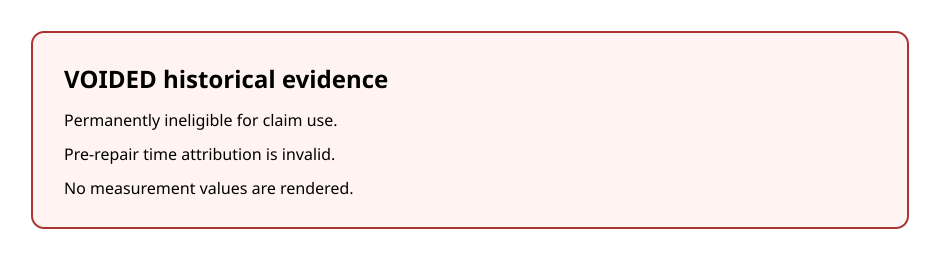

<!-- GENERATED by scripts/build_capstone.py; DO NOT EDIT. -->

## Legacy vertical-slice instrument results

This page exists to test the analysis-to-report path end to end: six pinned
strict-valid legacy bundles flow through the shared read layer into a sealed
dataset, an aggregate artifact, one figure, two tables, and one claims-index
row. It demonstrates the graded-artifact pipeline; it makes **no comparative
or scaling finding**.

Evidence class: **legacy L1 (manual review; pre-2M)**.

### Figure F1



Figure F1: Per-request energy by exact stack, legacy L1 (manual review; pre-2M). Panel A shows
idle-subtracted request energy (primary basis) alongside gross request energy
(context basis). The per-output-token companion is omitted because these
legacy bundles lack complete runtime stop-reason and output-policy provenance;
equality between realized output count and the configured cap is not labeled
as an observed stop reason. Points are the three retained sequential
repetitions; the marker is the arithmetic mean and the whisker is the observed
min–max range, not a confidence interval. Descriptive stack-specific
observations only; no cross-stack efficiency or scaling claim. Full stack
identities: Table S1.

### Table T1

Table T1: per-stack instrument results — legacy L1 (manual review; pre-2M). Values are mean, sample SD, and observed min–max over n=3 sequential repetitions per exact stack. No cross-stack comparison is made.

The per-output-token companion is omitted because runtime stop-reason and output-policy provenance are unavailable; no stop reason is inferred from the cap.

| stack_id | model_display_name | n | gross_j_request_mean | gross_j_request_sd | gross_j_request_min_max | idlesub_j_request_mean | idlesub_j_request_sd | idlesub_j_request_min_max | throughput_tokens_s_mean | ttft_ms_mean | token_companion_status | boundary | evidence_label | quality_waiver |
|---|---|---|---|---|---|---|---|---|---|---|---|---|---|---|
| LEGACY-M3MAX-QWEN25-1P5B-MLX | Qwen2.5-1.5B-Instruct-4bit | 3 | 47.2 | 0.7 | 46.6–48.0 | 44.4 | 3.3 | 40.7–46.3 | 257.4 | 94.1 | omitted: runtime stop reason and output policy unavailable | Apple SoC CPU + GPU + ANE package power | legacy L1 (manual review; pre-2M) | cooldown cap hit recorded before r2; point retained and reported (legacy manual-review carve-out) |
| LEGACY-M3MAX-QWEN35-122B-A10B-MLX | Qwen3.5-122B-A10B-4bit | 3 | 304.0 | 0.9 | 303.5–305.1 | 298.7 | 0.6 | 298.1–299.3 | 46.2 | 271.7 | omitted: runtime stop reason and output policy unavailable | Apple SoC CPU + GPU + ANE package power | legacy L1 (manual review; pre-2M) | none |

### Quality waivers

- **example-mac-mlx-local__r2** — cooldown cap hit was recorded; the point is retained and visibly reported under the legacy manual-review carve-out
- **token-normalized companion metrics** — legacy bundles predate complete runtime stop-reason and output-policy provenance; the companion is omitted from the v2 figure, table, and report

### Table S1

Table S1: full D-058 stack identity for both legacy stacks — legacy L1 (manual review; pre-2M). Every cell is a concrete recorded value or an explicit unknown.

| stack_id | hardware_unit | os_version | runtime_version | kernel_library | model_artifact_hash | quantization | tokenizer_identity | sampler_output_policy | batching_concurrency_policy | measurement_boundary | telemetry_backend |
|---|---|---|---|---|---|---|---|---|---|---|---|
| LEGACY-M3MAX-QWEN25-1P5B-MLX | macbook_m3_max (Mac15,9); physical unit id: unknown (legacy bundle) | macOS (kern.osversion 24G720 recorded in bundle metadata) | MLX 0.31.2 / mlx-lm 0.31.3 (from adapter prepare metadata) | unknown (legacy bundle) | unavailable (not captured); repo revision 8b403126fc14f14cfc99bb4cfa72ecbc129ea677 (revision, not a byte hash) | int4 (bits=4, group_size=unknown (legacy bundle)) | unknown (legacy bundle); prompt source/BOS handling: unavailable (not captured) | unknown (legacy bundle) | unknown (legacy bundle) | Apple SoC CPU + GPU + ANE package power | powermetrics |
| LEGACY-M3MAX-QWEN35-122B-A10B-MLX | macbook_m3_max (Mac15,9); physical unit id: unknown (legacy bundle) | macOS (kern.osversion 24G720 recorded in bundle metadata) | MLX 0.31.2 / mlx-lm 0.31.3 (from adapter prepare metadata) | unknown (legacy bundle) | unavailable (not captured); repo revision e9c67b08899964be5fdd069bb1b4bc8907fe68f5 (revision, not a byte hash) | int4 (bits=4, group_size=64) | unknown (legacy bundle); prompt source/BOS handling: unavailable (not captured) | unknown (legacy bundle) | unknown (legacy bundle) | Apple SoC CPU + GPU + ANE package power | powermetrics |

### Limitations carried by this page

All observations on this page come from a single physical hardware unit; they
characterize that exact unit and stack, not the hardware model line (D-052
single-unit limitation). The per-output-token companion is omitted: realized
token counts are retained for audit, but runtime stop reason and output policy
are unavailable, and neither is inferred from the configured cap (D-058).

### Claims index

Claims row: `CLM-RPT001-LEGACY-L1-001` in `analysis/rpt001-v2/claims_index.jsonl`.

### Regeneration

```sh
python3 scripts/build_capstone.py --profile rpt001 --full --offline --runs-root /Users/edr/code/JouleWise/runs
```

Artifact hashes: `analysis/rpt001-v2/artifact_manifest.json`.
